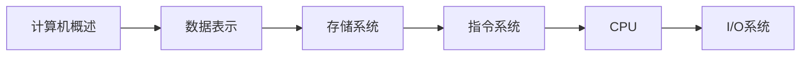

# 计算机组成原理教程

> 🖥️ **深入理解计算机硬件** | 从底层到体系结构 | 包含面试高频考点
> 
> 💡 **使用建议**：注重理解硬件工作原理，结合实际案例学习

---

## 📖 教程结构

### 第一章：计算机系统概述
> 理解计算机系统的基本组成和发展历史

| 序号 | 章节 | 核心内容 | 面试频率 |
|------|------|----------|----------|
| 01 | [计算机系统概述](basic/introduction.md) | 冯·诺依曼体系结构、计算机组成、性能指标 | ⭐⭐⭐⭐ |

**学习目标：**
- ✅ 理解冯·诺依曼体系结构
- ✅ 掌握计算机的基本组成
- ✅ 了解计算机性能指标

**重点面试题：**
- 冯·诺依曼结构的特点
- 计算机的五大部件及其功能
- 哈佛结构与冯·诺依曼结构的区别

---

### 第二章：数据的表示与运算
> 掌握计算机中数据的编码和运算方法

| 序号 | 章节 | 核心内容 | 面试频率 |
|------|------|----------|----------|
| 02 | [数据表示与运算](basic/data.md) | 数制转换、定点数、浮点数、ALU | ⭐⭐⭐⭐⭐ |

**学习目标：**
- ✅ 掌握各种数制之间的转换
- ✅ 理解定点数和浮点数的表示
- ✅ 了解算术逻辑单元ALU

**重点面试题：**
- 原码、反码、补码的概念和转换
- IEEE 754浮点数标准
- 定点数和浮点数的区别
- 溢出的判断方法

---

### 第三章：存储系统
> 深入理解存储器层次结构

| 序号 | 章节 | 核心内容 | 面试频率 |
|------|------|----------|----------|
| 03 | [存储系统](core/memory.md) | 存储层次、Cache、虚拟存储、主存 | ⭐⭐⭐⭐⭐ |

**学习目标：**
- ✅ 理解存储器层次结构
- ✅ 掌握Cache的工作原理
- ✅ 了解虚拟存储机制

**重点面试题：**
- 存储器层次结构的设计原理
- Cache的映射方式（直接映射、全相联、组相联）
- Cache替换算法（LRU、FIFO等）
- 虚拟存储和物理存储的区别
- 页面置换算法

---

### 第四章：指令系统
> 学习指令格式和寻址方式

| 序号 | 章节 | 核心内容 | 面试频率 |
|------|------|----------|----------|
| 04 | [指令系统](core/instruction.md) | 指令格式、寻址方式、RISC/CISC | ⭐⭐⭐⭐ |

**学习目标：**
- ✅ 掌握指令的格式和分类
- ✅ 理解各种寻址方式
- ✅ 了解RISC和CISC的特点

**重点面试题：**
- 常见的寻址方式
- RISC和CISC的区别
- 指令字长和机器字长

---

### 第五章：中央处理器CPU
> 理解CPU的组成和工作原理

| 序号 | 章节 | 核心内容 | 面试频率 |
|------|------|----------|----------|
| 05 | [中央处理器](core/cpu.md) | CPU组成、指令执行、流水线、控制器 | ⭐⭐⭐⭐⭐ |

**学习目标：**
- ✅ 理解CPU的功能和组成
- ✅ 掌握指令执行过程
- ✅ 了解流水线技术

**重点面试题：**
- 指令周期、机器周期、时钟周期的关系
- 流水线的工作原理
- 流水线冒险（数据冒险、控制冒险、结构冒险）
- 超标量和超流水线

---

### 第六章：总线与I/O系统
> 学习计算机的输入输出系统

| 序号 | 章节 | 核心内容 | 面试频率 |
|------|------|----------|----------|
| 06 | [总线与I/O](core/io.md) | 总线结构、I/O接口、中断、DMA | ⭐⭐⭐ |

**学习目标：**
- ✅ 理解总线的分类和结构
- ✅ 掌握I/O控制方式
- ✅ 了解中断系统

**重点面试题：**
- 总线的分类（数据总线、地址总线、控制总线）
- I/O控制方式（程序查询、中断、DMA）
- 中断的处理过程
- DMA的工作原理

---

## 🎯 学习路线建议

### 🔰 基础学习路线（2-3个月）


**推荐学习顺序：**
1. 第一章：计算机概述（1周）- 建立整体认知
2. 第二章：数据表示（2周）- **重点**：补码运算
3. 第三章：存储系统（2周）- **重点**：Cache原理
4. 第四章：指令系统（1周）- 理解寻址方式
5. 第五章：CPU（2周）- **重点**：流水线
6. 第六章：I/O系统（1周）- 了解I/O控制

### 🚀 进阶学习路线
```
基础理论 → 计算机体系结构 → CPU设计 → 实践项目
```

---

## 📝 面试高频考点汇总

### ⭐⭐⭐⭐⭐ 必考考点
1. **冯·诺依曼体系结构**
2. **原码、反码、补码**
3. **IEEE 754浮点数**
4. **存储器层次结构**
5. **Cache映射方式和替换算法**
6. **虚拟存储机制**
7. **指令执行过程**
8. **流水线技术**
9. **流水线冒险及解决方法**

### ⭐⭐⭐⭐ 常考考点
1. **哈佛结构 vs 冯·诺依曼结构**
2. **定点数和浮点数**
3. **寻址方式**
4. **RISC和CISC**
5. **指令周期、机器周期、时钟周期**
6. **中断处理过程**
7. **DMA工作原理**

### ⭐⭐⭐ 了解即可
1. **计算机性能指标（MIPS、CPI）**
2. **总线仲裁**
3. **超标量和超流水线**
4. **多级Cache**

---

## 💡 学习建议

### ✅ 推荐做法
1. **理解为主** - 重点理解硬件工作原理，不要死记硬背
2. **画图辅助** - 多画结构图、时序图帮助理解
3. **联系实际** - 结合现代CPU的实现技术
4. **做题巩固** - 通过习题加深理解
5. **分层学习** - 先宏观后微观，逐层深入

### ❌ 避免误区
1. ❌ 只记公式不理解原理
2. ❌ 忽视基础概念直接学高级内容
3. ❌ 没有动手画图和计算
4. ❌ 脱离实际应用孤立学习

---

## 🛠️ 学习工具

### Logisim 数字电路仿真
- 用于理解逻辑门、ALU等基础组件

### Verilog/VHDL
- 硬件描述语言，用于CPU设计

### MIPS模拟器
- 理解指令执行过程

---

## 📚 推荐资源

### 书籍推荐
- 《计算机组成原理》- 唐朔飞（第2版/第3版）
- 《深入理解计算机系统》(CSAPP) - Randal E. Bryant
- 《计算机体系结构：量化研究方法》- Hennessy & Patterson
- 《计算机组成与设计：硬件/软件接口》

### 在线资源
- [Logisim数字电路仿真](http://www.cburch.com/logisim/)
- [MIPS指令集参考](https://en.wikipedia.org/wiki/MIPS_architecture)

### 视频课程
- 哈工大计算机组成原理课程
- 中国大学MOOC - 计算机组成原理

---

## 📊 学习进度追踪

### 基础阶段 ✅
- [ ] 第一章：计算机系统概述
- [ ] 第二章：数据表示与运算（重点）

### 核心阶段 🔄
- [ ] 第三章：存储系统（重点）
- [ ] 第四章：指令系统
- [ ] 第五章：CPU（重点）

### 进阶阶段 ⏳
- [ ] 第六章：I/O系统
- [ ] 综合练习
- [ ] 真题演练

---

**开始学习** → [第一章 - 计算机系统概述](basic/introduction.md)

