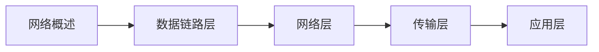
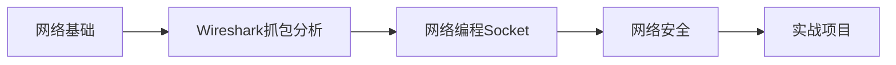

# 计算机网络教程

> 🌐 **系统化网络学习路线** | 从基础到应用 | 包含面试高频考点
> 
> 💡 **使用建议**：按章节顺序学习，理解网络协议栈的层次结构

---

## 📖 教程结构

### 第一章：计算机网络概述
> 理解计算机网络的基本概念和体系结构

| 序号 | 章节 | 核心内容 | 面试频率 |
|------|------|----------|----------|
| 01 | [网络概述](计算机网络第1章（概述）.md) | 网络体系结构、OSI/TCP-IP模型、网络分类 | ⭐⭐⭐⭐⭐ |

**学习目标：**
- ✅ 掌握计算机网络的基本概念
- ✅ 理解OSI七层模型和TCP/IP四层模型
- ✅ 了解网络性能指标

**重点面试题：**
- OSI七层模型和TCP/IP四层模型的区别
- 什么是网络协议？协议三要素是什么？
- 网络性能指标：带宽、时延、吞吐量

---

### 第二章：物理层
> 了解物理层的传输介质和编码技术

| 序号 | 章节 | 核心内容 | 面试频率 |
|------|------|----------|----------|
| 02 | [物理层](计算机网络第2章（物理层）.md) | 传输介质、信道复用、物理层设备 | ⭐⭐ |

**学习目标：**
- ✅ 了解传输介质的类型
- ✅ 掌握信道复用技术
- ✅ 理解数字信号的编码方式

---

### 第三章：数据链路层
> 掌握数据链路层的帧封装和差错检测

| 序号 | 章节 | 核心内容 | 面试频率 |
|------|------|----------|----------|
| 03 | [数据链路层](计算机网络第3章（数据链路层）.md) | MAC地址、以太网、交换机工作原理 | ⭐⭐⭐⭐ |

**学习目标：**
- ✅ 理解MAC地址和帧结构
- ✅ 掌握CSMA/CD协议
- ✅ 了解交换机的工作原理

**重点面试题：**
- MAC地址和IP地址的区别
- 交换机和路由器的区别
- ARP协议的工作原理
- CSMA/CD碰撞检测机制

---

### 第四章：网络层
> 深入理解IP协议和路由选择

| 序号 | 章节 | 核心内容 | 面试频率 |
|------|------|----------|----------|
| 04 | [网络层](计算机网络第4章（网络层）.md) | IP地址、子网划分、路由协议、ICMP | ⭐⭐⭐⭐⭐ |

**学习目标：**
- ✅ 掌握IP地址的分类和子网划分
- ✅ 理解路由选择算法
- ✅ 了解NAT和ICMP协议

**重点面试题：**
- IP地址的分类（A/B/C类）
- 子网掩码的作用和计算
- 路由表的工作原理
- NAT的作用和工作流程
- ICMP协议的应用（ping/traceroute）

---

### 第五章：传输层
> 掌握TCP和UDP协议的核心机制

| 序号 | 章节 | 核心内容 | 面试频率 |
|------|------|----------|----------|
| 05 | [传输层](计算机网络第5章（运输层）.md) | TCP连接、流量控制、拥塞控制、UDP | ⭐⭐⭐⭐⭐ |

**学习目标：**
- ✅ 理解TCP三次握手和四次挥手
- ✅ 掌握TCP的可靠传输机制
- ✅ 了解流量控制和拥塞控制
- ✅ 理解TCP和UDP的区别

**重点面试题：**
- TCP三次握手和四次挥手的过程
- 为什么是三次握手而不是两次？
- TCP如何保证可靠传输？
- TCP的流量控制和拥塞控制
- TCP和UDP的区别及应用场景
- TIME_WAIT状态的作用

---

### 第六章：应用层
> 学习常见应用层协议

| 序号 | 章节 | 核心内容 | 面试频率 |
|------|------|----------|----------|
| 06 | [应用层](计算机网络第6章（应用层）.md) | HTTP/HTTPS、DNS、FTP、SMTP | ⭐⭐⭐⭐⭐ |

**学习目标：**
- ✅ 掌握HTTP协议和HTTPS加密
- ✅ 理解DNS域名解析过程
- ✅ 了解常用应用层协议

**重点面试题：**
- HTTP和HTTPS的区别
- HTTP请求方法（GET/POST等）
- HTTP状态码的含义
- DNS解析过程
- Cookie和Session的区别
- HTTP 1.0/1.1/2.0的区别

---

## 🎯 学习路线建议

### 🔰 基础学习路线（1-2个月）


**推荐学习顺序：**
1. 第一章：网络概述（1周）- 建立整体认知
2. 第三章：数据链路层（1周）- 理解MAC和交换机
3. 第四章：网络层（2周）- **重点**：IP和路由
4. 第五章：传输层（2周）- **重点**：TCP/UDP
5. 第六章：应用层（1周）- HTTP等常用协议

### 🚀 进阶学习路线


---

## 📝 面试高频考点汇总

### ⭐⭐⭐⭐⭐ 必考考点
1. **OSI七层模型和TCP/IP四层模型**
2. **TCP三次握手和四次挥手**
3. **TCP如何保证可靠传输**
4. **TCP和UDP的区别**
5. **HTTP和HTTPS的区别**
6. **HTTP状态码**
7. **IP地址分类和子网划分**
8. **ARP协议**
9. **DNS解析过程**
10. **Cookie和Session**

### ⭐⭐⭐⭐ 常考考点
1. **TCP的流量控制和拥塞控制**
2. **TIME_WAIT状态**
3. **NAT网络地址转换**
4. **路由选择算法**
5. **HTTP 1.0/1.1/2.0的区别**
6. **HTTPS的加密过程**
7. **WebSocket协议**
8. **滑动窗口协议**

### ⭐⭐⭐ 了解即可
1. **物理层的传输介质**
2. **CSMA/CD协议**
3. **路由协议（RIP/OSPF/BGP）**
4. **ICMP协议**
5. **邮件协议（SMTP/POP3/IMAP）**

---

## 💡 学习建议

### ✅ 推荐做法
1. **自顶向下学习** - 从应用层开始，更容易理解
2. **理解协议原理** - 不要死记硬背，理解协议设计思想
3. **实践抓包分析** - 使用Wireshark观察真实网络数据包
4. **画图辅助理解** - 多画网络拓扑图和协议交互图
5. **结合实际应用** - 思考日常上网背后的网络原理

### ❌ 避免误区
1. ❌ 只记概念不理解原理
2. ❌ 忽视底层，只关注应用层
3. ❌ 没有动手实践和抓包分析
4. ❌ 混淆不同层次的协议

---

## 🛠️ 实践工具

### Wireshark 抓包分析
```bash
# 常用过滤器
tcp.port == 80          # HTTP流量
tcp.flags.syn == 1      # TCP握手包
http.request.method == "GET"  # HTTP GET请求
```

### ping命令
```bash
ping www.baidu.com      # 测试网络连通性
ping -c 4 192.168.1.1   # 发送4个数据包
```

### traceroute路由追踪
```bash
traceroute www.google.com    # 查看路由路径
```

---

## 📚 推荐资源

### 书籍推荐
- 《计算机网络》- 谢希仁（第7版/第8版）
- 《TCP/IP详解 卷1：协议》- W. Richard Stevens
- 《图解HTTP》- 上野宣
- 《图解TCP/IP》- 竹下隆史

### 在线资源
- [Wireshark官网](https://www.wireshark.org/) - 网络抓包工具
- [RFC文档](https://www.rfc-editor.org/) - 协议标准文档
- [菜鸟教程-计算机网络](https://www.runoob.com/w3cnote_genre/network)

### 视频课程
- 哈工大计算机网络课程
- 中国大学MOOC - 计算机网络

---

## 📊 学习进度追踪

### 基础阶段 ✅
- [ ] 第一章：网络概述
- [ ] 第二章：物理层
- [ ] 第三章：数据链路层

### 核心阶段 🔄
- [ ] 第四章：网络层（重点）
- [ ] 第五章：传输层（重点）

### 应用阶段 ⏳
- [ ] 第六章：应用层
- [ ] Wireshark实践
- [ ] 网络编程实战

---

**开始学习** → [第一章 - 网络概述](计算机网络第1章（概述）.md)
