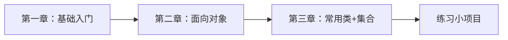
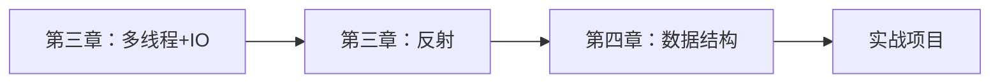

# Java 编程学习教程

> 从零开始学习 Java 编程，系统掌握面向对象编程思想

## 📚 教程简介

本教程将带你系统学习 Java 编程语言，从零基础到进阶开发，涵盖 Java 基础语法、面向对象编程、集合框架、多线程、IO 流、反射等核心知识点。Java 是世界上最流行的编程语言之一，广泛应用于企业级应用开发、Android 开发、大数据等领域，掌握 Java 是每个程序员的必备技能。

## 🎯 学习目标

- ✅ 掌握 Java 基础语法和编程规范
- ✅ 深入理解面向对象编程思想（封装、继承、多态）
- ✅ 熟练使用 Java 核心 API 和集合框架
- ✅ 掌握多线程编程和并发控制
- ✅ 理解 IO 流和文件操作
- ✅ 掌握反射机制和动态代理
- ✅ 应对 Java 高频面试题

## 📖 教程目录

### 第一章：Java 基础入门
> 适合零基础学习者，掌握Java开发环境和基本语法

| 序号 | 章节 | 核心内容 | 面试频率 |
|------|------|----------|----------|
| 01 | [开发环境与工具](第01章-基础入门/01-开发环境与工具.md) | IDEA使用、输入输出、常用方法 | ⭐⭐ |
| 02 | [变量与数据类型](第01章-基础入门/02-变量与数据类型.md) | 八大基本类型、类型转换 | ⭐⭐⭐⭐ |
| 03 | [运算符](第01章-基础入门/03-运算符.md) | 算术、关系、逻辑、位运算 | ⭐⭐⭐ |
| 04 | [数组](第01章-基础入门/04-数组.md) | 一维数组、二维数组、数组操作 | ⭐⭐⭐⭐ |

**学习目标：**
- ✅ 搭建Java开发环境
- ✅ 掌握基本语法和数据类型
- ✅ 理解内存模型和数据传递

---

### 第二章：面向对象编程（核心）
> Java的核心思想，必须深入理解

| 序号 | 章节 | 核心内容 | 面试频率 |
|------|------|----------|----------|
| 01 | [面向对象初级](第02章-核心编程/01-面向对象初级.md) | 类与对象、方法、构造器、this关键字 | ⭐⭐⭐⭐⭐ |
| 02 | [面向对象中级](第02章-核心编程/02-面向对象中级.md) | 封装、继承、多态、包管理 | ⭐⭐⭐⭐⭐ |
| 03 | [面向对象高级](第02章-核心编程/03-面向对象高级.md) | 抽象类、接口、内部类、单例模式 | ⭐⭐⭐⭐⭐ |

**学习目标：**
- ✅ 掌握面向对象三大特性
- ✅ 理解类与对象的关系
- ✅ 学会使用接口和抽象类

**重点面试题：**
- 封装、继承、多态的理解
- 重载与重写的区别
- 抽象类与接口的区别
- static、final关键字

---

### 第三章：Java 进阶编程
> 提升Java编程能力，掌握高级特性

| 序号 | 章节 | 核心内容 | 面试频率 |
|------|------|----------|----------|
| 01 | [枚举与注解](第03章-进阶编程/01-枚举与注解.md) | enum、@Override、@Deprecated | ⭐⭐⭐⭐ |
| 02 | [异常处理](第03章-进阶编程/02-异常处理.md) | try-catch、自定义异常 | ⭐⭐⭐⭐⭐ |
| 03 | [常用类](第03章-进阶编程/03-常用类.md) | String、StringBuilder、Math、日期类 | ⭐⭐⭐⭐⭐ |
| 04 | [集合框架](第03章-进阶编程/04-集合类.md) | List、Set、Map、Collection | ⭐⭐⭐⭐⭐ |
| 05 | [泛型](第03章-进阶编程/05-泛型.md) | 泛型类、泛型方法、通配符 | ⭐⭐⭐⭐ |
| 06 | [多线程](第03章-进阶编程/06-多线程.md) | Thread、Runnable、线程同步 | ⭐⭐⭐⭐⭐ |
| 07 | [IO流](第03章-进阶编程/07-IO流文件操作.md) | 字节流、字符流、文件操作 | ⭐⭐⭐⭐ |
| 08 | [网络编程](第03章-进阶编程/08-网络编程.md) | Socket、TCP/UDP | ⭐⭐⭐ |
| 09 | [反射](第03章-进阶编程/09-反射.md) | Class类、动态代理 | ⭐⭐⭐⭐⭐ |
| 10 | [正则表达式](第03章-进阶编程/10-正则表达式.md) | 模式匹配、字符串处理 | ⭐⭐⭐ |

**学习目标：**
- ✅ 掌握Java核心API
- ✅ 理解集合框架的使用
- ✅ 掌握多线程编程
- ✅ 了解反射机制

**重点面试题：**
- String、StringBuilder、StringBuffer区别
- ArrayList与LinkedList区别
- HashMap原理（JDK 7 vs JDK 8）
- 线程创建方式、线程安全
- 反射的应用场景

---

### 第四章：数据结构与算法（待补充）
> 提升算法能力，为面试和竞赛做准备

**学习目标：**
- ✅ 掌握常见数据结构
- ✅ 熟悉经典算法
- ✅ 提升算法思维能力

---

## 🚀 快速开始

### 安装 Java 开发环境

**前置要求：**
- 操作系统：Windows、macOS 或 Linux

**Step 1: 安装 JDK**

**Windows：**
```bash
# 1. 下载 JDK
https://www.oracle.com/java/technologies/downloads/

# 2. 安装 JDK（建议选择 JDK 8 或 JDK 11）

# 3. 配置环境变量
# JAVA_HOME = C:\Program Files\Java\jdk-11
# Path 添加 %JAVA_HOME%\bin

# 4. 验证安装
java -version
javac -version
```

**macOS：**
```bash
# 使用 Homebrew 安装
brew install openjdk@11

# 验证安装
java -version
```

**Linux：**
```bash
# Ubuntu/Debian
sudo apt-get update
sudo apt-get install openjdk-11-jdk

# CentOS/RHEL
sudo yum install java-11-openjdk-devel

# 验证安装
java -version
```

**Step 2: 安装 IDE**

推荐使用 **IntelliJ IDEA**：
1. 下载：https://www.jetbrains.com/idea/download/
2. 选择 Community 版（免费）或 Ultimate 版
3. 安装并配置 JDK

**Step 3: 创建第一个 Java 程序**

```java
public class HelloWorld {
    public static void main(String[] args) {
        System.out.println("Hello, Java!");
    }
}
```

编译并运行：
```bash
javac HelloWorld.java
java HelloWorld
```

## 💡 学习建议

### ✅ 推荐做法
1. **循序渐进** - 按章节顺序学习，不要跳过基础
2. **动手实践** - 每个知识点都要写代码验证
3. **总结归纳** - 每章学完后总结重点
4. **刷题巩固** - 在 LeetCode 上练习算法
5. **项目实战** - 学完基础后做实战项目
6. **查阅文档** - 学会使用 Java API 文档

### ❌ 避免误区
1. ❌ 只看不练，缺乏实践
2. ❌ 急于求成，基础不牢
3. ❌ 死记硬背，不理解原理
4. ❌ 孤立学习，缺乏总结

---

## 🎯 学习路线建议

### 🔰 初学者路线（0-3个月）


**推荐学习顺序：**
1. 第一章全部内容（1周）
2. 第二章全部内容（2周）
3. 第三章：01-05（3周）
4. 完成综合练习项目

---

### 🚀 进阶路线（3-6个月）


**推荐学习顺序：**
1. 第三章：06-10（4周）
2. 第四章全部内容（4周）
3. 学习框架（Spring、MyBatis等）
4. 参与实战项目

---

## 📝 面试高频考点汇总

### ⭐⭐⭐⭐⭐ 必考考点
1. **面向对象三大特性**（封装、继承、多态）
2. **重载与重写的区别**
3. **String 相关**（String、StringBuilder、StringBuffer）
4. **集合框架**（ArrayList、LinkedList、HashMap、HashSet）
5. **多线程**（线程创建、线程安全、synchronized）
6. **异常处理**（try-catch-finally、自定义异常）
7. **反射机制**（Class类、动态代理）
8. **值传递与引用传递**

### ⭐⭐⭐⭐ 常考考点
1. **static、final 关键字**
2. **抽象类与接口的区别**
3. **枚举的使用**
4. **泛型**（泛型类、泛型方法）
5. **IO流**（字节流、字符流）
6. **equals() 和 hashCode()**
7. **注解**（@Override、@Deprecated）

### ⭐⭐⭐ 了解即可
1. **网络编程**（Socket、TCP/UDP）
2. **正则表达式**
3. **序列化与反序列化**

---

## 📚 推荐资源

### 官方文档
- [Oracle Java 官方文档](https://docs.oracle.com/javase/8/docs/)
- [Java SE API 文档](https://docs.oracle.com/javase/8/docs/api/)
- [OpenJDK](https://openjdk.org/)

### 推荐书籍
- 《Java 核心技术 卷I》- 基础入门必读
- 《Java 编程思想》- 深入理解 Java
- 《Effective Java》- 最佳实践指南
- 《深入理解 Java 虚拟机》- JVM 原理
- 《Java 并发编程实战》- 多线程编程

### 在线资源
- [LeetCode](https://leetcode.cn/) - 算法练习平台
- [牛客网](https://www.nowcoder.com/) - 面试题库
- [GitHub](https://github.com/) - 开源项目学习
- [Stack Overflow](https://stackoverflow.com/) - 问答社区

### 推荐工具
- **IDE**: IntelliJ IDEA（推荐）、Eclipse、VS Code
- **JDK 版本**: JDK 8 (LTS)、JDK 11 (LTS)、JDK 17 (LTS)
- **构建工具**: Maven、Gradle
- **版本控制**: Git

## 🎯 Java 学习路线图

```
第 1-2 周：Java 基础
├─ 开发环境搭建
├─ 基本语法
├─ 数据类型与运算符
└─ 数组与控制流

第 3-4 周：面向对象
├─ 类与对象
├─ 封装、继承、多态
├─ 接口与抽象类
└─ 常用设计模式

第 5-8 周：核心 API
├─ String 与常用类
├─ 集合框架
├─ 泛型与注解
└─ 异常处理

第 9-12 周：高级特性
├─ 多线程编程
├─ IO 流操作
├─ 网络编程
├─ 反射与动态代理
└─ Lambda 表达式

第 13+ 周：框架与实战
├─ Spring 框架
├─ MyBatis 持久层
├─ Spring Boot
└─ 实战项目开发
```

## ⚠️ 注意事项

1. **版本选择** - 建议学习 JDK 8 或 JDK 11，企业主流版本
2. **编码规范** - 遵循 Java 命名规范和代码风格
3. **异常处理** - 养成良好的异常处理习惯
4. **资源管理** - 注意关闭流、连接等资源
5. **线程安全** - 多线程编程时注意线程安全问题
6. **内存管理** - 理解 JVM 内存模型和垃圾回收

## 📄 版权说明

本教程仅供学习使用，欢迎分享传播。

---

**准备好了吗？让我们开始 Java 学习之旅！🚀**

**建议从 [第一章：Java 基础入门](第01章-基础入门/01-开发环境与工具.md) 开始学习**
