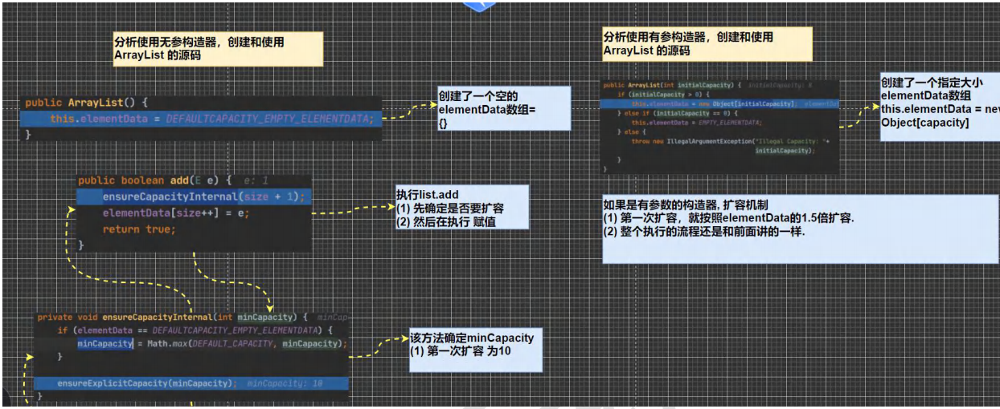
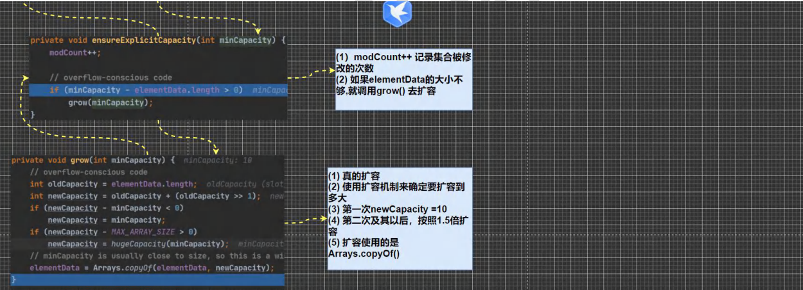

# Java 集合框架

> **本章重点：** Collection、List、Set、Map、泛型集合、Collections工具类
>
> **面试频率：** ⭐⭐⭐⭐⭐

---

## 目录

- [一、集合与数组的区别](#一集合与数组的区别)
- [二、集合框架体系](#二集合框架体系)
- [三、Collection接口](#三collection接口)
- [四、List接口](#四list接口)
- [五、Set接口](#五set接口)
- [六、Map接口](#六map接口)
- [七、集合选择指南](#七集合选择指南)
- [八、Collections工具类](#八collections工具类)
- [九、面试常见问题](#九面试常见问题)

---

## 一、集合与数组的区别

### 1.1 对比表格

| 特性 | 数组               | 集合                       |
| ---- | ------------------ | -------------------------- |
| 长度 | 固定，创建后不可变 | 动态，可自动扩容           |
| 类型 | 只能存储同一类型   | 可以存储不同类型（Object） |
| 操作 | 需要手动扩容，麻烦 | 提供丰富的API方法          |
| 存储 | 基本类型和引用类型 | 只能存储引用类型           |
| 性能 | 访问快             | 功能强大，易用             |

### 1.2 数组的局限性

**数组扩容示例：**

```java
// 数组扩容很麻烦
Person[] persons = new Person[1];
persons[0] = new Person("张三");

// 需要添加新元素，必须创建新数组
Person[] newPersons = new Person[persons.length + 1];
for (int i = 0; i < persons.length; i++) {
    newPersons[i] = persons[i];  // 复制原数组
}
newPersons[newPersons.length - 1] = new Person("李四");  // 添加新元素
persons = newPersons;  // 指向新数组
```

### 1.3 集合的优势

**集合操作简单：**

```java
// 集合自动扩容，操作简单
List<Person> list = new ArrayList<>();
list.add(new Person("张三"));
list.add(new Person("李四"));  // 直接添加，无需手动扩容
list.remove(0);  // 直接删除
Person p = list.get(1);  // 直接获取
```

---

## 二、集合框架体系

### 2.1 框架结构图

```
                    Collection (接口)
                    /              \
                List (接口)        Set (接口)
               /     |     \           |      \
         ArrayList Vector LinkedList HashSet TreeSet
                                          |
                                   LinkedHashSet

                    Map (接口)
                    /     |      \
              HashMap Hashtable TreeMap
                 |
            LinkedHashMap
```

### 2.2 两大接口体系

**1. Collection 接口（单列集合）**

- **List**：有序、可重复
  - ArrayList：动态数组
  - LinkedList：双向链表
  - Vector：线程安全的动态数组

- **Set**：无序、不可重复
  - HashSet：基于HashMap
  - LinkedHashSet：保持插入顺序
  - TreeSet：自动排序

**2. Map 接口（双列集合）**

- HashMap：键值对存储，无序
- LinkedHashMap：保持插入顺序
- TreeMap：按键排序
- Hashtable：线程安全
- Properties：配置文件

---

## 三、Collection接口

### 3.1 Collection接口特点

**接口定义：**

```java
public interface Collection<E> extends Iterable<E>
```

**特点：**

1. 可以存放多个元素，每个元素是Object类型
2. 有些实现类可以存放重复元素（List），有些不可以（Set）
3. 有些实现类是有序的（List），有些是无序的（Set）
4. Collection没有直接实现类，通过子接口List和Set实现

### 3.2 常用方法

| 方法                        | 说明                 |
| --------------------------- | -------------------- |
| `add(E e)`                  | 添加单个元素         |
| `remove(Object o)`          | 删除指定元素         |
| `contains(Object o)`        | 判断是否包含某元素   |
| `size()`                    | 获取元素个数         |
| `isEmpty()`                 | 判断是否为空         |
| `clear()`                   | 清空集合             |
| `addAll(Collection c)`      | 添加多个元素         |
| `containsAll(Collection c)` | 判断是否包含所有元素 |
| `removeAll(Collection c)`   | 删除多个元素         |


```java
package D829;

import java.util.ArrayList;
import java.util.List;

public class CollectionMethod {
    @SuppressWarnings({"all"})
    public static void main(String[] args) {
        List list = new ArrayList();

        // add:添加单个元素
        list.add("jack");
        list.add(10);//list.add(new Integer(10))
        list.add(true);
        System.out.println("list=" + list);

        // remove:删除指定元素
        // list.remove(0);//删除第一个元素
        list.remove(true);//指定删除某个元素
        System.out.println("list=" + list);

        // contains:查找元素是否存在
        System.out.println(list.contains("jack"));//T

        // size:获取元素个数
        System.out.println(list.size());//2

        // isEmpty:判断是否为空
        System.out.println(list.isEmpty());//F

        // clear:清空
        list.clear();
        System.out.println("list=" + list);

        // addAll:添加多个元素
        ArrayList list2 = new ArrayList();
        list2.add("红楼梦");
        list2.add("三国演义");
        list.addAll(list2);
        System.out.println("list=" + list);

        // containsAll:查找多个元素是否都存在
        System.out.println(list.containsAll(list2));//T

        // removeAll：删除多个元素
        list.add("聊斋");
        list.removeAll(list2);
        System.out.println("list=" + list);//[聊斋]
        //说明：以ArrayList实现类来演示.
    }
}
```

### 3.3 Collection 遍历方式

Collection 提供了三种遍历方式：迭代器、增强for循环、forEach（JDK 8+）

#### 方式一：Iterator 迭代器（推荐）

**特点：**

1. Iterator 对象称为迭代器，专门用于遍历集合
2. 所有 Collection 的实现类都有 `iterator()` 方法
3. Iterator 本身不存放对象，只是用于遍历

**基本用法：**

```java
Iterator iterator = collection.iterator();
while (iterator.hasNext()) {
    Object obj = iterator.next();
    System.out.println(obj);
}
```

**Iterator 常用方法：**

- `hasNext()`：判断是否还有下一个元素
- `next()`：返回下一个元素（指针下移）
- `remove()`：删除当前元素

**快捷键：** 输入 `itit` 快速生成 while 循环

```java
import java.util.ArrayList;
import java.util.Collection;
import java.util.Iterator;

public class CollectionIterator{
    public static void main(String[] args) {
        Collection col = new ArrayList();
        
        col.add(new Book("三国演义", "罗贯中", 10.1));
        col.add(new Book("小李飞刀", "古龙", 5.1));
        col.add(new Book("红楼梦", "曹雪芹", 34.6));
        //System.out.println("col=" + col);
        
        //遍历 col集合
        //1. 先得到 col 对应的 迭代器
        Iterator iterator = col.iterator();
        while (iterator.hasNext()) {//判断是否还有数据
            //返回下一个元素，类型是Object
            Object obj = iterator.next();
            System.out.println("obj=" + obj);
        }
        
        //2. 当退出while 循环后 , 这时iterator迭代器，指向最后的元素
        iterator.next();//NoSuchElementException
        //3. 如果希望再次遍历，需要重置我们的迭代器
        iterator = col.iterator();
        System.out.println("===第二次遍历===");
        while (iterator.hasNext()) {
            Object obj = iterator.next();
            System.out.println("obj=" + obj);
        }
    }
}

class Book {
    private String name;
    private String author;
    private double price;

    public Book(String name, String author, double price) {
        this.name = name;
        this.author = author;
        this.price = price;
    }

    public String getName() {
        return name;
    }

    public void setName(String name) {
        this.name = name;
    }

    public double getPrice() {
        return price;
    }

    public void setPrice(double price) {
        this.price = price;
    }

    public String getAuthor() {
        return author;
    }

    public void setAuthor(String author) {
        this.author = author;
    }

    @Override
    public String toString() {
        return "Book{" +
                "name='" + name + '\'' +
                ", author='" + author + '\'' +
                ", price=" + price +
                '}';
    }
}
```

#### 方式二：增强 for 循环

**特点：**

1. 增强for循环是 Iterator 的简化版，本质相同
2. 只能用于遍历集合或数组
3. 代码更简洁，但功能不如迭代器强大

**语法：**

```java
for (元素类型 元素名 : 集合名或数组名) {
    // 访问元素
}
```

**快捷键：** 输入 `iter` 快速生成


```java
import java.util.ArrayList;
import java.util.Collection;
import java.util.Iterator;

public class CollectionIterator{
    public static void main(String[] args) {
        Collection col = new ArrayList();
        
        col.add(new Book("三国演义", "罗贯中", 10.1));
        col.add(new Book("小李飞刀", "古龙", 5.1));
        col.add(new Book("红楼梦", "曹雪芹", 34.6));
        //System.out.println("col=" + col);
        
        //使用增强for循环
        for(Object book : col){
            System.out.println("book" + book);
        }
    
    }
}
class Book {
   ...
}
```


---

## 四、List接口

### 4.1 List 接口特点

**List 接口是 Collection 的子接口**

**核心特点：**

1. ✅ **有序**：添加顺序和取出顺序一致
2. ✅ **可重复**：允许存储重复元素
3. ✅ **有索引**：每个元素都有对应的整数索引（从0开始）
4. ✅ **可以通过索引精确控制元素**

**常用实现类：**

- **ArrayList**：动态数组，查询快
- **LinkedList**：双向链表，增删快
- **Vector**：线程安全的动态数组（已过时）

```java
import java.util.ArrayList;
import java.util.List;

public class Main{
    @SuppressWarnings({"all"})
    public static void main(String[] args){
        //1.List集合类中元素有序(即添加顺序和取出顺序一致)、且可重复[案例]
        List list = new ArrayList();
        list.add("jack");
        list.add("tom");
        list.add("mary");
        list.add("hsp");
        list.add("tom");
        System.out.println("list="+list);
        //2.List集合中的每个元素都有其对应的顺序索引，即支持索引
        //索引是从0开始的
        System.out.println(list.get(3));//hsp
    }
}
```

### 4.2 List 特有方法

List 除了继承 Collection 的方法外，还有一些特有的方法：

| 方法                                | 说明                   |
| ----------------------------------- | ---------------------- |
| `void add(int index, E element)`    | 在指定位置插入元素     |
| `E get(int index)`                  | 获取指定位置的元素     |
| `E set(int index, E element)`       | 替换指定位置的元素     |
| `E remove(int index)`               | 删除指定位置的元素     |
| `int indexOf(Object o)`             | 返回元素首次出现的位置 |
| `int lastIndexOf(Object o)`         | 返回元素最后出现的位置 |
| `List<E> subList(int from, int to)` | 返回子列表 [from, to)  |

**示例代码：**

```java
import java.util.ArrayList;
import java.util.List;

public class ListMethod {
    @SuppressWarnings({"all"})
    public static void main(String[] args) {
        List list = new ArrayList();
        list.add("张三丰");
        list.add("贾宝玉");
      
        // void add(int index, Object ele):在 index 位置插入 ele 元素
        // 在 index = 1 的位置插入一个对象
        list.add(1, "林黛玉");
        System.out.println("list=" + list);
        
        // boolean addAll(int index, Collection eles):从 index 位置开始将 eles 中的所有元素添加进来
        List list2 = new ArrayList();
        list2.add("jack");
        list2.add("tom");
        list.addAll(1, list2);
        System.out.println("list=" + list);
        
        // Object get(int index):获取指定 index 位置的元素

        // int indexOf(Object obj):返回 obj 在集合中首次出现的位置
        System.out.println(list.indexOf("tom"));//2
        
        // int lastIndexOf(Object obj):返回 obj 在当前集合中末次出现的位置
        list.add("林黛玉");
        System.out.println("list=" + list);
        System.out.println(list.lastIndexOf("林黛玉"));
        
        // Object remove(int index):移除指定 index 位置的元素，并返回此元素
        list.remove(0);
        System.out.println("list=" + list);
        
        // Object set(int index, Object ele):设置指定 index 位置的元素为 ele , 相当于是替换.
        list.set(1, "玛丽");
        System.out.println("list=" + list);
        
        // List subList(int fromIndex, int toIndex):返回从 fromIndex 到 toIndex 位置的子集合
        // 注意返回的子集合 fromIndex <= subList < toIndex
        List returnlist = list.subList(0, 2);
        System.out.println("returnlist=" + returnlist);
    }
}
```

### 4.3 List 的三种遍历方式

List 提供了三种遍历方式（适用于 ArrayList、LinkedList、Vector）：

| 遍历方式        | 特点               | 推荐度 |
| --------------- | ------------------ | ------ |
| **普通for循环** | 可以使用索引，灵活 | ⭐⭐⭐⭐⭐  |
| **增强for循环** | 代码简洁           | ⭐⭐⭐⭐   |
| **迭代器**      | 功能强大，可以删除 | ⭐⭐⭐⭐   |

```java
import java.util.*;

public class ListFor {
@SuppressWarnings({"all"})
    public static void main(String[] args) {
        //List 接口的实现子类 Vector LinkedList
        //List list = new ArrayList();
        //List list = new Vector();
        List list = new LinkedList();
        list.add("jack");
        list.add("tom");
        list.add("鱼香肉丝");
        list.add("北京烤鸭子");
        //遍历
        //1. 迭代器
        Iterator iterator = list.iterator();
        while (iterator.hasNext()) {
            Object obj = iterator.next();
            System.out.println(obj);
        }
        System.out.println("=====增强 for=====");
        
        //2. 增强 for
        for (Object o : list) {
            System.out.println("o=" + o);
        }
        System.out.println("=====普通 for====");
        
        //3. 使用普通 for
        for (int i = 0; i < list.size(); i++) {
            System.out.println("对象=" + list.get(i));
        }
    }
}
```


### 4.4 ArrayList 底层分析

#### 4.4.1 ArrayList 特点

| 特点         | 说明                            |
| ------------ | ------------------------------- |
| **底层实现** | 动态数组 `Object[] elementData` |
| **初始容量** | 无参构造：0，第一次添加扩容为10 |
| **扩容机制** | 扩容为原来的 1.5 倍             |
| **允许null** | 可以存储 null，且可以多个       |
| **线程安全** | 不安全（效率高）                |
| **适用场景** | 查询多，增删少                  |

#### 4.4.2 ArrayList 扩容机制

**无参构造器：**

1. 初始容量为 0
2. 第一次 `add()` 时扩容为 10
3. 后续扩容为当前容量的 1.5 倍

**有参构造器：**

1. 初始容量为指定大小
2. 扩容为当前容量的 1.5 倍

**底层源码关键点：**

```java
// 底层数组（transient 表示不参与序列化）
transient Object[] elementData;

// 扩容核心代码
int newCapacity = oldCapacity + (oldCapacity >> 1);  // 1.5倍
```

```java
import java.util.ArrayList;

@SuppressWarnings({"all"})
public class ArrayListSource {
    public static void main(String[] args) {
        // 解读源码：
        // 注意，注意，注意，Idea 默认情况下，Debug 显示的数据是简化后的，如果希望看到完整的数据
        // 需要做设置. 
        // 使用无参构造器创建 ArrayList 对象
        // ArrayList list = new ArrayList();
        ArrayList list = new ArrayList(8);
        //使用 for 给 list 集合添加 1 - 10 数据
        for (int i = 1; i <= 10; i++) {
            list.add(i);
        }
        //使用 for 给 list 集合添加 11-15 数据
        for (int i = 11; i <= 15; i++) {
            list.add(i);
        }
        list.add(100);
        list.add(200);
        list.add(null);
    }
}
```



---




### 4.5 Vector 底层分析

#### 4.5.1 Vector 特点

**类定义：**

```java
public class Vector<E> extends AbstractList<E>
    implements List<E>, RandomAccess, Cloneable, Serializable
```

**特点对比：**

| 特点         | Vector               | ArrayList               |
| ------------ | -------------------- | ----------------------- |
| **底层实现** | 动态数组             | 动态数组                |
| **初始容量** | 10                   | 0（第一次添加扩容为10） |
| **扩容机制** | 扩容为原来的 **2倍** | 扩容为原来的 **1.5倍**  |
| **线程安全** | 安全（synchronized） | 不安全                  |
| **效率**     | 低                   | 高                      |
| **推荐度**   | ⭐（已过时）          | ⭐⭐⭐⭐⭐                   |

**线程安全示例：**

```java
public synchronized E get(int index) {
    if (index >= elementCount)
        throw new ArrayIndexOutOfBoundsException(index);
    return elementData(index);
}
```

#### 4.5.2 Vector 扩容机制

```java
import java.util.Vector;

@SuppressWarnings({"all"})
public class VectorTest{
    public static void main(String[] args) {
        //无参构造器
        //有参数的构造
        Vector vector = new Vector(8);
        for (int i = 0; i < 10; i++) {
            vector.add(i);
        }
        vector.add(100);
        System.out.println("vector=" + vector);
        
        /*
        //解读源码
        //1. new Vector() 底层
        public Vector() {
            this(10);
        }
        补充：如果是 Vector vector = new Vector(8);
        走的方法是:
        public Vector(int initialCapacity) {
            this(initialCapacity, 0);
        }
        
        2. vector.add(i)
        2.1 //下面这个方法就添加数据到 vector 集合
        public synchronized boolean add(E e) {
            modCount++;
            ensureCapacityHelper(elementCount + 1);
            elementData[elementCount++] = e;
            return true;
        }
        
        2.2 //确定是否需要扩容 条件 ： minCapacity - elementData.length>0
        private void ensureCapacityHelper(int minCapacity) {
        // overflow-conscious code
        if (minCapacity - elementData.length > 0)
        grow(minCapacity);
        }
        
        2.3 //如果 需要的数组大小 不够用，就扩容 , 扩容的算法
        //newCapacity = oldCapacity + ((capacityIncrement > 0) ?
        // capacityIncrement : oldCapacity);
        //就是扩容两倍. private void grow(int minCapacity) {
        // overflow-conscious code
        int oldCapacity = elementData.length;
        int newCapacity = oldCapacity + ((capacityIncrement > 0) ?
        capacityIncrement : oldCapacity);
        if (newCapacity - minCapacity < 0)
            newCapacity = minCapacity;
        if (newCapacity - MAX_ARRAY_SIZE > 0)
            newCapacity = hugeCapacity(minCapacity);
        elementData = Arrays.copyOf(elementData, newCapacity);
        }
        */
        
    }
}
```


### 4.6 ArrayList vs Vector 对比

| 特性     | ArrayList      | Vector           |
| -------- | -------------- | ---------------- |
| 版本     | JDK 1.2        | JDK 1.0          |
| 线程安全 | 不安全         | 安全             |
| 扩容倍数 | 1.5倍          | 2倍              |
| 效率     | 高             | 低               |
| 使用场景 | 单线程（推荐） | 多线程（已过时） |

**推荐：** 单线程用 ArrayList，多线程用 `Collections.synchronizedList()` 或 `CopyOnWriteArrayList`

---

## 五、Set接口

### 5.1 Set 接口特点

**Set 接口是 Collection 的子接口**

**核心特点：**

1. ❌ **无序**：存取顺序不一致（但取出顺序固定）
2. ❌ **不可重复**：不允许存储重复元素
3. ✅ **允许null**：最多一个 null 元素
4. ❌ **无索引**：不能通过索引访问元素

**常用实现类：**

- **HashSet**：无序，基于 HashMap
- **LinkedHashSet**：保持插入顺序
- **TreeSet**：自动排序

### 5.2 Set 常用方法

Set 的方法和 Collection 接口完全相同，没有特有方法。

### 5.3 Set 的遍历方式

Set 不支持索引访问，只能使用：

1. ✅ **迭代器**（推荐）
2. ✅ **增强for循环**
3. ❌ **普通for循环**（不支持）

```java
import java.util.HashSet;  
import java.util.Iterator;  
import java.util.Set;  
  
@SuppressWarnings({"all"})  
public class SetMethod {  
    public static void main(String[] args) {  
//1. 以 Set 接口的实现类 HashSet 来讲解 Set 接口的方法  
//2. set 接口的实现类的对象(Set 接口对象), 不能存放重复的元素, 可以添加一个 null
//3. set 接口对象存放数据是无序(即添加的顺序和取出的顺序不一致)  
//4. 注意：取出的顺序的顺序虽然不是添加的顺序，但是他的固定.   
        Set set = new HashSet();  
        set.add("john");  
        set.add("lucy");  
        set.add("john");//重复  
        set.add("jack");  
        set.add("hsp");  
        set.add("mary");  
        set.add(null);//  
        set.add(null);//再次添加 null
        
        for(int i = 0; i <10;i ++) {  
            System.out.println("set=" + set);  
        }  
        //遍历  
        //方式 1： 使用迭代器  
        System.out.println("=====使用迭代器====");  
        Iterator iterator = set.iterator();  
        while (iterator.hasNext()) {  
            Object obj = iterator.next();  
            System.out.println("obj=" + obj);  
        }  
        set.remove(null);  
        //方式 2: 增强 for        System.out.println("=====增强 for====");  
        for (Object o : set) {  
            System.out.println("o=" + o);  
        }  
        //set 接口对象，不能通过索引来获取  
    }  
}
```

### 5.4 HashSet 底层原理

**HashSet 特点：**

1. 底层是 **HashMap**（存储在 HashMap 的 key 中）
2. 利用 HashMap 的 key 不重复特性
3. 添加元素时先计算 `hashCode()`，再用 `equals()` 比较
4. 初始容量 16，加载因子 0.75，扩容为 2 倍

**去重原理：**

```
添加元素
  ↓
计算 hashCode()
  ↓
找到存储位置
  ↓
位置为空？
  ├─ 是 → 直接存储
  └─ 否 → equals() 比较
          ├─ 相同 → 不添加
          └─ 不同 → 链表/红黑树存储
```

```java
import java.util.HashSet;  
import java.util.Set;  

@SuppressWarnings({"all"})  
public class HashSetTest{  
    public static void main(String[] args) {  
  
    //1. 构造器走的源码  
    /*  
    public HashSet() {
        map = new HashMap<>();
    }
    */    
    
    // 2. HashSet 可以存放 null ,但是只能有一个 null,即元素不能重复  
        Set hashSet = new HashSet();  
        hashSet.add(null);  
        hashSet.add(null);  
        System.out.println("hashSet=" + hashSet);  
    }  
}
```

### 5.5 LinkedHashSet 特点

**LinkedHashSet 特点：**

- 继承自 HashSet
- 底层是 **LinkedHashMap**
- **保持插入顺序**（额外维护了双向链表）
- 其他特性同 HashSet

**适用场景：** 需要去重且保持插入顺序

---

## 六、Map接口

### 6.1 Map 接口特点

**Map 与 Collection 并列存在，用于存储键值对（Key-Value）**

**核心特点：**

| 特性             | 说明                          |
| ---------------- | ----------------------------- |
| **键值对**       | 存储 Key-Value 映射关系       |
| **key 唯一**     | key 不允许重复                |
| **value 可重复** | value 可以重复                |
| **允许 null**    | key 和 value 都可以为 null    |
| **key → value**  | 通过 key 可以找到唯一的 value |
| **数据类型**     | key 和 value 都是引用类型     |

**常用实现类：**

- **HashMap**：无序，效率高（推荐）
- **LinkedHashMap**：保持插入顺序
- **TreeMap**：按 key 排序
- **Hashtable**：线程安全（已过时）
- **Properties**：配置文件专用

```java
import java.util.HashMap;  
import java.util.Map;  
@SuppressWarnings({"all"})  
public class MapTest {  
    public static void main(String[] args) {  
        Map map = new HashMap();  
        map.put("no1", "懿轩");//k-v  
        map.put("no2", "张无忌");//k-v  
        map.put("no1", "张三丰");//当有相同的 k , 就等价于替换. 
        map.put("no3", "张三丰");//k-v  
        map.put(null, null); //k-v  
        map.put(null, "abc"); //等价替换  
        map.put("no4", null); //k-v  
        map.put("no5", null); //k-v  
        map.put(1, "赵敏");//k-v  
        map.put(new Object(), "金毛狮王");//k-v  
        // 通过 get 方法，传入 key ,会返回对应的 value        
        System.out.println(map.get("no2"));//张无忌  
        System.out.println("map=" + map);  
    }  
}
```

### 6.2 Map 常用方法

| 方法                                  | 说明                        |
| ------------------------------------- | --------------------------- |
| `V put(K key, V value)`               | 添加键值对（key存在则替换） |
| `V get(Object key)`                   | 根据key获取value            |
| `V remove(Object key)`                | 根据key删除键值对           |
| `boolean containsKey(Object key)`     | 判断是否包含某个key         |
| `boolean containsValue(Object value)` | 判断是否包含某个value       |
| `Set<K> keySet()`                     | 获取所有key的集合           |
| `Collection<V> values()`              | 获取所有value的集合         |
| `Set<Map.Entry<K,V>> entrySet()`      | 获取所有键值对的集合        |
| `int size()`                          | 获取键值对个数              |
| `void clear()`                        | 清空所有键值对              |

**示例代码：**

```java
import java.util.HashMap;  
import java.util.Map;  
@SuppressWarnings({"all"})  
public class MapMethod {  
    public static void main(String[] args) {  
    //演示 map 接口常用方法  
        Map map = new HashMap();  
        map.put("邓超", new Book("", 100));//OK  
        map.put("邓超", "孙俪");//替换-> 一会分析源码  
        map.put("王宝强", "马蓉");//OK  
        map.put("宋喆", "马蓉");//OK  
        map.put("刘令博", null);//OK  
        map.put(null, "刘亦菲");//OK  
        map.put("鹿晗", "关晓彤");//OK  
        map.put("hsp", "hsp 的老婆");  
        System.out.println("map=" + map);  
        
        // remove:根据键删除映射关系  
        map.remove(null);  
        System.out.println("map=" + map);  
        
        // get：根据键获取值  
        Object val = map.get("鹿晗");  
        System.out.println("val=" + val);  
        
        // size:获取元素个数  
        System.out.println("k-v=" + map.size());  
        
        // isEmpty:判断个数是否为 0        
        System.out.println(map.isEmpty());//F  
        
        // clear:清除 k-v        
        // map.clear();        
        System.out.println("map=" + map);  
        
        // containsKey:查找键是否存在  
        System.out.println("结果=" + map.containsKey("hsp"));//T  
    }  
}  
class Book {  
    private String name;  
    private int num;  
    public Book(String name, int num) {  
        this.name = name;  
        this.num = num;  
    }  
}
```

### 6.3 Map 的四种遍历方式

Map 提供了四种遍历方式：

| 遍历方式               | 特点               | 推荐度        |
| ---------------------- | ------------------ | ------------- |
| **keySet() + get()**   | 通过key获取value   | ⭐⭐⭐           |
| **values()**           | 只遍历value        | ⭐⭐            |
| **entrySet() + Entry** | 同时获取key和value | ⭐⭐⭐⭐⭐（推荐） |
| **forEach（JDK 8+）**  | Lambda表达式       | ⭐⭐⭐⭐          |

```java
import java.util.*;  
@SuppressWarnings({"all"})  
public class MapFor{  
    public static void main(String[] args) {  
        Map map = new HashMap();  
        map.put("邓超", "孙俪");  
        map.put("王宝强", "马蓉");  
        map.put("宋喆", "马蓉");  
        map.put("刘令博", null);  
        map.put(null, "刘亦菲");  
        map.put("鹿晗", "关晓彤");  
        
        //第一组: 先取出 所有的 Key , 通过 Key 取出对应的 Value        
        Set keyset = map.keySet();  
        //(1) 增强 for        
        System.out.println("-----第一种方式-------");  
        for (Object key : keyset) {  
            System.out.println(key + "-" + map.get(key));  
        }  
        //(2) 迭代器  
        System.out.println("----第二种方式--------");  
        Iterator iterator = keyset.iterator();  
        while (iterator.hasNext()) {  
            Object key = iterator.next();  
            System.out.println(key + "-" + map.get(key));  
        }  
          
        //第二组: 把所有的 values 取出  
        Collection values = map.values();  
        //这里可以使用所有的 Collections 使用的遍历方法  
        //(1) 增强 for        
        System.out.println("---取出所有的 value 增强 for----");  
        for (Object value : values) {  
            System.out.println(value);  
        }  
        //(2) 迭代器  
        System.out.println("---取出所有的 value 迭代器----");  
        Iterator iterator2 = values.iterator();  
        while (iterator2.hasNext()) {  
            Object value = iterator2.next();  
            System.out.println(value);  
        }  
          
        //第三组: 通过 EntrySet 来获取 k-v        
        Set entrySet = map.entrySet();// EntrySet<Map.Entry<K,V>>  
        //(1) 增强 for        
        System.out.println("----使用 EntrySet 的 for 增强(第 3 种)----");  
        for (Object entry : entrySet) {  
            //将 entry 转成 Map.Entry            
            Map.Entry m = (Map.Entry) entry;  
            System.out.println(m.getKey() + "-" + m.getValue());  
        }  
        //(2) 迭代器  
        System.out.println("----使用 EntrySet 的 迭代器(第 4 种)----");  
        Iterator iterator3 = entrySet.iterator();  
        while (iterator3.hasNext()) {  
            Object entry = iterator3.next();  
            //System.out.println(next.getClass());
            //HashMap$Node -实现-> Map.Entry (getKey,getValue)  
            //向下转型 Map.Entry            
            Map.Entry m = (Map.Entry) entry;  
            System.out.println(m.getKey() + "-" + m.getValue());  
        }  
    }  
}
```

### 6.4 HashMap 底层原理

#### 6.4.1 HashMap 特点

**类定义：**

```java
public class HashMap<K,V> extends AbstractMap<K,V>
    implements Map<K,V>, Cloneable, Serializable
```

**核心特点：**

| 特性 | 说明 |
|------|------|
| **底层实现** | JDK 7：数组 + 链表<br>JDK 8+：数组 + 链表 + 红黑树 |
| **初始容量** | 16 |
| **加载因子** | 0.75（扩容阈值 = 容量 × 0.75） |
| **扩容机制** | 扩容为原来的 2 倍 |
| **key唯一性** | 通过 hashCode() 和 equals() 保证 |
| **允许null** | key 和 value 都可以为 null（key只能一个） |
| **线程安全** | 不安全（效率高） |
| **有序性** | 无序（不保证顺序） |

#### 6.4.2 HashMap 底层结构

**JDK 8 之后的结构：**

```
数组（Node[] table）
  ↓
每个数组元素是一个链表的头节点
  ↓
链表长度 > 8 && 数组长度 ≥ 64
  ↓
链表转换为红黑树（提高查询效率）
```

**Node 节点结构：**

```java
static class Node<K,V> implements Map.Entry<K,V> {
    final int hash;    // 哈希值
    final K key;       // 键
    V value;           // 值
    Node<K,V> next;    // 下一个节点
}
```

#### 6.4.3 HashMap 扩容机制

**扩容时机：**

1. 元素个数超过阈值（capacity × loadFactor）
2. 首次添加元素时初始化

**扩容过程：**

```java
// 1. 创建新数组（容量为原来的2倍）
newCapacity = oldCapacity << 1;  // 左移1位，相当于 × 2

// 2. 重新计算每个元素的位置（rehash）
// 3. 将元素移动到新数组
```

**示例代码：**

```java
import java.util.HashMap;

public class HashMapSource {
    public static void main(String[] args) {
        HashMap map = new HashMap();
        map.put("java", 10);
        map.put("php", 10);
        map.put("python", 10);
        
        System.out.println("map=" + map);
        
        /*
        解读HashMap源码：
        
        1. HashMap map = new HashMap();
           创建HashMap对象，底层：
           public HashMap() {
               this.loadFactor = DEFAULT_LOAD_FACTOR; // 0.75
           }
           注意：此时table数组还未创建
        
        2. map.put("java", 10);
           执行put方法：
           public V put(K key, V value) {
               return putVal(hash(key), key, value, false, true);
           }
           
           2.1 计算key的hash值：
           static final int hash(Object key) {
               int h;
               return (key == null) ? 0 : (h = key.hashCode()) ^ (h >>> 16);
           }
           
           2.2 执行putVal方法：
           - 首次添加时，table数组为null，进行扩容
           - 扩容到16，阈值为12（16 × 0.75）
           - 根据hash值计算存储位置：(n - 1) & hash
           - 如果位置为空，直接存储
           - 如果位置有元素，判断key是否相同
             - 相同：替换value
             - 不同：以链表形式存储（JDK 8：尾插法）
           
           2.3 链表转红黑树：
           - 链表长度 > 8 && 数组长度 ≥ 64
           - 转换为红黑树，提高查询效率（O(log n)）
        
        3. 扩容机制：
           - 当size > threshold时扩容
           - 新容量 = 旧容量 × 2
           - 重新计算元素位置（rehash）
        */
    }
}
```

#### 6.4.4 HashMap 去重原理

**添加元素流程：**

```
添加 key-value
  ↓
计算 key 的 hashCode()
  ↓
根据 hash 值找到数组位置：(n-1) & hash
  ↓
位置为空？
  ├─ 是 → 直接存储
  └─ 否 → equals() 比较 key
          ├─ 相同 → 替换 value
          └─ 不同 → 链表/红黑树存储
```

**重要方法：**

1. **hashCode()**：确定存储位置
2. **equals()**：确认是否为同一个key

**为什么重写 equals() 必须重写 hashCode()？**

- 如果两个对象 equals() 返回 true，它们的 hashCode() 必须相同
- 否则在 HashMap 中会被当作不同的 key

**示例：**

```java
class Person {
    private String name;
    private int age;
    
    // 必须同时重写 hashCode 和 equals
    @Override
    public int hashCode() {
        return Objects.hash(name, age);
    }
    
    @Override
    public boolean equals(Object o) {
        if (this == o) return true;
        if (o == null || getClass() != o.getClass()) return false;
        Person person = (Person) o;
        return age == person.age && Objects.equals(name, person.name);
    }
}
```
   
   


### 6.5 Hashtable 底层原理

#### 6.5.1 Hashtable 特点

**类定义：**

```java
public class Hashtable<K,V> extends Dictionary<K,V>
    implements Map<K,V>, Cloneable, Serializable
```

**核心特点：**

| 特性 | 说明 |
|------|------|
| **底层实现** | 数组 + 链表（没有红黑树） |
| **初始容量** | 11 |
| **加载因子** | 0.75 |
| **扩容机制** | 扩容为原来的 2倍 + 1 |
| **线程安全** | 安全（synchronized） |
| **允许null** | key 和 value 都不允许 null |
| **效率** | 低（因为同步） |
| **继承** | Dictionary（古老的类） |

#### 6.5.2 Hashtable 底层结构

**底层数组：**

```java
private transient Entry<?,?>[] table;

static class Entry<K,V> implements Map.Entry<K,V> {
    final int hash;
    final K key;
    V value;
    Entry<K,V> next;  // 链表结构
}
```

**与 HashMap 的区别：**

1. 线程安全：所有方法都加了 `synchronized`
2. 不允许 null：key 和 value 都不能为 null
3. 扩容方式：2n + 1（HashMap 是 2n）
4. 初始容量：11（HashMap 是 16）

**示例代码：**

```java
import java.util.Hashtable;

public class HashtableSource {
    public static void main(String[] args) {
        Hashtable hashtable = new Hashtable();
        hashtable.put("john", 100);
        hashtable.put("lucy", 200);
        hashtable.put("tom", 300);
        
        System.out.println("hashtable=" + hashtable);
        
        /*
        解读Hashtable源码：
        
        1. Hashtable hashtable = new Hashtable();
           底层：
           public Hashtable() {
               this(11, 0.75f);  // 初始容量11，加载因子0.75
           }
           创建大小为11的Entry数组
        
        2. hashtable.put("john", 100);
           public synchronized V put(K key, V value) {
               // 不允许value为null
               if (value == null) {
                   throw new NullPointerException();
               }
               // 不允许key为null（因为要调用key.hashCode()）
               int hash = key.hashCode();
               int index = (hash & 0x7FFFFFFF) % tab.length;
               // 存储元素
           }
        
        3. 扩容机制：
           - 临界值：threshold = capacity * loadFactor
           - 扩容大小：int newCapacity = (oldCapacity << 1) + 1;  // 2n + 1
           - 例如：11 → 23 → 47 → 95
        */
    }
}
```

### 6.6 HashMap 和 Hashtable 对比

**详细对比表：**

| 特性 | HashMap | Hashtable |
|------|---------|-----------|
| **版本** | JDK 1.2 | JDK 1.0 |
| **线程安全** | 不安全 | 安全（synchronized） |
| **效率** | 高 | 低 |
| **null键** | 允许1个null键 | 不允许 |
| **null值** | 允许多个null值 | 不允许 |
| **初始容量** | 16 | 11 |
| **扩容倍数** | 2倍 | 2倍 + 1 |
| **底层结构** | 数组+链表+红黑树 | 数组+链表 |
| **继承** | AbstractMap | Dictionary |
| **推荐度** | ⭐⭐⭐⭐⭐ | ⭐（已过时） |

**性能对比：**

```java
// HashMap - 效率高（无同步）
HashMap<String, Integer> hashMap = new HashMap<>();
hashMap.put("key", 1);  // 快

// Hashtable - 效率低（同步锁）
Hashtable<String, Integer> hashtable = new Hashtable<>();
hashtable.put("key", 1);  // 慢（每次操作都加锁）
```

**使用建议：**

1. ✅ **单线程**：使用 HashMap
2. ✅ **多线程**：
   - 推荐：`ConcurrentHashMap`（分段锁，效率高）
   - 或者：`Collections.synchronizedMap(new HashMap<>())`
   - 不推荐：Hashtable（已过时）

**示例对比：**

```java
import java.util.*;
import java.util.concurrent.ConcurrentHashMap;

public class MapComparison {
    public static void main(String[] args) {
        // 1. HashMap - 推荐（单线程）
        Map<String, Integer> hashMap = new HashMap<>();
        hashMap.put(null, 1);      // ✅ 允许null键
        hashMap.put("key", null);  // ✅ 允许null值
        
        // 2. Hashtable - 不推荐（已过时）
        Map<String, Integer> hashtable = new Hashtable<>();
        // hashtable.put(null, 1);     // ❌ 抛出NullPointerException
        // hashtable.put("key", null); // ❌ 抛出NullPointerException
        
        // 3. ConcurrentHashMap - 推荐（多线程）
        Map<String, Integer> concurrentMap = new ConcurrentHashMap<>();
        concurrentMap.put("key", 1);  // ✅ 线程安全且高效
        // concurrentMap.put(null, 1); // ❌ 不允许null
        
        // 4. SynchronizedMap - 备选（多线程）
        Map<String, Integer> syncMap = Collections.synchronizedMap(new HashMap<>());
        syncMap.put("key", 1);  // ✅ 线程安全
    }
}
```

### 6.7 Properties 底层原理

#### 6.7.1 Properties 特点

**类定义：**

```java
public class Properties extends Hashtable<Object,Object>
```

**核心特点：**

1. ✅ Properties 继承自 Hashtable，也是键值对存储
2. ✅ key 和 value 都是 String 类型（建议）
3. ✅ 专门用于读写配置文件（.properties）
4. ✅ 线程安全（继承自Hashtable）
5. ❌ key 和 value 都不能为 null

**配置文件格式：**

```properties
# 这是注释
username=admin
password=123456
url=jdbc:mysql://localhost:3306/db
```

#### 6.7.2 Properties 常用方法

| 方法 | 说明 |
|------|------|
| `setProperty(String key, String value)` | 设置属性 |
| `getProperty(String key)` | 获取属性值 |
| `getProperty(String key, String defaultValue)` | 获取属性值（带默认值） |
| `load(InputStream inStream)` | 从输入流加载配置 |
| `load(Reader reader)` | 从字符流加载配置 |
| `store(OutputStream out, String comments)` | 保存到输出流 |
| `store(Writer writer, String comments)` | 保存到字符流 |
| `list(PrintStream out)` | 列出所有属性 |

#### 6.7.3 基本使用

**说明：** 工作中 xxx.properties 文件通常作为配置文件使用，详细内容可参考 [IO流章节](./07-IO流文件操作.md)

```java
import java.util.Properties;  
  
@SuppressWarnings({"all"})  
public class Properties_ {  
    public static void main(String[] args) {  
        //解读  
        //1. Properties 继承 Hashtable        
        //2. 可以通过 k-v 存放数据，当然 key 和 value 不能为 null        
        //增加  
        Properties properties = new Properties();  
        //properties.put(null, "abc");//抛出 空指针异常  
        //properties.put("abc", null);//抛出 空指针异常  
        properties.put("john", 100);//k-v  
        properties.put("lucy", 100);  
        properties.put("lic", 100);  
        properties.put("lic", 88);//如果有相同的 key ， value 被替换  
        System.out.println("properties=" + properties);  
        //通过 k 获取对应值  
        System.out.println(properties.get("lic"));//88  
        //删除  
        properties.remove("lic");  
        System.out.println("properties=" + properties);  
        //修改  
        properties.put("john", "约翰");  
        System.out.println("properties=" + properties);  
    }  
}
```

---

## 七、集合选择指南

### 7.1 选择流程图

```
存储数据
  ├─ 单个对象 → Collection
  │   ├─ 允许重复 → List
  │   │   ├─ 查询多 → ArrayList
  │   │   └─ 增删多 → LinkedList
  │   └─ 不允许重复 → Set
  │       ├─ 无序 → HashSet
  │       ├─ 排序 → TreeSet
  │       └─ 保持顺序 → LinkedHashSet
  └─ 键值对 → Map
      ├─ 无序 → HashMap
      ├─ 排序 → TreeMap
      ├─ 保持顺序 → LinkedHashMap
      └─ 配置文件 → Properties
```

### 7.2 选择建议表

| 需求         | 推荐集合          | 理由                |
| ------------ | ----------------- | ------------------- |
| 频繁查询     | ArrayList         | 底层数组，查询O(1)  |
| 频繁增删     | LinkedList        | 双向链表，增删O(1)  |
| 去重         | HashSet           | 基于HashMap，去重快 |
| 去重+排序    | TreeSet           | 红黑树，自动排序    |
| 键值对存储   | HashMap           | 哈希表，效率高      |
| 键值对+排序  | TreeMap           | 红黑树，按key排序   |
| 保持插入顺序 | LinkedHashMap     | 额外维护链表        |
| 线程安全     | ConcurrentHashMap | 分段锁，效率高      |


---

## 八、Collections工具类

### 8.1 Collections 简介

**Collections 是操作集合的工具类**（注意与 Collection 接口区分）

**特点：**

- 提供了一系列 **static** 方法
- 用于对集合进行排序、查找、修改等操作
- 类似于数组的工具类 Arrays

### 8.2 Collections 常用方法

#### 排序操作

| 方法                       | 说明                 |
| -------------------------- | -------------------- |
| `reverse(List)`            | 反转List中元素的顺序 |
| `shuffle(List)`            | 随机排序             |
| `sort(List)`               | 自然顺序升序排序     |
| `sort(List, Comparator)`   | 自定义排序规则       |
| `swap(List, int i, int j)` | 交换i和j位置的元素   |

#### 查找操作

| 方法                            | 说明             |
| ------------------------------- | ---------------- |
| `max(Collection)`               | 返回最大元素     |
| `min(Collection)`               | 返回最小元素     |
| `frequency(Collection, Object)` | 返回元素出现次数 |

#### 修改操作

| 方法                               | 说明           |
| ---------------------------------- | -------------- |
| `copy(List dest, List src)`        | 复制集合       |
| `replaceAll(List, oldVal, newVal)` | 替换所有旧值   |
| `fill(List, Object)`               | 用指定元素填充 |

### 8.3 示例代码

```java
import java.util.*;

@SuppressWarnings({"all"})
public class Collections_ {
    public static void main(String[] args) {
        //创建 ArrayList 集合，用于测试. 
        List list = new ArrayList();
        list.add("tom");
        list.add("smith");
        list.add("king");
        list.add("milan");
        list.add("tom");
        // reverse(List)：反转 List 中元素的顺序
        Collections.reverse(list);
        System.out.println("list=" + list);
        // shuffle(List)：对 List 集合元素进行随机排序
        // for (int i = 0; i < 5; i++) {
        // Collections.shuffle(list);
        // System.out.println("list=" + list);
        // }
        
        // sort(List)：根据元素的自然顺序对指定 List 集合元素按升序排序
        Collections.sort(list);
        System.out.println("自然排序后");
        System.out.println("list=" + list);
        // sort(List，Comparator)：根据指定的 Comparator 产生的顺序对 List 集合元素进行排序
        //我们希望按照 字符串的长度大小排序
        Collections.sort(list, new Comparator() {
            @Override
            public int compare(Object o1, Object o2) {
            //可以加入校验代码. 
                return ((String) o2).length() - ((String) o1).length();
            }
        });
        System.out.println("字符串长度大小排序=" + list);
        // swap(List，int， int)：将指定 list 集合中的 i 处元素和 j 处元素进行交换
        //比如
        Collections.swap(list, 0, 1);
        System.out.println("交换后的情况");
        System.out.println("list=" + list);
        //Object max(Collection)：根据元素的自然顺序，返回给定集合中的最大元素
        System.out.println("自然顺序最大元素=" + Collections.max(list));
        //Object max(Collection，Comparator)：根据 Comparator 指定的顺序，返回给定集合中的最大元素
        //比如，我们要返回长度最大的元素
        Object maxObject = Collections.max(list, new Comparator() {
            @Override
            public int compare(Object o1, Object o2) {
                return ((String)o1).length() - ((String)o2).length();
            }
        });
        System.out.println("长度最大的元素=" + maxObject);
        //Object min(Collection)
        //Object min(Collection，Comparator)
        //上面的两个方法，参考 max 即可
        //int frequency(Collection，Object)：返回指定集合中指定元素的出现次数
        System.out.println("tom 出现的次数=" + Collections.frequency(list, "tom"));
        //void copy(List dest,List src)：将 src 中的内容复制到 dest 中
        ArrayList dest = new ArrayList();
        //为了完成一个完整拷贝，我们需要先给 dest 赋值，大小和 list.size()一样
        for(int i = 0; i < list.size(); i++) {
            dest.add("");
        }
        //拷贝
        Collections.copy(dest, list);
        System.out.println("dest=" + dest);
        //boolean replaceAll(List list，Object oldVal，Object newVal)：使用新值替换 List 对象的所有旧值
        //如果 list 中，有 tom 就替换成 汤姆
        Collections.replaceAll(list, "tom", "汤姆");
        System.out.println("list 替换后=" + list);
    }
}
```

### 8.4 使用注意事项

**重要提示：**

1. **静态方法调用**

   - 所有方法都是 `static` 方法
   - 直接通过 `Collections.方法名()` 调用
   - 无需创建 Collections 对象

2. **copy() 方法特殊要求**

   ```java
   // ❌ 错误：目标集合为空
   List dest = new ArrayList<>();
   Collections.copy(dest, src);  // 抛出异常
   
   // ✅ 正确：目标集合大小 ≥ 源集合
   List dest = new ArrayList<>();
   for (int i = 0; i < src.size(); i++) {
       dest.add("");  // 先填充元素
   }
   Collections.copy(dest, src);
   ```

3. **自定义排序规则**

   ```java
   // 使用 Comparator 自定义排序
   Collections.sort(list, new Comparator<String>() {
       @Override
       public int compare(String s1, String s2) {
           return s2.length() - s1.length();  // 按长度降序
       }
   });
   
   // JDK 8+ Lambda 表达式
   Collections.sort(list, (s1, s2) -> s2.length() - s1.length());
   ```

4. **线程安全转换**

   ```java
   // 将线程不安全的集合转为线程安全
   List<String> list = new ArrayList<>();
   List<String> syncList = Collections.synchronizedList(list);
   
   Map<String, Object> map = new HashMap<>();
   Map<String, Object> syncMap = Collections.synchronizedMap(map);
   ```

**常用工具方法总结：**

| 分类         | 方法                            | 功能                       |
| ------------ | ------------------------------- | -------------------------- |
| **查找**     | `max(Collection)`               | 返回最大元素（自然顺序）   |
|              | `min(Collection)`               | 返回最小元素（自然顺序）   |
|              | `max(Collection, Comparator)`   | 返回最大元素（自定义规则） |
|              | `min(Collection, Comparator)`   | 返回最小元素（自定义规则） |
|              | `frequency(Collection, Object)` | 统计元素出现次数           |
| **修改**     | `copy(List dest, List src)`     | 复制集合                   |
|              | `replaceAll(List, old, new)`    | 替换所有旧值               |
|              | `fill(List, Object)`            | 用指定元素填充             |
| **排序**     | `sort(List)`                    | 自然顺序排序               |
|              | `sort(List, Comparator)`        | 自定义排序                 |
|              | `reverse(List)`                 | 反转列表                   |
|              | `shuffle(List)`                 | 随机打乱                   |
| **线程安全** | `synchronizedList(List)`        | 返回线程安全的List         |
|              | `synchronizedSet(Set)`          | 返回线程安全的Set          |
|              | `synchronizedMap(Map)`          | 返回线程安全的Map          |

---

## 九、面试常见问题

### Q1: ArrayList 和 LinkedList 的区别？

**答案：**

| 特性     | ArrayList          | LinkedList         |
| -------- | ------------------ | ------------------ |
| 底层实现 | 动态数组           | 双向链表           |
| 随机访问 | 快 O(1)            | 慢 O(n)            |
| 插入删除 | 慢（需要移动元素） | 快（只需改变指针） |
| 内存占用 | 连续空间           | 额外指针开销       |
| 适用场景 | 查询多             | 增删多             |

---

### Q2: HashMap 和 Hashtable 的区别？

**答案：**

| 特性     | HashMap     | Hashtable            |
| -------- | ----------- | -------------------- |
| 线程安全 | 不安全      | 安全（synchronized） |
| 效率     | 高          | 低                   |
| null键值 | 允许        | 不允许               |
| 继承     | AbstractMap | Dictionary           |
| 推荐度   | ⭐⭐⭐⭐⭐       | ⭐（已过时）          |

---

### Q3: HashSet 如何保证元素不重复？

**答案：**

HashSet 底层是 HashMap，利用 HashMap 的 key 不重复特性：

1. 添加元素时调用 `hashCode()` 计算哈希值
2. 根据哈希值找到存储位置
3. 如果位置为空，直接存储
4. 如果位置有元素，调用 `equals()` 比较
5. 相同则不添加，不同则以链表或红黑树形式存储

---

### Q4: Collection 和 Collections 的区别？

**答案：**

- **Collection**：集合接口，定义了集合的基本操作
- **Collections**：工具类，提供了操作集合的静态方法（排序、查找等）

---

### Q5: 如何选择合适的集合？

**答案：**

**单列集合（Collection）：**

- 需要有序、可重复 → List
  - 查询多 → ArrayList
  - 增删多 → LinkedList
- 需要无序、不重复 → Set
  - 无序 → HashSet
  - 排序 → TreeSet
  - 保持插入顺序 → LinkedHashSet

**双列集合（Map）：**

- 无序 → HashMap
- 排序 → TreeMap
- 保持插入顺序 → LinkedHashMap
- 线程安全 → ConcurrentHashMap

---

**上一章：** [常用类](03-常用类（优化版）.md)

**下一章：** [泛型](05-泛型.md) →