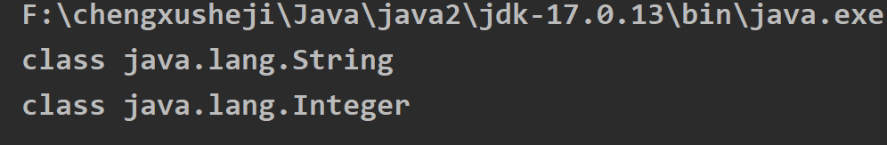
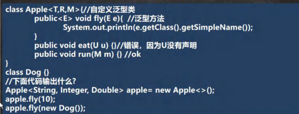

# Java 泛型

> **本章重点：** 泛型类、泛型接口、泛型方法、泛型通配符、类型擦除
> 
> **面试频率：** ⭐⭐⭐⭐⭐

---

## 目录
- [一、泛型入门](#一泛型入门)
- [二、泛型的理解和好处](#二泛型的理解和好处)
- [三、泛型的语法](#三泛型的语法)
- [四、自定义泛型](#四自定义泛型)
- [五、泛型的继承和通配符](#五泛型的继承和通配符)
- [六、面试常见问题](#六面试常见问题)

---

## 一、泛型入门

### 1.1 为什么需要泛型

**问题场景：** 在 ArrayList 中添加 Dog 对象，但不小心添加了 Cat 对象

### 1.2 传统方法的问题

```java
import java.util.ArrayList;
@SuppressWarnings({"all"})
public class Generic01 {
    public static void main(String[] args) {
        //使用传统的方法来解决
        ArrayList arrayList = new ArrayList();
        arrayList.add(new Dog("旺财", 10));
        arrayList.add(new Dog("发财", 1));
        arrayList.add(new Dog("小黄", 5));
        //假如我们的程序员，不小心，添加了一只猫
        arrayList.add(new Cat("招财猫", 8));
        
        //遍历
        for (Object o : arrayList) {
        //向下转型 Object ->Dog
            Dog dog = (Dog) o;
            System.out.println(dog.getName() + "-" + dog.getAge());
        }
    }
}

/*
泛型
1. 泛型：在定义类，接口，方法时，添加一个或者多个形参类型，在定义时，添加一个或者多个泛型，
   格式： <>
2. 泛型的作用：
      1) 避免强转
      2) 保证安全性
      3) 减少重复性代码
      4) 泛型方法
      5) 泛型接口
      6) 泛型类
      7) 泛型类继承泛型接口
      8) 泛型类实现泛型接口
/*
请编写程序，在 ArrayList 中，添加 3 个 Dog 对象
Dog 对象含有 name 和 age, 并输出 name 和 age (要求使用 getXxx())
*/
class Dog {
    private String name;
    private int age;
    public Dog(String name, int age) {
        this.name = name;
        this.age = age;
    }
    public String getName() {
        return name;
    }
    public void setName(String name) {
        this.name = name;
    }
    public int getAge() {
        return age;
    }
    public void setAge(int age) {
        this.age = age;
    }
}
class Cat { //Cat 类
    private String name;
    private int age;
    public Cat(String name, int age) {
        this.name = name;
        this.age = age;
    }
    public String getName() {
        return name;
    }
    public void setName(String name) {
        this.name = name;
    }
    public int getAge() {
        return age;
    }
    public void setAge(int age) {
        this.age = age;
    }
}
```


```java

import java.util.ArrayList;

@SuppressWarnings({"all"})
public class Generic {
    public static void main(String[] args) {

//使用传统的方法来解决===> 使用泛型

//1. 当我们 ArrayList<Dog> 表示存放到 ArrayList 集合中的元素是 Dog 类型 (细节后面说...)
//2. 如果编译器发现添加的类型，不满足要求，就会报错
//3. 在遍历的时候，可以直接取出 Dog 类型而不是 Object
//4. public class ArrayList<E> {} E 称为泛型,那么 Dog -> E

        ArrayList<Dog> arrayList = new ArrayList<Dog>();

        arrayList.add(new Dog("旺财", 10));

        arrayList.add(new Dog("发财", 1));

        arrayList.add(new Dog("小黄", 5));

        //假如我们的程序员，不小心，添加了一只猫
        //arrayList.add(new Cat("招财猫", 8));
        System.out.println("===使用泛型====");

        for (Dog dog : arrayList) {
            System.out.println(dog.getName() + "-" + dog.getAge());

        }

    }

}

/*
1.请编写程序，在 ArrayList 中，添加 3 个 Dog 对象
2.Dog 对象含有 name 和 age, 并输出 name 和 age (要求使用 getXxx())
3.使用泛型来完成代码
*/

class Dog {
    private String name;
    private int age;

    public Dog(String name, int age) {
        this.name = name;
        this.age = age;
    }

    public String getName() {
        return name;
    }

    public void setName(String name) {
        this.name = name;
    }

    public int getAge() {
        return age;
    }

    public void setAge(int age) {
        this.age = age;
    }

}

class Cat { //Cat 类
    private String name;
    private int age;

    public Cat(String name, int age) {
        this.name = name;
        this.age = age;

    }

    public String getName() {
        return name;
    }

    public void setName(String name) {
        this.name = name;
    }

    public int getAge() {
        return age;
    }

    public void setAge(int age) {
        this.age = age;
    }

}


```

**传统方法存在的问题：**

| 问题 | 说明 |
|------|------|
| **类型不安全** | 可以添加任意类型的对象 |
| **需要强制转换** | 取出时需要向下转型 |
| **运行时异常** | 类型转换可能抛出 ClassCastException |
| **代码可读性差** | 不知道集合中存储的是什么类型 |

### 1.3 使用泛型解决问题

```java

import java.util.ArrayList;
@SuppressWarnings({"all"})
public class Generic02 {
    public static void main(String[] args) {
    //使用传统的方法来解决===> 使用泛型
    //1. 当我们 ArrayList<Dog> 表示存放到 ArrayList 集合中的元素是 Dog 类型 (细节后面说...)
    //2. 如果编译器发现添加的类型，不满足要求，就会报错
    //3. 在遍历的时候，可以直接取出 Dog 类型而不是 Object
    //4. public class ArrayList<E> {} E 称为泛型,那么 Dog->E
        ArrayList<Dog> arrayList = new ArrayList<Dog>();
        arrayList.add(new Dog("旺财", 10));
        arrayList.add(new Dog("发财", 1));
        arrayList.add(new Dog("小黄", 5));

    //假如我们的程序员，不小心，添加了一只猫
    //arrayList.add(new Cat("招财猫", 8));
        System.out.println("===使用泛型====");
        for (Dog dog : arrayList) {
            System.out.println(dog.getName() + "-" + dog.getAge());
        }
    }
}
/*
1.请编写程序，在 ArrayList 中，添加 3 个 Dog 对象
2.Dog 对象含有 name 和 age, 并输出 name 和 age (要求使用 getXxx())
3.使用泛型来完成代码
*/
class Dog {
    private String name;
    private int age;
    public Dog(String name, int age) {
        this.name = name;
        this.age = age;
    }
    public String getName() {
        return name;
    }
    public void setName(String name) {
        this.name = name;
    }
    public int getAge() {
        return age;
    }
    public void setAge(int age) {
        this.age = age;
    }
}
class Cat { //Cat 类
    private String name;
    private int age;
    public Cat(String name, int age) {
        this.name = name;
        this.age = age;
    }
    public String getName() {
        return name;
    }
    public void setName(String name) {
        this.name = name;
    }
    public int getAge() {
        return age;
    }
    public void setAge(int age) {
        this.age = age;
    }
}
```

---

## 二、泛型的理解和好处

### 2.1 泛型的概念

**泛型（Generics）** 是JDK 5引入的特性，允许在定义类、接口和方法时使用类型参数。

**语法格式：**
```java
类名<T>、接口名<T>、方法名<T>
```

**常用类型参数：**
| 参数 | 含义 |
|------|------|
| T | Type（类型） |
| E | Element（元素） |
| K | Key（键） |
| V | Value（值） |
| N | Number（数字） |

### 2.2 泛型的好处

| 好处 | 说明 |
|------|------|
| ✅ **编译时类型检查** | 在编译期就能发现类型错误 |
| ✅ **避免强制转换** | 取出元素时不需要向下转型 |
| ✅ **代码重用性** | 一份代码可以处理多种类型 |
| ✅ **更好的可读性** | 明确知道集合中的元素类型 |
| ✅ **更安全** | 减少运行时异常 |

**对比示例：**
```java
// ❌ 不使用泛型
ArrayList list = new ArrayList();
list.add("Hello");
String s = (String) list.get(0);  // 需要强制转换

// ✅ 使用泛型
ArrayList<String> list = new ArrayList<>();
list.add("Hello");
String s = list.get(0);  // 无需转换
```

```java
import java.util.List;

public class Generic03 {
    public static void main(String[] args) {
        
		//注意，特别强调： E 具体的数据类型在定义 Person 对象的时候指定，即在编译期间，就确定 E 是什么类型
        Person<String> person = new Person<String>("你好懿轩");
        person.show(); //String
        /*
        你可以这样理解，上面的 Person 类
        class Person {
            String s ;//E 表示 s 的数据类型, 该数据类型在定义 Person 对象的时候指定, 即在编译期间，就确定 E 是什么类型
            public Person(String s) {//E 也可以是参数类型
                this.s = s;
            }

            public String f() {//返回类型使用 E
                return s;
            }
        }
        */
        
        Person<Integer> person2 = new Person<Integer>(100);
        person2.show();//Integer
        /*
        class Person {
        	Integer s ;//E 表示 s 的数据类型, 该数据类型在定义 Person 对象的时候指定,即在编译期间，就确定 E
        是什么类型
        	public Person(Integer s) {//E 也可以是参数类型
       			this.s = s;
        	}

        	public Integer f() {//返回类型使用 E
        		return s;
        	}
        }
        */
    }
}

//泛型的作用是：可以在类声明时通过一个标识表示类中某个属性的类型，
// 或者是某个方法的返回值的类型，或者是参数类型
class Person<E> {
    E s ;//E 表示 s 的数据类型, 该数据类型在定义 Person 对象的时候指定,即在编译期间，就确定 E 是什么类型
    public Person(E s) {//E 也可以是参数类型
        this.s = s;
    }
    public E f() {//返回类型使用 E
        return s;
    }
    public void show() {
        System.out.println(s.getClass());//显示 s 的运行类型
    }
}
```

输出：




---

## 三、泛型的语法

### 3.1 泛型的声明

**语法：**
```java
// 泛型类
class 类名<T> { }

// 泛型接口
interface 接口名<T> { }

// 泛型方法
<T> 返回类型 方法名(T t) { }
```

### 3.2 泛型的实例化

**语法：**
```java
// 完整写法
类名<具体类型> 对象名 = new 类名<具体类型>();

// 简化写法（JDK 7+，类型推断）
类名<具体类型> 对象名 = new 类名<>();
```

**示例：**
```java
// 完整写法
ArrayList<String> list1 = new ArrayList<String>();

// 简化写法（推荐）
ArrayList<String> list2 = new ArrayList<>();

// 多个类型参数
HashMap<String, Integer> map = new HashMap<>();
```

### 3.3 泛型使用示例

```java
import java.util.*;
@SuppressWarnings({"all"})

public class GenericExercise {
    public static void main(String[] args) {
		//使用泛型方式给 HashSet 放入 3 个学生对象
        HashSet<Student> students = new HashSet<Student>();
        students.add(new Student("jack", 18));
        students.add(new Student("tom", 28));
        students.add(new Student("mary", 19));
        
		//遍历
        for (Student student : students) {
            System.out.println(student);
        }
        
        //使用泛型方式给 HashMap 放入 3 个学生对象
        //K -> String V->Student
        HashMap<String, Student> hm = new HashMap<String, Student>();
        
        /*
        public class HashMap<K,V> {}
        */
        hm.put("milan", new Student("milan", 38));
        hm.put("smith", new Student("smith", 48));
        hm.put("yixuan", new Student("yixuan", 18));
        
        //迭代器 EntrySet
        /*
        public Set<Map.Entry<K,V>> entrySet() {
        Set<Map.Entry<K,V>> es;
        return (es = entrySet) == null ? (entrySet = new EntrySet()) : es;
        }
        */
        Set<Map.Entry<String, Student>> entries = hm.entrySet();
        
        /*
        public final Iterator<Map.Entry<K,V>> iterator() {
        	return new EntryIterator();
        }
        */
        Iterator<Map.Entry<String, Student>> iterator = entries.iterator();
        System.out.println("==============================");
        while (iterator.hasNext()) {
            Map.Entry<String, Student> next = iterator.next();
            System.out.println(next.getKey() + "-" + next.getValue());
        }
    }
}

/**
 * 创建 3 个学生对象
 * 放入到 HashSet 中学生对象, 使用. * 放入到 HashMap 中，要求 Key 是 String name, Value 就是 学生对象
 * 使用两种方式遍历
 */
class Student {
    private String name;
    private int age;
    public Student(String name, int age) {
        this.name = name;
        this.age = age;
    }
    public String getName() {
        return name;
    }
    public void setName(String name) {
        this.name = name;
    }
    public int getAge() {
        return age;
    }
    public void setAge(int age) {
        this.age = age;
    }
    @Override
    public String toString() {
        return "Student{" +
                "name='" + name + '\'' +
                ", age=" + age +
                '}';
    }
}
```


### 3.4 泛型使用注意事项

| 注意事项 | 说明 |
|---------|------|
| ⭐ **只能使用引用类型** | 不能使用基本数据类型（int、double等） |
| ⭐ **支持继承** | 指定类型后，可以传入该类型或其子类 |
| ⭐ **类型推断** | JDK 7+ 可以省略右边的类型 |
| ⭐ **默认类型** | 不指定类型时，默认为 Object |
| ⭐ **静态方法限制** | 静态方法不能使用类的泛型 |
| ⭐ **数组限制** | 不能直接创建泛型数组 |

```java
import java.util.ArrayList;
import java.util.List;

@SuppressWarnings({"all"})
public class GenericDetail {
    public static void main(String[] args) {
        //1. 给泛型指向数据类型是，要求是引用类型，不能是基本数据类型
        List<Integer> list = new ArrayList<Integer>(); //OK
        //List<int> list2 = new ArrayList<int>();//错误
        
        //2. 说明
        //因为 E 指定了 A 类型, 构造器传入了 new A()
        //在给泛型指定具体类型后，可以传入该类型或者其子类类型
        Pig<A> aPig = new Pig<A>(new A());
        aPig.f();
        Pig<A> aPig2 = new Pig<A>(new B());
        aPig2.f();
        
        //3. 泛型的使用形式
        ArrayList<Integer> list1 = new ArrayList<Integer>();
        List<Integer> list2 = new ArrayList<Integer>();
        
        //在实际开发中，我们往往简写
        //编译器会进行类型推断, 推荐使用下面写法
        ArrayList<Integer> list3 = new ArrayList<>();
        List<Integer> list4 = new ArrayList<>();
        ArrayList<Pig> pigs = new ArrayList<>();
        
        //4. 如果是这样写 泛型默认是 Object
        ArrayList arrayList = new ArrayList();// 等价 ArrayList<Object> arrayList = new ArrayList<Object>();
        /*
        public boolean add(Object e) {
            ensureCapacityInternal(size + 1); // Increments modCount!!
            elementData[size++] = e;
            return true;
        }
        */
        Tiger tiger = new Tiger();
        
        /*
        class Tiger { // 类
            Object e;
            public Tiger() {}
            public Tiger(Object e) {
                this.e = e;
            }
        }
        */
    }
}

class Tiger<E> { // 类
    E e;
    public Tiger() {}
    public Tiger(E e) {
        this.e = e;
    }
}

class A {} // A类
class B extends A {} // B类

class Pig<E> { 
    E e;
    public Pig(E e) {
        this.e = e;
    }
    public void f() {
        System.out.println(e.getClass()); //运行类型
    }
}
```


---

## 四、自定义泛型

### 4.1 自定义泛型类

**语法：**
```java
class 类名<T, R, M> {
    // 属性可以使用泛型
    T t;
    R r;
    M m;
    
    // 构造器可以使用泛型
    public 类名(T t, R r) {
        this.t = t;
        this.r = r;
    }
    
    // 方法可以使用泛型
    public T getT() {
        return t;
    }
}
```

**注意事项：**
| 限制 | 说明 |
|------|------|
| ❌ **静态成员** | 静态方法和静态属性不能使用类的泛型 |
| ❌ **泛型数组** | 不能直接创建泛型数组（T[] arr = new T[10]） |
| ✅ **多个类型参数** | 可以有多个类型参数（T, R, M等） |
| ✅ **继承支持** | 可以传入该类型或其子类 |

### 4.2 课堂练习

**需求：**
1. 定义 Employee 类，包含 name、salary、birthday
2. MyDate 类包含 year、month、day
3. 创建 3 个 Employee 对象，放入 ArrayList
4. 按 name 排序，name相同则按birthday排序

MyDate类：

```java
package com.project;

public class MyDate implements Comparable<MyDate> {
    private int year;
    private int month;
    private int day;

    public MyDate(int year, int month, int day) {
        this.year = year;
        this.month = month;
        this.day = day;
    }

    public int getYear() {
        return year;
    }

    public void setYear(int year) {
        this.year = year;
    }

    public int getMonth() {
        return month;
    }

    public void setMonth(int month) {
        this.month = month;
    }

    public int getDay() {
        return day;
    }

    public void setDay(int day) {
        this.day = day;
    }

    @Override
    public String toString() {
        return "MyDate{" +
                "year=" + year +
                ", month=" + month +
                ", day=" + day +
                '}';
    }

    @Override
    public int compareTo(MyDate o){
        int yearMinus = year - o.getYear();
        if(yearMinus != 0){
            return yearMinus;
        }

        // 年份相同，比较月份
        int monthMinus = month - o.getMonth();
        if(monthMinus != 0){
            return monthMinus;
        }
        return day - o.getDay();
    }
}

```

Employee类：

```java
package com.project;

public class Employee {
    private String name;
    private double salary;
    private MyDate birthday;

    public Employee(String name, double salary, MyDate birthday) {
        this.name = name;
        this.salary = salary;
        this.birthday = birthday;
    }

    public String getName() {
        return name;
    }

    public void setName(String name) {
        this.name = name;
    }

    public double getSalary() {
        return salary;
    }

    public void setSalary(double salary) {
        this.salary = salary;
    }

    public MyDate getBirthday() {
        return birthday;
    }

    @Override
    public String toString() {
        return "Employee{" +
                "name='" + name + '\'' +
                ", salary=" + salary +
                ", birthday=" + birthday + "\n" +
                '}';
    }

    public void setBirthday(MyDate birthday) {
        this.birthday = birthday;
    }

}

```

GenericExercise02类：

```java
import com.project.Employee;
import com.project.MyDate;

import java.util.ArrayList;
import java.util.Comparator;
/**
 * 定义 Employee 类
 * 1) 该类包含：private 成员变量 name,sal,birthday，其中 birthday 为 MyDate 类的对象；
 * 2) 为每一个属性定义 getter, setter 方法；
 * 3) 重写 toString 方法输出 name, sal, birthday
 * 4) MyDate 类包含: private 成员变量 month,day,year；并为每一个属性定义 getter, setter 方法；
 * 5) 创建该类的 3 个对象，并把这些对象放入 ArrayList 集合中（ArrayList 需使用泛型来定义），对集合中的元素进
 行排序，并遍历输出：
 *
 * 排序方式： 调用 ArrayList 的 sort 方法 , * 传入 Comparator 对象[使用泛型]，先按照 name 排序，如果 name 相同，则按生日日期的先后排序。【即：定制排序】
 * 有一定难度 15min , 比较经典 泛型使用案例 GenericExercise02.java
 */

@SuppressWarnings({"all"})
public class GenericExercise02 {
    public static void main(String[] args) {
        ArrayList<Employee> employees = new ArrayList<>();
        employees.add(new Employee("tom", 20000, new MyDate(1980,12,11)));
        employees.add(new Employee("jack", 12000, new MyDate(2001,12,12)));
        employees.add(new Employee("tom", 50000, new MyDate(1980,12,10)));

        System.out.println("employees=" + employees);

        employees.sort(new Comparator<Employee>() {
            @Override
            public int compare(Employee emp1, Employee emp2) {
                // 先按照 name 排序，如果 name 相同，则按生日日期的先后排序。【即：定制排序】
                // 先对传入的参数进行验证
                if(!(emp1 instanceof Employee && emp2 instanceof Employee)) {
                    System.out.println("类型不正确..");
                    return 0;
                }
                //比较 name
                int i = emp1.getName().compareTo(emp2.getName());
                if(i != 0) {
                    return i;
                }
                //下面是对 birthday 的比较，因此，我们最好把这个比较，放在 MyDate 类完成
                //封装后，将来可维护性和复用性，就大大增强.
                return emp1.getBirthday().compareTo(emp2.getBirthday());
            }
        });
        System.out.println("==对雇员进行排序==");
        System.out.println(employees);
    }
}
```


### 4.3 自定义泛型类完整示例

```java
import java.util.Arrays;

@SuppressWarnings({"all"})
public class CustomGeneric{
    public static void main(String[] args) {
        // T = Double, R = String, M = Integer
        Tiger<Double,String,Integer> g = new Tiger<>("john");
        g.setT(10.9); //OK

        //g.setT("yy"); //错误，类型不对
        System.out.println(g);
        Tiger g2 = new Tiger("john~~");//OK T=Object R=Object M=Object
        g2.setT("yy"); //OK ,因为 T=Object "yy"=String 是 Object 子类
        System.out.println("g2=" + g2);
    }
}

//解读
//1. Tiger 后面泛型，所以我们把 Tiger 就称为自定义泛型类
//2. T, R, M 泛型的标识符, 一般是单个大写字母
//3. 泛型标识符可以有多个.
//4. 普通成员可以使用泛型 (属性、方法)
//5. 使用泛型的数组，不能初始化
//6. 静态方法中不能使用类的泛型
class Tiger<T, R, M> {
    String name;
    R r; //属性使用到泛型
    M m;
    T t;
    //不能初始化，因为数组在 new 不能确定 T 的类型，就无法在内存开空间
    T[] ts;

    public Tiger(String name) {
        this.name = name;
    }

    public Tiger(R r, M m, T t) {//构造器使用泛型
        this.r = r;
        this.m = m;
        this.t = t;
    }
    
    public Tiger(String name, R r, M m, T t) {//构造器使用泛型
        this.name = name;
        this.r = r;
        this.m = m;
        this.t = t;
    }
    
    // 因为静态是和类相关的，在类加载时，对象还没有创建
    // 所以，如果静态方法和静态属性使用了泛型，JVM 就无法完成初始化
    // static R r2;
    // public static void m1(M m) {
    //
    // }

    //方法使用泛型
    public String getName() {
        return name;
    }
    public void setName(String name) {
        this.name = name;
    }
    public R getR() {
        return r;
    }
    public void setR(R r) {//方法使用到泛型
        this.r = r;
    }
    public M getM() {//返回类型可以使用泛型.
        return m;
    }
    public void setM(M m) {
        this.m = m;
    }
    public T getT() {
        return t;
    }
    public void setT(T t) {
        this.t = t;
    }
    @Override
    public String toString() {
        return "Tiger{" +
                "name='" + name + '\'' +
                ", r=" + r +
                ", m=" + m +
                ", t=" + t +
                ", ts=" + Arrays.toString(ts) +
                '}';
    }
}
```


### 4.4 自定义泛型接口

**语法：**
```java
interface 接口名<T, R> {
    R method(T t);
}
```

**注意事项：**
| 注意 | 说明 |
|------|------|
| ❌ **静态成员** | 接口中的静态成员不能使用泛型 |
| ✅ **实现时指定** | 实现接口时可以指定泛型类型 |
| ✅ **继承时指定** | 继承接口时可以指定泛型类型 |
| ✅ **默认方法** | JDK 8的默认方法可以使用泛型 |

```java
public class CustomInterfaceGeneric {
    public static void main(String[] args) {
    }
}
/**
 * 泛型接口使用的说明
 * 1. 接口中，静态成员也不能使用泛型
 * 2. 泛型接口的类型, 在继承接口或者实现接口时确定
 * 3. 没有指定类型，默认为 Object
 */
//在继承接口 指定泛型接口的类型
interface IA extends IUsb<String, Double> {
}
// 当我们去实现 IA 接口时，因为 IA 在继承 IUsu 接口时，指定了 U 为 String R 为 Double
// 在实现 IUsu 接口的方法时，使用 String 替换 U, 是 Double 替换 R
class AA implements IA {
    @Override
    public Double get(String s) {
        return null;
        懿轩循序渐进学 Java 零基础
    }
    @Override
    public void hi(Double aDouble) {
    }
    @Override
    public void run(Double r1, Double r2, String u1, String u2) {
    }
}

//实现接口时，直接指定泛型接口的类型
//给 U 指定 Integer 给 R 指定了 Float
//所以，当我们实现 IUsb 方法时，会使用 Integer 替换 U, 使用 Float 替换 R
class BB implements IUsb<Integer, Float> {
    @Override
    public Float get(Integer integer) {
        return null;
    }
    @Override
    public void hi(Float aFloat) {
    }
    @Override
    public void run(Float r1, Float r2, Integer u1, Integer u2) {
    }
}

//没有指定类型，默认为 Object
//建议直接写成 IUsb<Object,Object>
class CC implements IUsb { //等价 class CC implements IUsb<Object,Object> {
    @Override
    public Object get(Object o) {
        return null;
    }
    @Override
    public void hi(Object o) {
    }
    @Override
    public void run(Object r1, Object r2, Object u1, Object u2) {
    }
}

interface IUsb<U, R> {
    int n = 10;
	//U name; 不能这样使用
    //普通方法中，可以使用接口泛型
    R get(U u);
    void hi(R r);
    void run(R r1, R r2, U u1, U u2);
    //在 jdk8 中，可以在接口中，使用默认方法, 也是可以使用泛型
    default R method(U u) {
        return null;
    }
}
```

### 4.5 自定义泛型方法

**语法：**
```java
[访问修饰符] <T, R> 返回类型 方法名(T t, R r) {
    // 方法体
}
```

**泛型方法 vs 普通方法：**

| 特性 | 泛型方法 | 使用类泛型的方法 |
|------|---------|----------------|
| 声明 | 方法上有`<T>` | 方法上没有`<T>` |
| 类型参数 | 独立于类的泛型 | 使用类声明的泛型 |
| 适用范围 | 普通类和泛型类 | 只能在泛型类中 |
| 静态方法 | 可以是静态的 | 不能是静态的 |

**关键点：**
- ⭐ `<T>` 必须写在返回类型前面
- ⭐ 泛型方法可以定义在普通类中
- ⭐ 泛型方法可以是静态的
- ⭐ 调用时编译器会自动推断类型

```java
import java.util.ArrayList;

@SuppressWarnings({"all"})
public class CustomMethodGeneric {
    public static void main(String[] args) {
        Car car = new Car();
        car.fly("宝马", 100);//当调用方法时，传入参数，编译器，就会确定类型
        System.out.println("=======");
        car.fly(300, 100.1);//当调用方法时，传入参数，编译器，就会确定类型
        
		//测试
		//T->String, R-> ArrayList
        Fish<String, ArrayList> fish = new Fish<>();
        fish.hello(new ArrayList(), 11.3f);
    }
}

//泛型方法，可以定义在普通类中, 也可以定义在泛型类中
class Car {//普通类
    public void run() {//普通方法
    }
    // 说明 泛型方法
	// 1. <T,R> 就是泛型
	// 2. 是提供给 fly 使用的
    public <T, R> void fly(T t, R r) {// 泛型方法
        System.out.println(t.getClass());// String
        System.out.println(r.getClass());// Integer
    }
}

class Fish<T, R> {//泛型类
    public void run() {//普通方法
    }
    public<U,M> void eat(U u, M m) {//泛型方法
    }
    //说明
	// 1. 下面 hi 方法不是泛型方法
	// 2. 是 hi 方法使用了类声明的 泛型
    public void hi(T t) {
    }
    //泛型方法，可以使用类声明的泛型，也可以使用自己声明泛型
    public<K> void hello(R r, K k) {
        System.out.println(r.getClass());//ArrayList
        System.out.println(k.getClass());//Float
    }
}
```



```java
public class CustomMethodGenericExercise {
    public static void main(String[] args) {
		//T->String, R->Integer, M->Double
        Apple<String, Integer, Double> apple = new Apple<>();
        apple.fly(10);//10 会被自动装箱 Integer10, 输出 Integer
        apple.fly(new Dog());//Dog
    }
}
class Apple<T, R, M> {//自定义泛型类
    public <E> void fly(E e) { //泛型方法
        System.out.println(e.getClass().getSimpleName());
    }
    //public void eat(U u) {}//错误，因为 U 没有声明
    public void run(M m) {
    } //ok
}
class Dog {
}
```


---

## 五、泛型的继承和通配符

### 5.1 泛型的继承特点

**重要：** 泛型不具有继承性！

```java
// ❌ 错误：虽然 String 继承 Object，但不能这样写
List<Object> list = new ArrayList<String>();  // 编译错误

// ✅ 正确：类型必须完全一致
List<String> list = new ArrayList<String>();
```

### 5.2 泛型通配符

**三种通配符：**

| 通配符 | 说明 | 示例 |
|--------|------|------|
| **`<?>`** | 无限定通配符 | `List<?>` 接受任意类型 |
| **`<? extends T>`** | 上界通配符 | `List<? extends Number>` 接受Number及其子类 |
| **`<? super T>`** | 下界通配符 | `List<? super Integer>` 接受Integer及其父类 |

### 5.3 通配符详解

#### ① 无限定通配符 `<?>`

**作用：** 接受任意泛型类型

```java
public static void printList(List<?> list) {
    for (Object obj : list) {
        System.out.println(obj);
    }
}

// 可以接受任何类型
printList(new ArrayList<String>());
printList(new ArrayList<Integer>());
printList(new ArrayList<Object>());
```

#### ② 上界通配符 `<? extends T>`

**作用：** 限定上限，只能传入 T 或 T 的子类

```java
public static void printNumbers(List<? extends Number> list) {
    for (Number num : list) {
        System.out.println(num);
    }
}

// ✅ 可以传入
printNumbers(new ArrayList<Integer>());
printNumbers(new ArrayList<Double>());
printNumbers(new ArrayList<Number>());

// ❌ 不能传入
// printNumbers(new ArrayList<String>());  // String不是Number的子类
```

#### ③ 下界通配符 `<? super T>`

**作用：** 限定下限，只能传入 T 或 T 的父类

```java
public static void addNumbers(List<? super Integer> list) {
    list.add(100);  // 可以添加Integer
    list.add(200);
}

// ✅ 可以传入
addNumbers(new ArrayList<Integer>());
addNumbers(new ArrayList<Number>());
addNumbers(new ArrayList<Object>());

// ❌ 不能传入
// addNumbers(new ArrayList<String>());  // String不是Integer的父类
```

### 5.4 通配符使用建议

| 场景 | 使用 | 原因 |
|------|------|------|
| 只读取数据 | `<? extends T>` | PECS原则：Producer Extends |
| 只写入数据 | `<? super T>` | PECS原则：Consumer Super |
| 既读又写 | `<T>` | 使用确定类型 |

```java
import java.util.ArrayList;
import java.util.List;

public class GenericExtends {
    public static void main(String[] args) {
        Object o = new String("xx");
        //泛型没有继承性
        //List<Object> list = new ArrayList<String>();
        //举例说明下面三个方法的使用
        List<Object> list1 = new ArrayList<>();
        List<String> list2 = new ArrayList<>();
        List<AA> list3 = new ArrayList<>();
        List<BB> list4 = new ArrayList<>();
        List<CC> list5 = new ArrayList<>();
        
        //如果是 List<?> c ，可以接受任意的泛型类型
        printCollection1(list1);
        printCollection1(list2);
        printCollection1(list3);
        printCollection1(list4);
        printCollection1(list5);
        
        // List<? extends AA> c： 表示 上限，可以接受 AA 或者 AA 子类
        // printCollection2(list1);//×
        // printCollection2(list2);//×
        printCollection2(list3);//√
        printCollection2(list4);//√
        printCollection2(list5);//√
        
        // List<? super AA> c: 支持 AA 类以及 AA 类的父类，不限于直接父类
        printCollection3(list1);//√
        // printCollection3(list2);//×
        printCollection3(list3);//√
        // printCollection3(list4);//×
        // printCollection3(list5);//×
        // 冒泡排序
        // 插入排序
        //....
    }
    
    // ? super 子类类名 AA:支持 AA 类以及 AA 类的父类，不限于直接父类，
    // 规定了泛型的下限
    public static void printCollection3(List<? super AA> c) {
        for (Object object : c) {
            System.out.println(object);
        }
    }
    
    // ? extends AA 表示 上限，可以接受 AA 或者 AA 子类
    public static void printCollection2(List<? extends AA> c) {
        for (Object object : c) {
            System.out.println(object);
        }
    }
    //说明: List<?> 表示 任意的泛型类型都可以接受
    public static void printCollection1(List<?> c) {
        for (Object object : c) { // 通配符，取出时，就是 Object
            System.out.println(object);
        }
    }
}

class AA {
}
class BB extends AA {
}
class CC extends BB {
}
```

---

## 六、面试常见问题

### Q1: 什么是泛型？为什么要使用泛型？

**答案：**

**泛型的定义：**
- 泛型是JDK 5引入的特性，允许在定义类、接口、方法时使用类型参数
- 通过`<T>`的形式指定类型参数

**使用泛型的好处：**
1. **编译时类型检查**：在编译期就能发现类型错误
2. **避免强制转换**：取出元素时不需要类型转换
3. **代码重用性**：一份代码可以处理多种类型
4. **更安全**：减少运行时异常

---

### Q2: 泛型中 T、E、K、V 分别代表什么？

**答案：**

| 参数 | 含义 | 常用场景 |
|------|------|---------|
| **T** | Type（类型） | 泛型类、泛型方法 |
| **E** | Element（元素） | 集合类（ArrayList、HashSet） |
| **K** | Key（键） | Map的键 |
| **V** | Value（值） | Map的值 |
| **N** | Number（数字） | 数值类型 |

**注意：** 这些只是约定俗成的命名，可以使用任何大写字母

---

### Q3: 泛型擦除是什么？

**答案：**

**泛型擦除：** Java的泛型是伪泛型，只在编译期有效，运行时会被擦除。

**擦除规则：**
```java
// 编译前
List<String> list = new ArrayList<String>();

// 编译后（擦除泛型）
List list = new ArrayList();  // 变成 Object 类型
```

**为什么要擦除？**
- 为了兼容JDK 5之前的代码
- 避免字节码膨胀

**影响：**
- 不能创建泛型数组：`T[] arr = new T[10];`  // ❌ 错误
- 不能用于静态方法：静态方法不能使用类的泛型
- 运行时无法获取泛型类型信息

---

### Q4: `<? extends T>` 和 `<? super T>` 的区别？

**答案：**

| 通配符 | 含义 | 适用场景 | 能否写入 |
|--------|------|---------|---------|
| **`<? extends T>`** | 上界通配符 | 只读取（Producer） | ❌ 不能写入 |
| **`<? super T>`** | 下界通配符 | 只写入（Consumer） | ✅ 可以写入 |

**PECS原则：**
- **Producer Extends**：如果你需要从集合中读取T类型的数据，使用`<? extends T>`
- **Consumer Super**：如果你需要往集合中写入T类型的数据，使用`<? super T>`

**示例：**
```java
// 读取数据 - 使用 extends
public static void read(List<? extends Number> list) {
    for (Number num : list) {
        System.out.println(num);
    }
}

// 写入数据 - 使用 super
public static void write(List<? super Integer> list) {
    list.add(100);
    list.add(200);
}
```

---

### Q5: 泛型类和泛型方法的区别？

**答案：**

| 特性 | 泛型类 | 泛型方法 |
|------|--------|---------|
| **声明位置** | 类名后面 | 返回类型前面 |
| **语法** | `class A<T>` | `<T> void method(T t)` |
| **作用域** | 整个类 | 只在方法内 |
| **静态方法** | 不能使用类的泛型 | 可以是静态的 |
| **适用范围** | 只能用于泛型类 | 普通类和泛型类都可以 |

**示例：**
```java
// 泛型类
class Box<T> {
    private T value;
    
    // 使用类的泛型（不是泛型方法）
    public T getValue() {
        return value;
    }
}

// 泛型方法
class Utils {
    // 泛型方法
    public static <T> void print(T t) {
        System.out.println(t);
    }
}
```

---

### Q6: 为什么泛型数组不能直接创建？

**答案：**

**原因：** 由于泛型擦除，运行时无法确定T的具体类型，无法分配内存。

```java
// ❌ 错误
T[] arr = new T[10];  // 编译错误

// ✅ 正确做法
T[] arr = (T[]) new Object[10];  // 需要强制转换
```

**为什么不安全：**
```java
// 如果允许创建泛型数组
List<String>[] arrays = new List<String>[10];  // 假设可以

// 由于泛型擦除，运行时变成
List[] arrays = new List[10];

// 可以添加任意类型
arrays[0] = new ArrayList<Integer>();  // 编译通过，运行时出错
```

---

### Q7: 泛型的限制有哪些？

**答案：**

| 限制 | 说明 |
|------|------|
| ❌ **不能使用基本类型** | 只能使用引用类型（int→Integer） |
| ❌ **不能创建泛型数组** | `T[] arr = new T[10]` 不允许 |
| ❌ **不能实例化类型参数** | `new T()` 不允许 |
| ❌ **静态方法不能使用类泛型** | 静态环境无法访问类的泛型 |
| ❌ **不能用于异常类** | 泛型类不能继承Throwable |
| ❌ **不能重载** | 泛型擦除后签名相同会冲突 |

---

**上一章：** [集合框架](04-集合类.md)

**下一章：** [多线程](06-多线程.md) →

