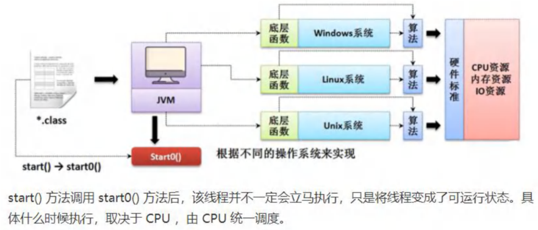
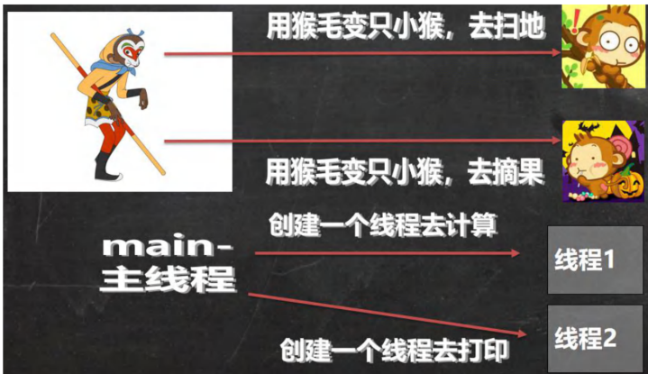
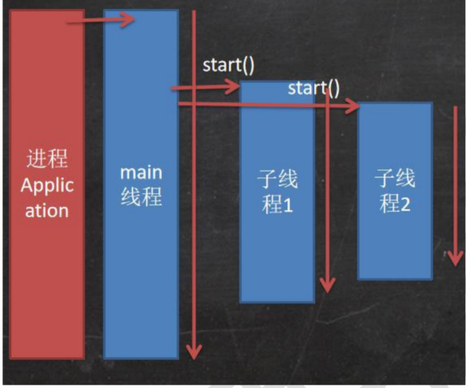
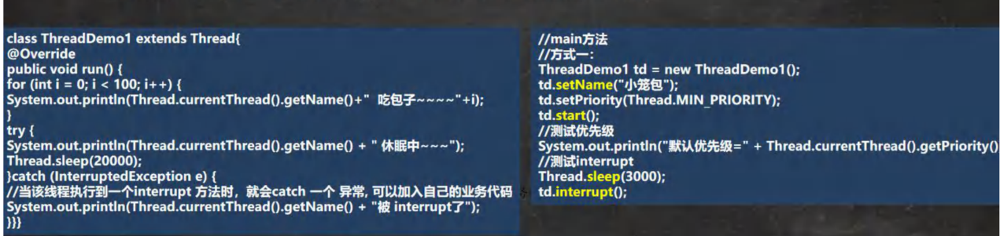
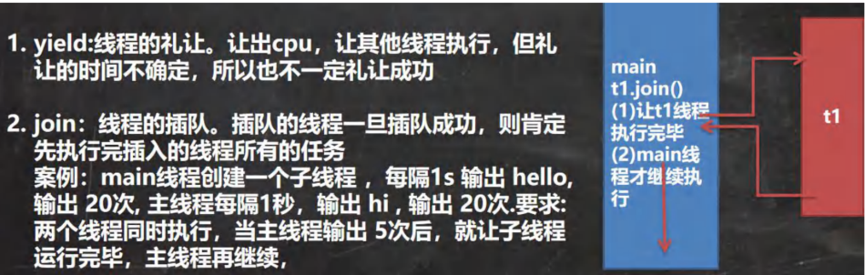
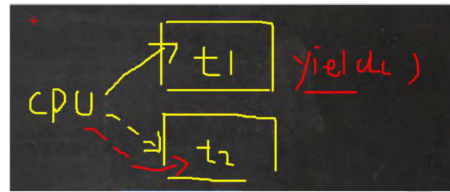
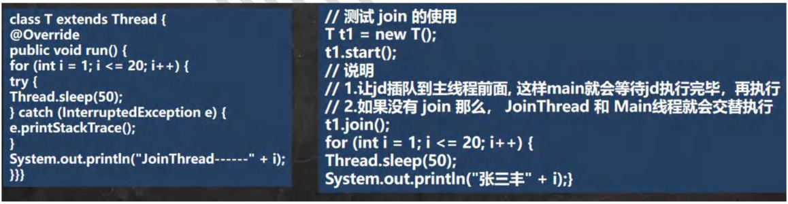
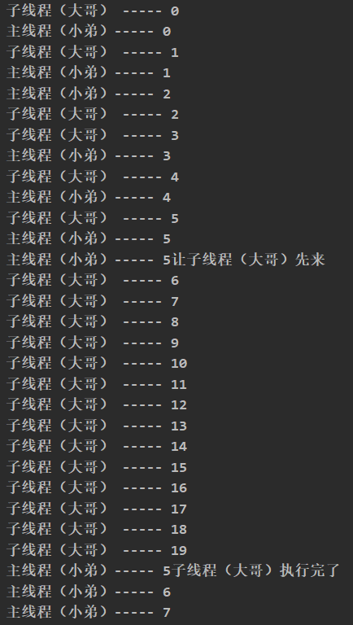

# Java 多线程

> **本章重点：** 线程创建、线程同步、线程通信、线程池、synchronized、Lock
> 
> **面试频率：** ⭐⭐⭐⭐⭐

---

## 目录
- [一、线程相关概念](#一线程相关概念)
- [二、线程的创建](#二线程的创建)
- [三、线程常用方法](#三线程常用方法)
- [四、线程的生命周期](#四线程的生命周期)
- [五、线程池](#五线程池)
- [六、线程同步](#六线程同步)
- [七、面试常见问题](#七面试常见问题)

---

## 一、线程相关概念

### 1.1 基本概念

| 概念 | 说明 |
|------|------|
| **程序** | 存储在磁盘上的可执行文件（静态的） |
| **进程** | 正在运行的程序，是系统资源分配的基本单位 |
| **线程** | 进程中的一个执行单元，是CPU调度的基本单位 |

### 1.2 程序、进程、线程的关系

```
程序（静态）
  ↓ 运行
进程（动态）
  ├─ 线程1（主线程）
  ├─ 线程2
  └─ 线程3
```

**关系：**
- 1个进程可以包含多个线程
- 线程由进程创建
- 进程是资源分配的单位，线程是CPU调度的单位

### 1.3 线程的特点

| 特点 | 说明 |
|------|------|
| ✅ **轻量级** | 创建和销毁比进程快 |
| ✅ **共享内存** | 同一进程内的线程共享资源 |
| ✅ **并发执行** | 多个线程可以同时运行 |
| ✅ **提高效率** | 充分利用CPU资源 |

---

## 二、线程的创建

### 2.1 创建线程的方式

Java提供了多种创建线程的方式：

| 方式 | 说明 | 优缺点 |
|------|------|--------|
| **继承Thread类** | 重写run()方法 | 简单，但不能继承其他类 |
| **实现Runnable接口** | 实现run()方法 | 推荐，可以继承其他类 |
| **实现Callable接口** | 可以有返回值 | 可以抛出异常，有返回值 |
| **使用线程池** | ExecutorService | 推荐，便于管理和复用 |

### 2.2 方式一：继承Thread类

**步骤：**
1. 创建类继承Thread
2. 重写run()方法
3. 创建对象并调用start()

**注意：** 调用start()才能启动线程，直接调用run()只是普通方法调用

```java
public class Thread01 {
    public static void main(String[] args) throws InterruptedException {
        //创建 Cat 对象，可以当做线程使用
        Cat cat = new Cat();
        
        //源码分析
        /*
        (1)
        public synchronized void start() {
        	start0();
        }
        (2)
        //start0() 是本地方法，是 JVM 调用, 底层是 c/c++实现
        //真正实现多线程的效果， 是 start0(), 而不是 run
        private native void start0();
        */
        
        cat.start(); // 启动线程-> 最终会执行 cat 的 run 方法
        
        //cat.run(); // run 方法就是一个普通的方法, 没有真正的启动一个线程，就会把 run 方法执行完毕，才向下执行
        //说明: 当 main 线程启动一个子线程 Thread-0, 主线程不会阻塞, 会继续执行
        //这时 主线程和子线程是交替执行.. System.out.println("主线程继续执行" + 		Thread.currentThread().getName()); //名字 main
        
        for(int i = 0; i < 60; i++) {
            System.out.println("主线程 i=" + i);
			//让主线程休眠
            Thread.sleep(1000);
        }
    }
}

//说明
//1. 当一个类继承了 Thread 类， 该类就可以当做线程使用
//2. 我们会重写 run 方法，写上自己的业务代码
//3. run Thread 类 实现了 Runnable 接口的 run 方法
/*
@Override
public void run() {
    if (target != null) {
    	target.run();
	}
}
*/
class Cat extends Thread {
    int times = 0;
    @Override
    public void run() {//重写 run 方法，写上自己的业务逻辑
        while (true) {
			//该线程每隔 1 秒。在控制台输出 “喵喵, 我是小猫咪”
            System.out.println("喵喵, 我是小猫咪" + (++times) + " 线程名=" + Thread.currentThread().getName());
			//让该线程休眠 1 秒 ctrl+alt+t
            try {
                Thread.sleep(1000);
            } catch (InterruptedException e) {
                e.printStackTrace();
            }
            if(times == 80) {
                break;//当 times 到 80, 退出 while, 这时线程也就退出.. }
            }
        }
    }
```



### 2.3 方式二：实现Runnable接口（推荐）

**步骤：**
1. 创建类实现Runnable接口
2. 实现run()方法
3. 创建Thread对象，传入Runnable实现类
4. 调用Thread对象的start()

**优点：**
- ✅ 可以继承其他类
- ✅ 适合多个线程共享同一个资源
- ✅ 代码结构更清晰

```java
public class Thread02 {
    public static void main(String[] args) {
        Dog dog = new Dog();
        // dog.start(); 这里不能调用 start
        // 创建了 Thread 对象，把 dog 对象(实现 Runnable),放入 Thread
        Thread thread = new Thread(dog);
        thread.start();
        // Tiger tiger = new Tiger();//实现了 Runnable
        // ThreadProxy threadProxy = new ThreadProxy(tiger);
        // threadProxy.start();
    }
}

class Animal {
}

class Tiger extends Animal implements Runnable {
    @Override
    public void run() {
        System.out.println("老虎嗷嗷叫....");
    }
}

//线程代理类 , 模拟了一个极简的 Thread 类
class ThreadProxy implements Runnable {//你可以把 Proxy 类当做 ThreadProxy
    private Runnable target = null;//属性，类型是 Runnable
    @Override
    public void run() {
        if (target != null) {
            target.run();//动态绑定（运行类型 Tiger）
        }
    }
    public ThreadProxy(Runnable target) {
        this.target = target;
    }
    public void start() {
        start0();//这个方法时真正实现多线程方法
    }
    public void start0() {
        run();
    }
}

class Dog implements Runnable { //通过实现 Runnable 接口，开发线程
    int count = 0;
    @Override
    public void run() { //普通方法
        while (true) {
            System.out.println("小狗汪汪叫..hi" + (++count) + Thread.currentThread().getName());
            // 休眠 1 秒
            try {
                Thread.sleep(1000);
            } catch (InterruptedException e) {
                e.printStackTrace();
            }
            if (count == 10) {
                break;
            }
        }
    }
}
```

### 2.4 方式三：实现Callable接口

**Callable vs Runnable：**

| 特性 | Callable | Runnable |
|------|----------|----------|
| **方法** | call() | run() |
| **返回值** | 有返回值 | 无返回值 |
| **异常** | 可以抛出异常 | 不能抛出checked异常 |
| **用途** | 需要返回结果 | 不需要返回结果 |

**步骤：**
1. 创建类实现Callable接口
2. 实现call()方法
3. 使用FutureTask包装Callable对象
4. 创建Thread对象，传入FutureTask
5. 调用Thread对象的start()
6. 通过FutureTask的get()获取返回值

**示例代码：**

```java
import java.util.concurrent.Callable;
import java.util.concurrent.FutureTask;

public class ThreadCallable {
    public static void main(String[] args) throws Exception {
        // 1. 创建Callable实现类对象
        MyCallable callable = new MyCallable();
        
        // 2. 使用FutureTask包装Callable对象
        FutureTask<Integer> futureTask = new FutureTask<>(callable);
        
        // 3. 创建线程并启动
        Thread thread = new Thread(futureTask, "计算线程");
        thread.start();
        
        // 4. 主线程继续执行其他任务
        System.out.println("主线程继续执行...");
        for(int i = 1; i <= 5; i++) {
            System.out.println("主线程：" + i);
            Thread.sleep(500);
        }
        
        // 5. 获取返回结果（会阻塞，直到计算完成）
        System.out.println("等待子线程计算结果...");
        Integer result = futureTask.get();  // 获取返回值
        System.out.println("计算结果：" + result);
    }
}

class MyCallable implements Callable<Integer> {
    @Override
    public Integer call() throws Exception {
        System.out.println("子线程开始计算...");
        int sum = 0;
        for(int i = 1; i <= 100; i++) {
            sum += i;
            Thread.sleep(50);  // 模拟耗时操作
        }
        System.out.println("子线程计算完成");
        return sum;  // 返回计算结果
    }
}
```

**优点：**
- ✅ 可以获取线程执行的返回值
- ✅ 可以抛出异常
- ✅ 支持泛型

**应用场景：**
- 需要获取线程执行结果
- 并行计算任务
- 异步任务处理

### 2.5 Thread vs Runnable 对比

| 特性 | 继承Thread | 实现Runnable |
|------|-----------|--------------|
| **继承性** | 不能继承其他类 | 可以继承其他类 ✅ |
| **资源共享** | 需要static共享 | 天然共享资源 ✅ |
| **代码复用** | 较差 | 较好 ✅ |
| **扩展性** | 较差 | 较好 ✅ |
| **推荐度** | ⭐⭐ | ⭐⭐⭐⭐⭐ |

**建议：** 优先使用实现Runnable接口的方式

### 2.6 多线程执行应用案例


```java
public class Thread03 {
    public static void main(String[] args) {
        T1 t1 = new T1();
        T2 t2 = new T2();
        Thread thread1 = new Thread(t1);
        Thread thread2 = new Thread(t2);
        thread1.start();//启动第 1 个线程
        thread2.start();//启动第 2 个线程
            //... 
        }
    }

    class T1 implements Runnable {
        int count = 0;
        @Override
        public void run() {
            while (true) {
				//每隔 1 秒输出 “hello,world”,输出 10 次
                System.out.println("hello,world " + (++count));
                try {
                    Thread.sleep(1000);
                } catch (InterruptedException e) {
                    e.printStackTrace();
                }
                if(count == 60) {
                    break;
                }
            }
        }
    }

    class T2 implements Runnable {
        int count = 0;
        @Override
        public void run() {
            //每隔 1 秒输出 “hi”,输出 5 次
            while (true) {
                System.out.println("hi " + (++count));
                try {
                    Thread.sleep(1000);
                } catch (InterruptedException e) {
                    e.printStackTrace();
                }
                if(count == 50) {
                    break;
                }
            }
        }
    }
```

### 2.7 线程执行流程图



---



---

## 三、线程常用方法

### 3.1 线程终止

**停止线程的方式：**

| 方式 | 说明 | 推荐度 |
|------|------|--------|
| **通知方式** | 使用标志变量控制 | ⭐⭐⭐⭐⭐（推荐） |
| **interrupt()** | 中断线程 | ⭐⭐⭐ |
| ~~stop()~~ | 强制停止 | ❌（已废弃，不安全） |

**推荐做法：使用标志变量**
```java
class MyThread extends Thread {
    private boolean loop = true;  // 控制标志
    
    public void run() {
        while (loop) {
            // 业务逻辑
        }
    }
    
    public void setLoop(boolean loop) {
        this.loop = loop;  // 通过修改标志停止线程
    }
}
```

**示例：**

```java
public class ThreadExit_ {
    public static void main(String[] args) throws InterruptedException {
        T t1 = new T();
        t1.start();

        //如果希望main线程去控制 t1 线程的终止，必须可以修改loop
        //让t1 线程停止/终止，需要修改loop的值
        //让t1 退出run方法，从而终止 t1线程 -> 通知方法

        // 让主线程休眠10秒，再通知t1线程退出
        System.out.println("main线程休息10秒");
        Thread.sleep(10 * 1000);
        t1.setLoop(false);

    }
}

class T extends Thread {
    private int count = 0;
    private boolean loop =true; // 步骤1:定义标记变量，默认为true

    @Override
    public void run() {
        while (loop) {
            // 步骤2:将loop作为循环条件
            try {
                Thread.sleep(50); // 让当前线程休眠50ms
            } catch (InterruptedException e) {
                e.printStackTrace();
            }
            System.out.println("T运行中..." + (++count));
        }
    }
    // 步骤3:提供公共的set方法，用于更新loop
    public void setLoop(boolean loop) {
        this.loop = loop;
    }
}

```


### 3.2 线程常用方法

**第一组方法：**

| 方法 | 说明 |
|------|------|
| `setName(String name)` | 设置线程名称 |
| `getName()` | 获取线程名称 |
| `start()` | 启动线程 |
| `run()` | 线程要执行的任务 |
| `setPriority(int priority)` | 设置线程优先级（1-10） |
| `getPriority()` | 获取线程优先级 |
| `sleep(long millis)` | 让当前线程休眠（静态方法） |
| `interrupt()` | 中断线程 |

**第二组方法：**

| 方法 | 说明 |
|------|------|
| `yield()` | 线程让步，让出CPU |
| `join()` | 线程插队，等待该线程终止 |

**注意事项：**
1. ⭐ **start() vs run()**
   - `start()`：启动线程，JVM调用run()
   - `run()`：普通方法调用，不会启动新线程

2. ⭐ **优先级**
   - 范围：1（最低）~ 10（最高）
   - 默认：5（NORM_PRIORITY）
   - 高优先级只是获得CPU时间片的概率更大

3. ⭐ **sleep()**
   - 使当前线程休眠指定毫秒
   - 不会释放锁
   - 可被interrupt()中断

### 3.4 线程方法应用案例



```java
package method;

public class ThreadMethod01 {
    public static void main(String[] args) throws InterruptedException {
        // 测试相关方法
        T t = new T();
        t.setName("懿轩");
        t.setPriority(Thread.MIN_PRIORITY); // 优先级最小为1
        t.start(); // 启动子线程

        System.out.println(t.getName() + " 线程优先级为" + t.getPriority());

        // 主线程打印 5 个hi，然后就中断子进程休眠
        for (int i = 0; i < 5; i++) {
            Thread.sleep(1000);
            System.out.println("hi" + i);
        }

        t.interrupt();// 当执行到这里时，就是停止t线程的休眠，提前终止睡眠

    }
}
class T extends Thread {
    @Override
    public void run() {
        while(true) {
            for (int i = 0; i < 100; i++) {
                System.out.println(Thread.currentThread().getName() + " 吃包子~~~~" + i);
            }
            try {
                System.out.println(Thread.currentThread().getName() + " 休眠中~~~");
                Thread.sleep(20000); // 20秒
            } catch (InterruptedException e) {
                //当该线程执行到一个interrupt 方法时，就会catch 一个 异常,可以加入自己的业务代码
                System.out.println(Thread.currentThread().getName() + "被 interrupt了");
            }
        }
    }
}
```

### 3.5 常用方法第二组



---



### 3.6 yield和join应用案例

测试 yield 和 join 方法



```java
public class ThreadMethod02 {
    public static void main(String[] args) throws InterruptedException {
        T2 t2 = new T2();
        t2.start();

        for(int i = 1; i <= 20; i++) {
            Thread.sleep(1000);
            System.out.println("主线程(小弟) 吃了 " + i  + " 包子");
            if(i == 5) {
                System.out.println("主线程(小弟) 让 子线程(老大) 先吃");
                // join, 线程插队
                // t2.join(); // 这里相当于让t2 线程先执行完毕
                Thread.yield(); // 礼让，不一定成功.. 
                System.out.println("线程(老大) 吃完了 主线程(小弟) 接着吃..");
            }
        }
    }
}

class T2 extends Thread {
    @Override
    public void run() {
        for(int i = 1; i <= 20; i++) {
            try {
                Thread.sleep(1000); // 休眠1秒
            } catch (InterruptedException e) {
                e.printStackTrace();
            }
            System.out.println("子线程(老大) 吃了 " + i + " 包子");
        }
    }
}
```




### 3.7 线程方法练习


```java
public class ThreadMethodExercise {
    public static void main(String[] args) throws InterruptedException {
        Thread t3 = new Thread(new T3());//创建子线程
        for (int i = 1; i <= 10; i++) {
            System.out.println("hi " + i);
            if(i == 5) {//说明主线程输出了 5 次 hi
                t3.start();//启动子线程 输出 hello... t3.join();//立即将 t3 子线程，插入到 main 线程，让 t3 先执行
            }
            Thread.sleep(1000);//输出一次 hi, 让 main 线程也休眠 1s
        }
    }
}

class T3 implements Runnable {
    private int count = 0;
    @Override
    public void run() {
        while (true) {
            System.out.println("hello " + (++count));
            try {
                Thread.sleep(1000);
            } catch (InterruptedException e) {
                e.printStackTrace();
            }
            if (count == 10) {
                break;
            }
        }
    }
}
```


### 3.3 用户线程和守护线程

**两种类型：**

| 类型 | 说明 | 示例 |
|------|------|------|
| **用户线程** | 主线程结束后仍继续运行 | main线程、自定义线程 |
| **守护线程** | 主线程结束后自动结束 | GC垃圾回收线程 |

**守护线程设置：**
```java
Thread thread = new Thread();
thread.setDaemon(true);  // 设置为守护线程（必须在start()前）
thread.start();
```

**特点：**
- ⭐ 守护线程必须在start()之前设置
- ⭐ 当所有用户线程结束时，守护线程自动结束
- ⭐ 常见守护线程：GC、监控线程等

```java
package method;

public class ThreadMethod03 {
    public static void main(String[] args) throws InterruptedException {
        MyDaemonThread myDaemonThread = new MyDaemonThread();
        // 如果我们希望当main线程结束，那么子线程也必须结束
        // 设置守护线程
        myDaemonThread.setDaemon(true);

        myDaemonThread.start();

        for (int i = 0; i < 10; i++){
            System.out.println("主线程运行" + i);
            Thread.sleep(1000);
        }
    }
}

class MyDaemonThread extends Thread {
    public void run() {
        for (; ; ) { // 无限循环
            try {
                Thread.sleep(50);
            } catch (InterruptedException e) {
                // TODO Auto-generated catch blocke.printStackTrace():
            }
            System.out.println("子线程运行");
        }
    }
}
```

---

## 四、线程的生命周期

### 4.1 线程的六种状态

Java中线程有6种状态（Thread.State枚举）：

| 状态 | 说明 | 触发条件 |
|------|------|---------|
| **NEW** | 新建状态 | 线程创建但未start() |
| **RUNNABLE** | 可运行状态 | 调用start()后 |
| **BLOCKED** | 阻塞状态 | 等待获取锁 |
| **WAITING** | 无限等待 | wait()、join() |
| **TIMED_WAITING** | 限时等待 | sleep()、wait(timeout) |
| **TERMINATED** | 终止状态 | run()执行完毕 |

### 4.2 线程状态转换图

```
    NEW
     ↓ start()
  RUNNABLE ←→ BLOCKED（等待锁）
     ↓
     ├→ WAITING（wait/join）
     ├→ TIMED_WAITING（sleep/wait有超时）
     ↓
  TERMINATED
```

**状态转换说明：**
1. **NEW → RUNNABLE**：调用start()
2. **RUNNABLE ↔ BLOCKED**：等待synchronized锁
3. **RUNNABLE → WAITING**：调用wait()、join()
4. **RUNNABLE → TIMED_WAITING**：调用sleep()、wait(timeout)
5. **WAITING/TIMED_WAITING → RUNNABLE**：notify()、notifyAll()、超时
6. **RUNNABLE → TERMINATED**：run()执行完毕

```java
public class ThreadState_ {
    public static void main(String[] args) throws InterruptedException {
        T t = new T();
        System.out.println(t.getName() + " 状态 " + t.getState());
        t.start();
        while (Thread.State.TERMINATED != t.getState()) {
            System.out.println(t.getName() + " 状态 " + t.getState());
            Thread.sleep(500);
        }
        System.out.println(t.getName() + " 状态 " + t.getState());
    }
}
class T extends Thread {
    @Override
    public void run() {
        while (true) {
            for (int i = 0; i < 10; i++) {
                System.out.println("hi " + i);
                try {
                    Thread.sleep(1000);
                } catch (InterruptedException e) {
                    e.printStackTrace();
                }
            }
            break;
        }
    }
}
```

---

## 五、线程池

### 5.1 为什么需要线程池

**传统方式的问题：**
- ❌ 频繁创建和销毁线程，开销大
- ❌ 无法控制线程数量，可能耗尽系统资源
- ❌ 缺乏统一的管理和监控

**线程池的优点：**
- ✅ **降低资源消耗**：重用线程，减少创建销毁开销
- ✅ **提高响应速度**：任务来了直接执行，无需等待创建
- ✅ **提高可管理性**：统一分配、调优和监控
- ✅ **提供更多功能**：定时执行、周期执行、延迟执行

### 5.2 线程池核心参数

**ThreadPoolExecutor 构造方法：**

```java
public ThreadPoolExecutor(
    int corePoolSize,              // 核心线程数
    int maximumPoolSize,           // 最大线程数
    long keepAliveTime,            // 空闲线程存活时间
    TimeUnit unit,                 // 时间单位
    BlockingQueue<Runnable> workQueue,  // 任务队列
    ThreadFactory threadFactory,   // 线程工厂
    RejectedExecutionHandler handler    // 拒绝策略
)
```

**核心参数说明：**

| 参数 | 说明 |
|------|------|
| **corePoolSize** | 核心线程数，即使空闲也不会被回收 |
| **maximumPoolSize** | 最大线程数，线程池能创建的最大线程数 |
| **keepAliveTime** | 非核心线程的空闲存活时间 |
| **workQueue** | 任务队列，存储等待执行的任务 |
| **threadFactory** | 线程工厂，用于创建线程 |
| **handler** | 拒绝策略，队列满时如何处理新任务 |

### 5.3 常见线程池类型

**Java提供的4种线程池：**

| 类型 | 创建方式 | 特点 |
|------|---------|------|
| **FixedThreadPool** | `Executors.newFixedThreadPool(n)` | 固定大小，无界队列 |
| **CachedThreadPool** | `Executors.newCachedThreadPool()` | 可缓存，最大Integer.MAX_VALUE |
| **SingleThreadExecutor** | `Executors.newSingleThreadExecutor()` | 单线程，顺序执行 |
| **ScheduledThreadPool** | `Executors.newScheduledThreadPool(n)` | 支持定时和周期任务 |

**示例代码：**

```java
import java.util.concurrent.*;

public class ThreadPoolDemo {
    public static void main(String[] args) {
        // 1. 固定大小线程池（推荐用于处理CPU密集型任务）
        ExecutorService fixedPool = Executors.newFixedThreadPool(5);
        
        // 2. 缓存线程池（适合大量短期异步任务）
        ExecutorService cachedPool = Executors.newCachedThreadPool();
        
        // 3. 单线程池（保证任务按顺序执行）
        ExecutorService singlePool = Executors.newSingleThreadExecutor();
        
        // 4. 定时线程池（支持定时/周期任务）
        ScheduledExecutorService scheduledPool = Executors.newScheduledThreadPool(3);
        
        // 使用示例
        for(int i = 1; i <= 10; i++) {
            final int taskNum = i;
            fixedPool.execute(() -> {
                System.out.println(Thread.currentThread().getName() + 
                    " 正在执行任务：" + taskNum);
                try {
                    Thread.sleep(2000);
                } catch (InterruptedException e) {
                    e.printStackTrace();
                }
                System.out.println(Thread.currentThread().getName() + 
                    " 完成任务：" + taskNum);
            });
        }
        
        // 定时任务示例
        scheduledPool.schedule(() -> {
            System.out.println("延迟3秒执行的任务");
        }, 3, TimeUnit.SECONDS);
        
        // 周期任务示例
        scheduledPool.scheduleAtFixedRate(() -> {
            System.out.println("每2秒执行一次：" + System.currentTimeMillis());
        }, 1, 2, TimeUnit.SECONDS);
        
        // 关闭线程池（不再接受新任务，等待已有任务完成）
        fixedPool.shutdown();
        
        // 立即关闭线程池（尝试停止所有任务）
        // fixedPool.shutdownNow();
    }
}
```

### 5.4 线程池工作原理

**任务提交流程：**

```
提交任务
  ↓
核心线程数未满？
  ├─ 是 → 创建核心线程执行
  └─ 否 → 任务队列未满？
          ├─ 是 → 加入队列等待
          └─ 否 → 最大线程数未满？
                  ├─ 是 → 创建非核心线程执行
                  └─ 否 → 执行拒绝策略
```

**4种拒绝策略：**

| 策略 | 说明 |
|------|------|
| **AbortPolicy**（默认） | 抛出RejectedExecutionException异常 |
| **CallerRunsPolicy** | 调用者所在线程执行任务 |
| **DiscardPolicy** | 直接丢弃任务，不抛异常 |
| **DiscardOldestPolicy** | 丢弃队列最早的任务，重试提交 |

### 5.5 自定义线程池（推荐）

**阿里巴巴开发手册建议：** 不要使用Executors创建，而是通过ThreadPoolExecutor自定义

**原因：**
- FixedThreadPool和SingleThreadExecutor：队列长度Integer.MAX_VALUE，可能堆积大量请求导致OOM
- CachedThreadPool：最大线程数Integer.MAX_VALUE，可能创建大量线程导致OOM

**自定义示例：**

```java
import java.util.concurrent.*;

public class CustomThreadPool {
    public static void main(String[] args) {
        // 自定义线程池
        ThreadPoolExecutor executor = new ThreadPoolExecutor(
            5,                              // 核心线程数
            10,                             // 最大线程数
            60L,                            // 空闲线程存活时间
            TimeUnit.SECONDS,               // 时间单位
            new ArrayBlockingQueue<>(100),  // 有界队列，容量100
            Executors.defaultThreadFactory(),  // 默认线程工厂
            new ThreadPoolExecutor.CallerRunsPolicy()  // 调用者运行策略
        );
        
        // 提交任务
        for(int i = 1; i <= 20; i++) {
            final int taskNum = i;
            executor.execute(() -> {
                System.out.println(Thread.currentThread().getName() + 
                    " 执行任务：" + taskNum);
                try {
                    Thread.sleep(1000);
                } catch (InterruptedException e) {
                    e.printStackTrace();
                }
            });
        }
        
        // 优雅关闭
        executor.shutdown();
        try {
            // 等待所有任务完成，最多等待60秒
            if(!executor.awaitTermination(60, TimeUnit.SECONDS)) {
                executor.shutdownNow();
            }
        } catch (InterruptedException e) {
            executor.shutdownNow();
        }
    }
}
```

**使用建议：**
1. ✅ 根据业务场景设置合理的核心线程数和最大线程数
2. ✅ 使用有界队列，防止内存溢出
3. ✅ 自定义线程名称，便于排查问题
4. ✅ 选择合适的拒绝策略
5. ✅ 监控线程池状态（队列大小、活跃线程数等）

---

## 六、线程同步

### 6.1 为什么需要线程同步

**线程安全问题：**
- 多个线程同时访问共享资源
- 可能导致数据不一致
- 例如：多线程售票出现超卖

**解决方案：** 线程同步（同一时刻只允许一个线程访问）

### 6.2 synchronized关键字

**三种使用方式：**

| 方式 | 语法 | 锁对象 |
|------|------|--------|
| **同步代码块** | `synchronized(对象) {}` | 指定对象 |
| **同步方法** | `synchronized void method()` | this |
| **静态同步方法** | `static synchronized void method()` | 类.class |

**语法示例：**
```java
// 1. 同步代码块
synchronized (this) {
    // 临界区代码
}

// 2. 同步方法
public synchronized void method() {
    // 临界区代码
}

// 3. 静态同步方法
public static synchronized void method() {
    // 临界区代码
}
```

### 6.3 synchronized原理

**互斥锁（Monitor）：**
1. 每个Java对象都有一个Monitor（监视器）
2. 线程进入synchronized时获取Monitor
3. 同一时刻只有一个线程能获取Monitor
4. 其他线程进入BLOCKED状态
5. 释放锁时，其他线程竞争获取

**特点：**
- ✅ 保证原子性
- ✅ 保证可见性
- ✅ 保证有序性
- ⚠️ 性能开销较大

### 6.3.1 互斥锁解决售票问题

```java
public class SellTicket {
    public static void main(String[] args) {
        //测试
        // SellTicket01 sellTicket01 = new SellTicket01();
        // SellTicket01 sellTicket02 = new SellTicket01();
        // SellTicket01 sellTicket03 = new SellTicket01();
        //
        // //这里我们会出现超卖.. // sellTicket01.start();//启动售票线程
        // sellTicket02.start();//启动售票线程
        // sellTicket03.start();//启动售票线程
        // System.out.println("===使用实现接口方式来售票=====");
        // SellTicket02 sellTicket02 = new SellTicket02();
        //
        // new Thread(sellTicket02).start();//第 1 个线程-窗口
        // new Thread(sellTicket02).start();//第 2 个线程-窗口
        // new Thread(sellTicket02).start();//第 3 个线程-窗口
        //测试
        SellTicket03 sellTicket03 = new SellTicket03();
        new Thread(sellTicket03).start();//第 1 个线程-窗口
        new Thread(sellTicket03).start();//第 2 个线程-窗口
        new Thread(sellTicket03).start();//第 3 个线程-窗口
    }
}
//实现接口方式, 使用 synchronized 实现线程同步
class SellTicket03 implements Runnable {
    private int ticketNum = 100; //让多个线程共享 ticketNum
    private boolean loop = true; //控制 run 方法变量
    Object object = new Object();
    //同步方法（静态的）的锁为当前类本身
    //解读
    //1. public synchronized static void m1() {} 锁是加在 SellTicket03.class
    //2. 如果在静态方法中，实现一个同步代码块.
    /*
    synchronized (SellTicket03.class) {
        System.out.println("m2");
    }
    public synchronized static void m1() {
    }
    public static void m2() {
        synchronized (SellTicket03.class) {
            System.out.println("m2");
        }
    }
    */
    
    //说明
    //1. public synchronized void sell() {} 就是一个同步方法
    //2. 这时锁在 this 对象
    //3. 也可以在代码块上写 synchronize ,同步代码块, 互斥锁还是在 this 对象
    public /*synchronized*/ void sell() { //同步方法, 在同一时刻， 只能有一个线程来执行 sell 方法
        synchronized (/*this*/ object) {
            if (ticketNum <= 0) {
                System.out.println("售票结束...");
                loop = false;
                return;
            }
            //休眠 50 毫秒, 模拟
            try {
                Thread.sleep(50);
            } catch (InterruptedException e) {
                e.printStackTrace();
            }
            System.out.println("窗口 " + Thread.currentThread().getName() + " 售出一张票" + " 剩余票数=" + (--ticketNum));//1 - 0 - -1 - -2
        }
    }
    @Override
    public void run() {
        while (loop) {
            sell();//sell 方法是一共同步方法
        }
    }
}

//使用 Thread 方式
// new SellTicket01().start()
// new SellTicket01().start();
class SellTicket01 extends Thread {
    private static int ticketNum = 100;//让多个线程共享 ticketNum
//    public void m1() {
//        synchronized (this) {
//            System.out.println("hello");
//        }
//    }
    @Override
    public void run() {
        while (true) {
            if (ticketNum <= 0) {
                System.out.println("售票结束...");
                break;
            }
            //休眠 50 毫秒, 模拟
            try {
                Thread.sleep(50);
            } catch (InterruptedException e) {
                e.printStackTrace();
            }
            System.out.println("窗口 " + Thread.currentThread().getName() + " 售出一张票" + " 剩余票数=" + (--ticketNum));
        }
    }
}

//实现接口方式
class SellTicket02 implements Runnable {
    private int ticketNum = 100;//让多个线程共享 ticketNum
    @Override
    public void run() {
        while (true) {
            if (ticketNum <= 0) {
                System.out.println("售票结束...");
                break;
            }
            //休眠 50 毫秒, 模拟
            try {
                Thread.sleep(50);
            } catch (InterruptedException e) {
                e.printStackTrace();
            }
            System.out.println("窗口 " + Thread.currentThread().getName() + " 售出一张票" + " 剩余票数=" + (--ticketNum));//1 - 0 - -1 - -2
        }
    }
}
```

### 6.4 死锁问题

**死锁定义：**
两个或多个线程相互持有对方需要的资源，导致都无法继续执行。

**死锁的四个必要条件：**

| 条件 | 说明 |
|------|------|
| **互斥条件** | 资源不能被多个线程共享 |
| **请求与保持** | 已持有资源，又请求新资源 |
| **不可剥夺** | 已获得的资源不能被强制剥夺 |
| **循环等待** | 存在线程资源的循环等待链 |

**死锁示例：**
```
线程A持有锁1，等待锁2
线程B持有锁2，等待锁1
→ 死锁！
```

**如何避免死锁：**
1. ✅ 按固定顺序获取锁
2. ✅ 使用tryLock()设置超时
3. ✅ 避免嵌套锁
4. ✅ 使用并发工具类（如ConcurrentHashMap）

```java
public class DeadLock_ {
    public static void main(String[] args) {
        //模拟死锁现象
        DeadLockDemo A = new DeadLockDemo(true);
        A.setName("A 线程");
        DeadLockDemo B = new DeadLockDemo(false);
        B.setName("B 线程");
        A.start();
        B.start();
    }
}
//线程
class DeadLockDemo extends Thread {
    static Object o1 = new Object();// 保证多线程，共享一个对象,这里使用 static
    static Object o2 = new Object();
    boolean flag;
    public DeadLockDemo(boolean flag) {//构造器
        this.flag = flag;
    }
    @Override
    public void run() {
        //下面业务逻辑的分析
        //1. 如果 flag 为 T, 线程 A 就会先得到/持有 o1 对象锁, 然后尝试去获取 o2 对象锁
        //2. 如果线程 A 得不到 o2 对象锁，就会 Blocked
        //3. 如果 flag 为 F, 线程 B 就会先得到/持有 o2 对象锁, 然后尝试去获取 o1 对象锁
        //4. 如果线程 B 得不到 o1 对象锁，就会 Blocked
        if (flag) {
            synchronized (o1) {//对象互斥锁, 下面就是同步代码
                System.out.println(Thread.currentThread().getName() + " 进入 1");
                synchronized (o2) { // 这里获得 li 对象的监视权
                    System.out.println(Thread.currentThread().getName() + " 进入 2");
                }
            }
        } else {
            synchronized (o2) {
                System.out.println(Thread.currentThread().getName() + " 进入 3");
                synchronized (o1) { // 这里获得 li 对象的监视权
                    System.out.println(Thread.currentThread().getName() + " 进入 4");
                }
            }
        }
    }
}
```

### 6.5 锁的释放

**会释放锁的操作：**

| 操作 | 说明 |
|------|------|
| ✅ `wait()` | 释放锁并进入等待状态 |
| ✅ `同步代码块执行完毕` | 正常结束释放锁 |
| ✅ `抛出异常` | 异常导致退出同步代码块 |
| ✅ `break/return` | 跳出同步代码块 |

**不会释放锁的操作：**

| 操作 | 说明 |
|------|------|
| ❌ `sleep()` | 休眠不释放锁 |
| ❌ `yield()` | 让步不释放锁 |
| ❌ `suspend()` | 挂起不释放锁（已废弃） |

**重要区别：**
```java
// wait() - 释放锁
synchronized (obj) {
    obj.wait();  // 释放锁，其他线程可以进入
}

// sleep() - 不释放锁
synchronized (obj) {
    Thread.sleep(1000);  // 不释放锁，其他线程无法进入
}
```

### 6.6 Lock接口

**Lock vs synchronized：**

| 特性 | synchronized | Lock |
|------|--------------|------|
| **类型** | 关键字 | 接口 |
| **锁的获取和释放** | 自动获取和释放 | 手动lock()和unlock() |
| **可中断** | 不可中断 | 可以中断（lockInterruptibly） |
| **公平性** | 非公平锁 | 可以选择公平锁或非公平锁 |
| **尝试获取锁** | 不支持 | 支持tryLock() |
| **条件变量** | 单一的wait/notify | 多个Condition |
| **性能** | 适中 | 高并发下更优 |

**Lock常用实现类：**
- **ReentrantLock**：可重入锁（最常用）
- **ReadWriteLock**：读写锁
- **StampedLock**：改进的读写锁（JDK 8+）

**ReentrantLock示例：**

```java
import java.util.concurrent.locks.Lock;
import java.util.concurrent.locks.ReentrantLock;

public class LockDemo {
    public static void main(String[] args) {
        TicketSeller seller = new TicketSeller();
        
        new Thread(seller, "窗口1").start();
        new Thread(seller, "窗口2").start();
        new Thread(seller, "窗口3").start();
    }
}

class TicketSeller implements Runnable {
    private int tickets = 100;
    private final Lock lock = new ReentrantLock();  // 创建Lock对象
    
    @Override
    public void run() {
        while (true) {
            lock.lock();  // 加锁
            try {
                if (tickets <= 0) {
                    break;
                }
                
                Thread.sleep(50);  // 模拟售票耗时
                System.out.println(Thread.currentThread().getName() + 
                    " 售出一张票，剩余：" + (--tickets));
                    
            } catch (InterruptedException e) {
                e.printStackTrace();
            } finally {
                lock.unlock();  // 必须在finally中释放锁
            }
        }
    }
}
```

**tryLock()示例：**

```java
import java.util.concurrent.TimeUnit;
import java.util.concurrent.locks.Lock;
import java.util.concurrent.locks.ReentrantLock;

public class TryLockDemo {
    private final Lock lock = new ReentrantLock();
    
    public void method() {
        // 尝试获取锁，最多等待3秒
        try {
            if (lock.tryLock(3, TimeUnit.SECONDS)) {
                try {
                    System.out.println(Thread.currentThread().getName() + 
                        " 获取锁成功");
                    Thread.sleep(2000);
                } finally {
                    lock.unlock();
                }
            } else {
                System.out.println(Thread.currentThread().getName() + 
                    " 获取锁失败，执行其他逻辑");
            }
        } catch (InterruptedException e) {
            e.printStackTrace();
        }
    }
}
```

**公平锁 vs 非公平锁：**

```java
// 非公平锁（默认）- 性能更好
Lock lock = new ReentrantLock();

// 公平锁 - 按照请求顺序获取锁
Lock fairLock = new ReentrantLock(true);
```

### 6.7 线程通信

**线程通信机制：** 多个线程在处理同一个资源时，需要协调工作。

**wait/notify机制：**

| 方法 | 说明 | 注意 |
|------|------|------|
| `wait()` | 释放锁，等待唤醒 | 必须在synchronized中调用 |
| `notify()` | 随机唤醒一个等待线程 | 必须在synchronized中调用 |
| `notifyAll()` | 唤醒所有等待线程 | 必须在synchronized中调用 |

**wait/notify使用规范：**
1. 必须在synchronized代码块中使用
2. wait()会释放锁，notify()不会释放锁
3. 调用对象必须是锁对象
4. 建议使用while循环判断条件（防止虚假唤醒）

**经典案例：生产者消费者模式**

```java
public class ProducerConsumer {
    public static void main(String[] args) {
        Product product = new Product();
        
        // 生产者线程
        new Thread(() -> {
            for (int i = 1; i <= 10; i++) {
                product.produce("商品-" + i);
            }
        }, "生产者").start();
        
        // 消费者线程
        new Thread(() -> {
            for (int i = 1; i <= 10; i++) {
                product.consume();
            }
        }, "消费者").start();
    }
}

class Product {
    private String name;
    private boolean hasProduct = false;  // 是否有商品
    
    // 生产商品
    public synchronized void produce(String name) {
        // 如果有商品，等待消费
        while (hasProduct) {
            try {
                System.out.println("仓库已满，生产者等待...");
                wait();  // 释放锁，等待消费者消费
            } catch (InterruptedException e) {
                e.printStackTrace();
            }
        }
        
        // 生产商品
        this.name = name;
        hasProduct = true;
        System.out.println(Thread.currentThread().getName() + 
            " 生产了：" + name);
        
        notify();  // 唤醒消费者
    }
    
    // 消费商品
    public synchronized void consume() {
        // 如果没有商品，等待生产
        while (!hasProduct) {
            try {
                System.out.println("仓库为空，消费者等待...");
                wait();  // 释放锁，等待生产者生产
            } catch (InterruptedException e) {
                e.printStackTrace();
            }
        }
        
        // 消费商品
        System.out.println(Thread.currentThread().getName() + 
            " 消费了：" + this.name);
        hasProduct = false;
        
        notify();  // 唤醒生产者
    }
}
```

**使用Condition实现线程通信（Lock）：**

```java
import java.util.concurrent.locks.Condition;
import java.util.concurrent.locks.Lock;
import java.util.concurrent.locks.ReentrantLock;

public class ConditionDemo {
    public static void main(String[] args) {
        BoundedBuffer buffer = new BoundedBuffer();
        
        // 生产者
        new Thread(() -> {
            for (int i = 1; i <= 10; i++) {
                buffer.put("数据-" + i);
            }
        }, "生产者").start();
        
        // 消费者
        new Thread(() -> {
            for (int i = 1; i <= 10; i++) {
                buffer.take();
            }
        }, "消费者").start();
    }
}

class BoundedBuffer {
    private final Lock lock = new ReentrantLock();
    private final Condition notFull = lock.newCondition();   // 非满条件
    private final Condition notEmpty = lock.newCondition();  // 非空条件
    
    private String[] items = new String[10];
    private int putIndex, takeIndex, count;
    
    public void put(String item) {
        lock.lock();
        try {
            while (count == items.length) {
                System.out.println("缓冲区已满，生产者等待...");
                notFull.await();  // 等待非满
            }
            
            items[putIndex] = item;
            putIndex = (putIndex + 1) % items.length;
            count++;
            System.out.println(Thread.currentThread().getName() + 
                " 生产：" + item + "，当前数量：" + count);
            
            notEmpty.signal();  // 通知消费者
        } catch (InterruptedException e) {
            e.printStackTrace();
        } finally {
            lock.unlock();
        }
    }
    
    public String take() {
        lock.lock();
        try {
            while (count == 0) {
                System.out.println("缓冲区为空，消费者等待...");
                notEmpty.await();  // 等待非空
            }
            
            String item = items[takeIndex];
            takeIndex = (takeIndex + 1) % items.length;
            count--;
            System.out.println(Thread.currentThread().getName() + 
                " 消费：" + item + "，当前数量：" + count);
            
            notFull.signal();  // 通知生产者
            return item;
        } catch (InterruptedException e) {
            e.printStackTrace();
            return null;
        } finally {
            lock.unlock();
        }
    }
}
```

**线程通信总结：**

| 方式 | 机制 | 优点 | 缺点 |
|------|------|------|------|
| **wait/notify** | synchronized + Object方法 | 简单易用 | 只能有一个等待队列 |
| **Condition** | Lock + Condition | 可以有多个等待队列 | 代码稍复杂 |
| **BlockingQueue** | 阻塞队列 | 最简单，推荐使用 | 功能相对固定 |

---

## 七、面试常见问题

### Q1: 进程和线程的区别？

**答案：**

| 特性 | 进程 | 线程 |
|------|------|------|
| **定义** | 资源分配的基本单位 | CPU调度的基本单位 |
| **资源** | 拥有独立的资源 | 共享进程资源 |
| **开销** | 创建、切换开销大 | 创建、切换开销小 |
| **通信** | 进程间通信复杂（IPC） | 线程间通信简单（共享内存） |
| **独立性** | 独立性强 | 独立性弱 |
| **崩溃影响** | 一个进程崩溃不影响其他进程 | 一个线程崩溃可能导致整个进程崩溃 |

---

### Q2: 创建线程的方式有哪些？

**答案：**

主要有4种方式：

1. **继承Thread类**
   ```java
   class MyThread extends Thread {
       public void run() { }
   }
   new MyThread().start();
   ```

2. **实现Runnable接口（推荐）**
   ```java
   class MyRunnable implements Runnable {
       public void run() { }
   }
   new Thread(new MyRunnable()).start();
   ```

3. **实现Callable接口**
   ```java
   class MyCallable implements Callable<String> {
       public String call() { return "result"; }
   }
   FutureTask<String> task = new FutureTask<>(new MyCallable());
   new Thread(task).start();
   ```

4. **使用线程池（推荐）**
   ```java
   ExecutorService pool = Executors.newFixedThreadPool(5);
   pool.execute(runnable);
   ```

**推荐：** Runnable接口 或 线程池

---

### Q3: start() 和 run() 的区别？

**答案：**

| 方法 | 说明 | 效果 |
|------|------|------|
| **start()** | 启动新线程 | 创建新线程并调用run() |
| **run()** | 普通方法调用 | 在当前线程中执行，不创建新线程 |

```java
Thread t = new Thread();

// ✅ 正确：启动新线程
t.start();  // 创建新线程，JVM调用run()

// ❌ 错误：不会启动新线程
t.run();  // 在main线程中执行，不是多线程
```

---

### Q4: sleep() 和 wait() 的区别？

**答案：**

| 特性 | sleep() | wait() |
|------|---------|--------|
| **所属类** | Thread类 | Object类 |
| **释放锁** | ❌ 不释放 | ✅ 释放 |
| **使用位置** | 任何地方 | 必须在synchronized中 |
| **唤醒方式** | 时间到自动醒 | notify()或notifyAll() |
| **用途** | 暂停执行 | 线程通信 |

```java
// sleep() - 不释放锁
synchronized (obj) {
    Thread.sleep(1000);  // 持有锁，睡眠1秒
}

// wait() - 释放锁
synchronized (obj) {
    obj.wait();  // 释放锁，等待唤醒
}
```

---

### Q5: synchronized 和 Lock 的区别？

**答案：**

| 特性 | synchronized | Lock |
|------|--------------|------|
| **类型** | 关键字 | 接口 |
| **释放锁** | 自动释放 | 必须手动释放 |
| **获取锁** | 阻塞等待 | 可以tryLock()非阻塞 |
| **公平性** | 非公平锁 | 可以选择公平/非公平 |
| **中断** | 不可中断 | 可以中断 |
| **灵活性** | 较低 | 较高 |

```java
// synchronized - 自动释放
synchronized (obj) {
    // 代码
}  // 自动释放

// Lock - 手动释放
Lock lock = new ReentrantLock();
lock.lock();
try {
    // 代码
} finally {
    lock.unlock();  // 必须手动释放
}
```

---

### Q6: 如何保证线程安全？

**答案：**

**4种方式：**

1. **synchronized关键字**
   ```java
   public synchronized void method() { }
   ```

2. **Lock锁**
   ```java
   lock.lock();
   try { } finally { lock.unlock(); }
   ```

3. **volatile关键字**（保证可见性）
   ```java
   private volatile boolean flag = true;
   ```

4. **原子类**
   ```java
   AtomicInteger count = new AtomicInteger(0);
   count.incrementAndGet();
   ```

---

### Q7: 什么是死锁？如何避免？

**答案：**

**死锁定义：** 两个或多个线程相互等待对方持有的资源，导致都无法继续执行。

**四个必要条件：**
1. 互斥条件
2. 请求与保持
3. 不可剥夺
4. 循环等待

**避免死锁的方法：**
1. ✅ 按固定顺序获取锁
2. ✅ 使用tryLock()设置超时
3. ✅ 避免嵌套锁
4. ✅ 使用死锁检测工具（jstack）

**示例：**
```java
// ❌ 可能死锁
synchronized (lock1) {
    synchronized (lock2) { }
}

// ✅ 按固定顺序获取
synchronized (lock1) {
    synchronized (lock2) { }
}
// 所有线程都按 lock1 → lock2 的顺序获取
```

---

### Q8: 线程池的优点是什么？

**答案：**

**优点：**
1. ✅ **降低资源消耗**：重用线程，减少创建和销毁开销
2. ✅ **提高响应速度**：任务来了，线程已准备好
3. ✅ **提高可管理性**：统一分配、调优和监控
4. ✅ **提供更多功能**：定时执行、周期执行等

**常见线程池：**
```java
// 固定大小线程池
ExecutorService pool = Executors.newFixedThreadPool(5);

// 缓存线程池
ExecutorService pool = Executors.newCachedThreadPool();

// 单线程池
ExecutorService pool = Executors.newSingleThreadExecutor();

// 定时线程池
ScheduledExecutorService pool = Executors.newScheduledThreadPool(5);
```

---

**上一章：** [泛型](05-泛型.md)

**下一章：** [IO流](07-IO流文件操作.md) →
