# Java 网络编程

> **本章重点：** TCP/UDP协议、Socket编程、InetAddress类、文件传输、多线程服务器
> 
> **面试频率：** ⭐⭐⭐⭐

---

## 目录
- [一、网络的相关概念](#一网络的相关概念)
- [二、InetAddress类](#二inetaddress类)
- [三、Socket](#三socket)
- [四、TCP网络通信编程](#四tcp网络通信编程)
- [五、UDP网络通信编程](#五udp网络通信编程)
- [六、网络编程最佳实践](#六网络编程最佳实践)
- [七、网络编程常见问题](#七网络编程常见问题)
- [八、总结](#八总结)

---

## 一、网络的相关概念

### 1.1 网络通信

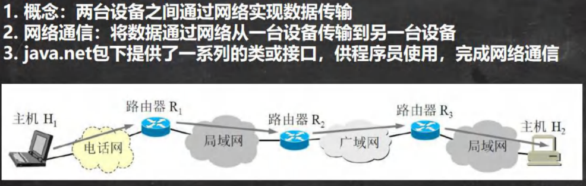

### 1.2 网络

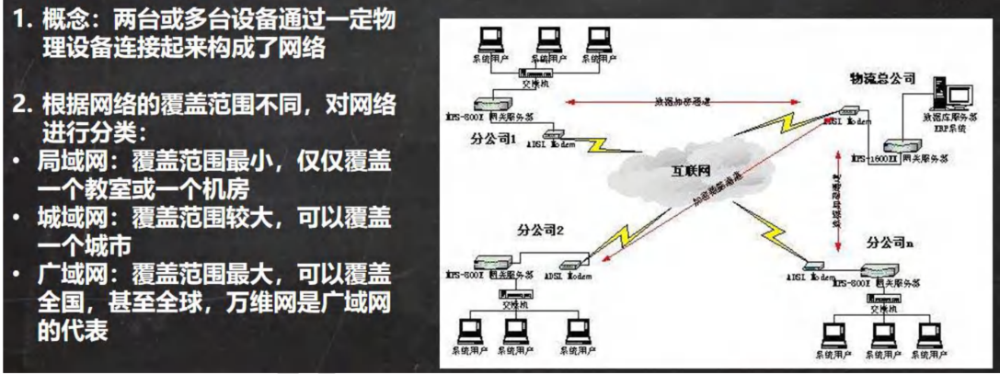

### 1.3 IP 地址

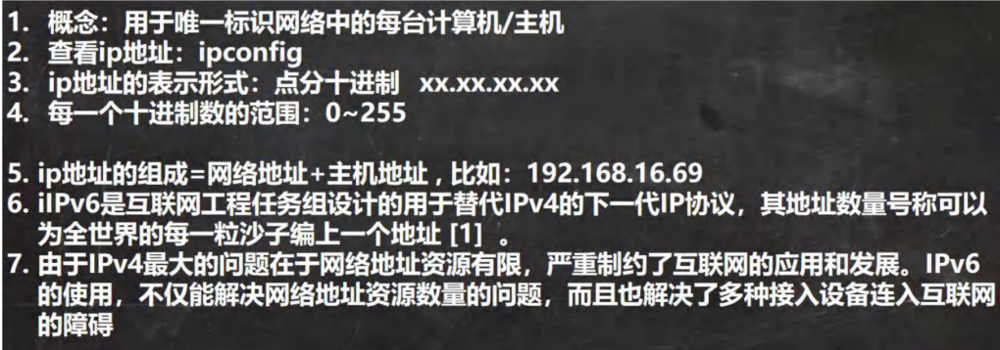

### 1.4 IPv4 地址分类

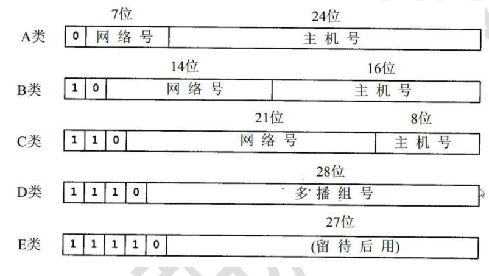

---

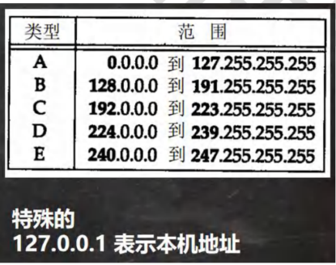

### 1.5 域名

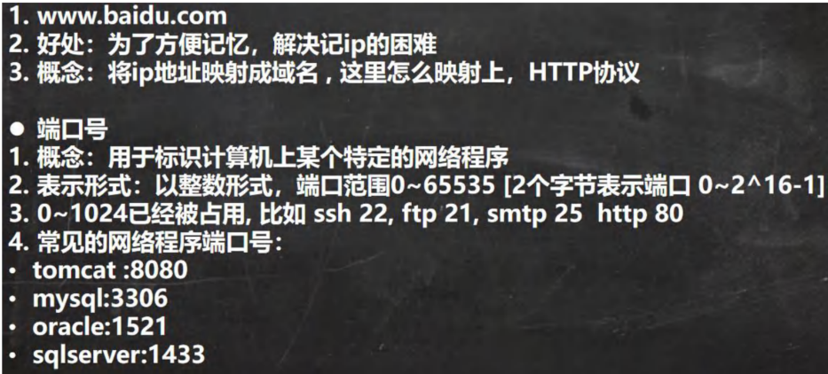

### 1.6 网络通信协议

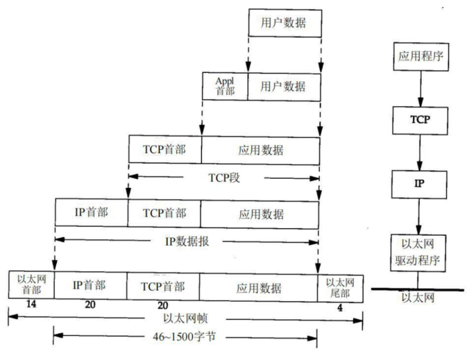

---

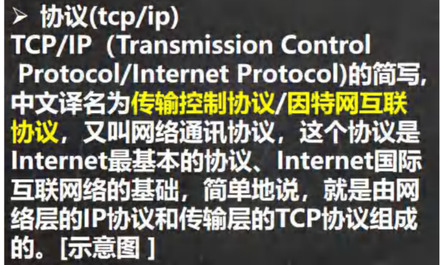

### 1.7 TCP/IP 协议

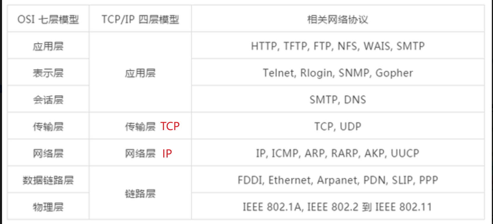

### 1.8 TCP 和 UDP

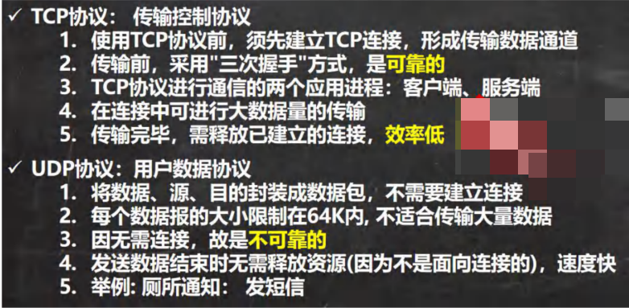

#### TCP vs UDP 对比

| 特性 | TCP | UDP |
|------|-----|-----|
| **连接性** | 面向连接 | 无连接 |
| **可靠性** | 可靠传输，保证数据完整性 ✅ | 不可靠传输 |
| **速度** | 较慢 | 较快 ✅ |
| **数据顺序** | 保证顺序 ✅ | 不保证顺序 |
| **开销** | 较大 | 较小 ✅ |
| **应用场景** | 文件传输、邮件、网页浏览 | 视频直播、语音通话、DNS查询 |
| **推荐度** | ⭐⭐⭐⭐⭐（数据完整性要求高） | ⭐⭐⭐⭐（实时性要求高） |

---

## 二、InetAddress 类

### 2.1 相关方法

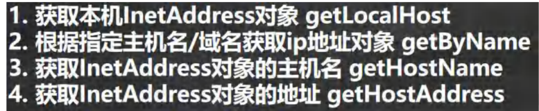

#### InetAddress 常用方法

| 方法 | 说明 | 返回值 |
|------|------|--------|
| `getLocalHost()` | 获取本机InetAddress对象 | InetAddress |
| `getByName(String host)` | 根据主机名/域名获取InetAddress对象 | InetAddress |
| `getHostName()` | 获取主机名 | String |
| `getHostAddress()` | 获取IP地址 | String |

### 2.2 应用案例

**需求：** 编写代码，获取计算机的主机名和 IP 地址相关 API

```java
//获取本机 InetAddress 对象 getLocalHost
InetAddress localHost = InetAddress.getLocalHost();
System.out.println(localHost);
//根据指定主机名/域名获取 ip 地址对象 getByName
InetAddress host2 = InetAddress.getByName("ThinkPad-PC");
System.out.println(host2);
InetAddress host3 = InetAddress.getByName("www.hsp.com");
System.out.println(host3);
//获取 InetAddress 对象的主机名 getHostName
String host3Name = host3.getHostName();
System.out.println(host3Name);
//获取 InetAddress 对象的地址 getHostAddress
String host3Address = host3.getHostAddress();
System.out.println(host3Address);
```

---

## 三、Socket

### 3.1 基本介绍

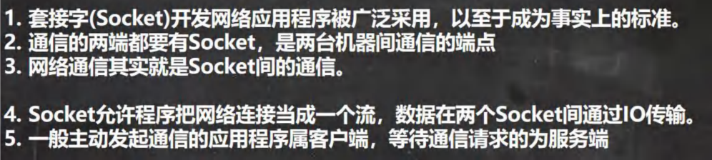

### 3.2 示意图

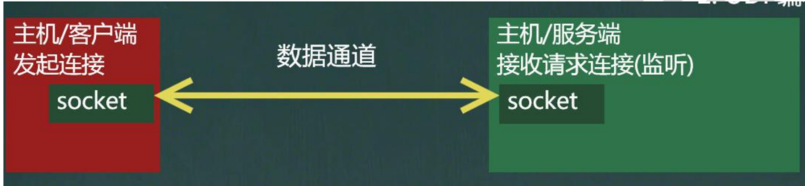

#### Socket 核心概念

| 概念 | 说明 |
|------|------|
| **Socket** | 网络通信的端点，用于在两个程序之间建立连接 |
| **ServerSocket** | 服务器端Socket，用于监听客户端连接请求 |
| **端口号** | 标识应用程序的逻辑地址（0-65535） |
| **IP地址** | 标识网络中的主机 |

---

## 四、TCP 网络通信编程

### 4.1 基本介绍


---

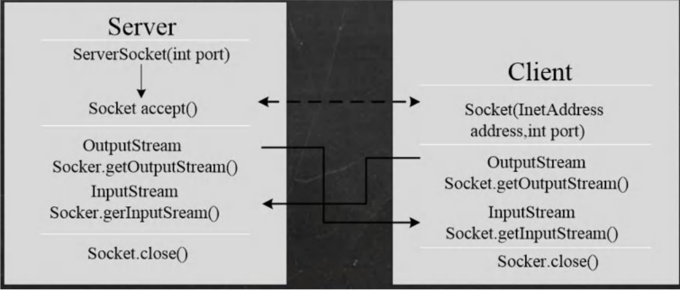

#### TCP 编程步骤

**服务端步骤：**
1. 创建 ServerSocket 对象，指定端口号
2. 调用 accept() 方法等待客户端连接
3. 获取输入流，读取客户端数据
4. 获取输出流，向客户端发送数据
5. 关闭资源

**客户端步骤：**
1. 创建 Socket 对象，指定服务器IP和端口
2. 获取输出流，向服务器发送数据
3. 获取输入流，读取服务器响应
4. 关闭资源

### 4.2 应用案例 1（使用字节流）

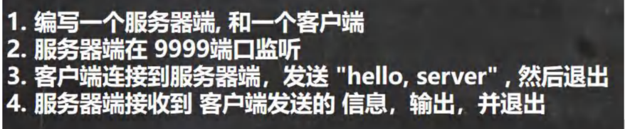

服务端：

```java
import java.io.IOException;
import java.io.InputStream;
import java.net.ServerSocket;
import java.net.Socket;

/**
 * 服务端
 */
public class SocketTCP01Server {
    public static void main(String[] args) throws IOException {
        //思路
        //1. 在本机 的 9999 端口监听, 等待连接
        // 细节: 要求在本机没有其它服务在监听 9999
        // 细节：这个 ServerSocket 可以通过 accept() 返回多个 Socket[多个客户端连接服务器的并发]
        ServerSocket serverSocket = new ServerSocket(9999);
        System.out.println("服务端，在 9999 端口监听，等待连接..");
        
        //2. 当没有客户端连接 9999 端口时，程序会 阻塞, 等待连接
        // 如果有客户端连接，则会返回 Socket 对象，程序继续
        Socket socket = serverSocket.accept();
        System.out.println("服务端 socket =" + socket.getClass());
        
        //3. 通过 socket.getInputStream() 读取客户端写入到数据通道的数据, 显示
        InputStream inputStream = socket.getInputStream();
        
        //4. IO 读取
        byte[] buf = new byte[1024];
        int readLen = 0;
        while ((readLen = inputStream.read(buf)) != -1) {
            System.out.println(new String(buf, 0, readLen));//根据读取到的实际长度，显示内容
        }
        
        //5.关闭流和 socket
        inputStream.close();
        socket.close();
        serverSocket.close();//关闭
    }
}
```

客户端：

```java
import java.io.IOException;
import java.io.OutputStream;
import java.net.InetAddress;
import java.net.Socket;

/**
 * 客户端，发送 "hello, server" 给服务端
 */
public class SocketTCP01Client {
    public static void main(String[] args) throws IOException {
        //思路
        //1. 连接服务端 (ip , 端口）
        //解读: 连接本机的 9999 端口, 如果连接成功，返回 Socket 对象
        Socket socket = new Socket(InetAddress.getLocalHost(), 9999);
        System.out.println("客户端 socket 返回=" + socket.getClass());
        
        //2. 连接上后，生成 Socket, 通过 socket.getOutputStream()
        // 得到 和 socket 对象关联的输出流对象
        OutputStream outputStream = socket.getOutputStream();
        
        //3. 通过输出流，写入数据到 数据通道
        outputStream.write("hello, server".getBytes());
        
        //4. 关闭流对象和 socket, 必须关闭
        outputStream.close();
        socket.close();
        System.out.println("客户端退出.....");
    }
}
```

---

### 4.3 应用案例 2（使用字节流）


服务端：

```java
import java.io.IOException;
import java.io.InputStream;
import java.io.OutputStream;
import java.net.ServerSocket;
import java.net.Socket;

/**
 * 服务端
 */
@SuppressWarnings({"all"})
public class SocketTCP02Server {
    public static void main(String[] args) throws IOException {
        //思路
        //1. 在本机 的 9999 端口监听, 等待连接
        // 细节: 要求在本机没有其它服务在监听 9999
        // 细节：这个 ServerSocket 可以通过 accept() 返回多个 Socket[多个客户端连接服务器的并发]
        ServerSocket serverSocket = new ServerSocket(9999);
        System.out.println("服务端，在 9999 端口监听，等待连接..");
        
        //2. 当没有客户端连接 9999 端口时，程序会 阻塞, 等待连接
        // 如果有客户端连接，则会返回 Socket 对象，程序继续
        Socket socket = serverSocket.accept();
        System.out.println("服务端 socket =" + socket.getClass());

        //3. 通过 socket.getInputStream() 读取客户端写入到数据通道的数据, 显示
        InputStream inputStream = socket.getInputStream();
        
        //4. IO 读取
        byte[] buf = new byte[1024];
        int readLen = 0;
        while ((readLen = inputStream.read(buf)) != -1) {
            System.out.println(new String(buf, 0, readLen));//根据读取到的实际长度，显示内容
        }
        
        //5. 获取 socket 相关联的输出流
        OutputStream outputStream = socket.getOutputStream();
        outputStream.write("hello, client".getBytes());
        // 设置结束标记
        socket.shutdownOutput();
        
        //6.关闭流和 socket
        outputStream.close();
        inputStream.close();
        socket.close();
        serverSocket.close();//关闭
    }
}
```

客户端：

```java
import java.io.IOException;
import java.io.InputStream;
import java.io.OutputStream;
import java.net.InetAddress;
import java.net.Socket;
/**
 * 客户端，发送 "hello, server" 给服务端
 */
@SuppressWarnings({"all"})
public class SocketTCP02Client {
    public static void main(String[] args) throws IOException {
        //思路
        //1. 连接服务端 (ip , 端口）
        //解读: 连接本机的 9999 端口, 如果连接成功，返回 Socket 对象
        Socket socket = new Socket(InetAddress.getLocalHost(), 9999);
        System.out.println("客户端 socket 返回=" + socket.getClass());
        
        //2. 连接上后，生成 Socket, 通过 socket.getOutputStream()
        // 得到 和 socket 对象关联的输出流对象
        OutputStream outputStream = socket.getOutputStream();
        
        //3. 通过输出流，写入数据到 数据通道
        outputStream.write("hello, server".getBytes());
        // 设置结束标记
        socket.shutdownOutput();
        
        //4. 获取和 socket 关联的输入流. 读取数据(字节)，并显示
        InputStream inputStream = socket.getInputStream();
        byte[] buf = new byte[1024];
        int readLen = 0;
        while ((readLen = inputStream.read(buf)) != -1) {
            System.out.println(new String(buf, 0, readLen));
        }
        //5. 关闭流对象和 socket, 必须关闭
        inputStream.close();
        outputStream.close();
        socket.close();
        System.out.println("客户端退出.....");
    }
}
```

---

### 4.4 应用案例 3（使用字符流）


服务端：

```java
import java.io.*;
import java.net.ServerSocket;
import java.net.Socket;
/**
 * 服务端, 使用字符流方式读写
 */
@SuppressWarnings({"all"})
public class SocketTCP03Server {
    public static void main(String[] args) throws IOException {
        //思路
        //1. 在本机 的 9999 端口监听, 等待连接
        // 细节: 要求在本机没有其它服务在监听 9999
        // 细节：这个 ServerSocket 可以通过 accept() 返回多个 Socket[多个客户端连接服务器的并发]
        ServerSocket serverSocket = new ServerSocket(9999);
        System.out.println("服务端，在 9999 端口监听，等待连接..");
        
        //2. 当没有客户端连接 9999 端口时，程序会 阻塞, 等待连接
        // 如果有客户端连接，则会返回 Socket 对象，程序继续
        Socket socket = serverSocket.accept();
        System.out.println("服务端 socket =" + socket.getClass());

        //3. 通过 socket.getInputStream() 读取客户端写入到数据通道的数据, 显示
        InputStream inputStream = socket.getInputStream();
        
        //4. IO 读取, 使用字符流, 老师使用 InputStreamReader 将 inputStream 转成字符流
        BufferedReader bufferedReader = new BufferedReader(new InputStreamReader(inputStream));
        String s = bufferedReader.readLine();
        System.out.println(s);//输出
        
        //5. 获取 socket 相关联的输出流
        OutputStream outputStream = socket.getOutputStream();
        // 使用字符输出流的方式回复信息
        BufferedWriter bufferedWriter = new BufferedWriter(new OutputStreamWriter(outputStream));
        bufferedWriter.write("hello client 字符流");
        bufferedWriter.newLine();// 插入一个换行符，表示回复内容的结束
        bufferedWriter.flush();//注意需要手动的 flush

        //6.关闭流和 socket
        bufferedWriter.close();
        bufferedReader.close();
        socket.close();
        serverSocket.close();//关闭
    }
}
```

客户端：

```java
import java.io.*;
import java.net.InetAddress;
import java.net.Socket;
/**
 * 客户端，发送 "hello, server" 给服务端， 使用字符流
 */
@SuppressWarnings({"all"})
public class SocketTCP03Client {
    public static void main(String[] args) throws IOException {
        // 思路
        // 1. 连接服务端 (ip , 端口）
        //解读: 连接本机的 9999 端口, 如果连接成功，返回 Socket 对象
        Socket socket = new Socket(InetAddress.getLocalHost(), 9999);
        System.out.println("客户端 socket 返回=" + socket.getClass());
        
        // 2. 连接上后，生成 Socket, 通过 socket.getOutputStream()
        // 得到 和 socket 对象关联的输出流对象
        OutputStream outputStream = socket.getOutputStream();
        
        // 3. 通过输出流，写入数据到 数据通道, 使用字符流
        BufferedWriter bufferedWriter = new BufferedWriter(new OutputStreamWriter(outputStream));
        bufferedWriter.write("hello, server 字符流");
        bufferedWriter.newLine();// 插入一个换行符，表示写入的内容结束, 注意，要求对方使用 readLine()!!!!
        bufferedWriter.flush();  // 如果使用的字符流，需要手动刷新，否则数据不会写入数据通道
        
        // 4. 获取和 socket 关联的输入流. 读取数据(字符)，并显示
        InputStream inputStream = socket.getInputStream();
        BufferedReader bufferedReader = new BufferedReader(new InputStreamReader(inputStream));
        String s = bufferedReader.readLine();
        System.out.println(s);
        
        // 5. 关闭流对象和 socket, 必须关闭
        bufferedReader.close();//关闭外层流
        bufferedWriter.close();
        socket.close();
        System.out.println("客户端退出.....");
    }
}
```

---

### 4.5 应用案例 4（文件传输）

**需求：** 实现客户端向服务器上传文件的功能

- TCPFileUploadServer.java 
- TCPFileUploadClient.java


#### StreamUtils 工具类

```java
import java.io.BufferedReader;
import java.io.ByteArrayOutputStream;
import java.io.InputStream;
import java.io.InputStreamReader;
/**
 * 此类用于演示关于流的读写方法
 */
public class StreamUtils {
    /**
     * 功能：将输入流转换成 byte[]
     * @param is
     * @return
     * @throws Exception
     */
    public static byte[] streamToByteArray(InputStream is) throws Exception{
        ByteArrayOutputStream bos = new ByteArrayOutputStream();//创建输出流对象
        byte[] b = new byte[1024];
        int len;
        while((len=is.read(b))!=-1){
            bos.write(b, 0, len);
        }
        byte[] array = bos.toByteArray();
        bos.close();
        return array;
    }
    
    /**
     * 功能：将 InputStream 转换成 String
     * @param is
     * @return
     * @throws Exception
     */
    public static String streamToString(InputStream is) throws Exception{
        BufferedReader reader = new BufferedReader(new InputStreamReader(is));
        StringBuilder builder= new StringBuilder();
        String line;
        while((line=reader.readLine())!=null){ //当读取到 null 时，就表示结束
            builder.append(line+"\r\n");
        }
        return builder.toString();
    }
}
```

#### 服务端代码

```java
import java.io.*;
import java.net.ServerSocket;
import java.net.Socket;

/**
 * 文件上传的服务端
 */
public class TCPFileUploadServer {
    public static void main(String[] args) throws Exception {
        //1. 服务端在本机监听 8888 端口
        ServerSocket serverSocket = new ServerSocket(8888);
        System.out.println("服务端在 8888 端口监听....");
        
        //2. 等待连接
        Socket socket = serverSocket.accept();
        
        //3. 读取客户端发送的数据
        // 通过 Socket 得到输入流
        BufferedInputStream bis = new BufferedInputStream(socket.getInputStream());
        byte[] bytes = StreamUtils.streamToByteArray(bis);
        
        //4. 将得到 bytes 数组，写入到指定的路径，就得到一个文件了
        String destFilePath = "src\\abc.mp4";
        BufferedOutputStream bos = new BufferedOutputStream(new FileOutputStream(destFilePath));
        bos.write(bytes);
        bos.close();
        
        // 向客户端回复 "收到文件"
        // 通过 socket 获取到输出流(字符)
        BufferedWriter writer = new BufferedWriter(new OutputStreamWriter(socket.getOutputStream()));
        writer.write("收到文件");
        writer.flush();//把内容刷新到数据通道
        socket.shutdownOutput();//设置写入结束标记
        
        //关闭其他资源
        writer.close();
        bis.close();
        socket.close();
        serverSocket.close();
    }
}
```

#### 客户端代码

```java
import java.io.*;
import java.net.InetAddress;
import java.net.Socket;

/**
 * 文件上传的客户端
 */
public class TCPFileUploadClient {
    public static void main(String[] args) throws Exception {
        //客户端连接服务端 8888，得到 Socket 对象
        Socket socket = new Socket(InetAddress.getLocalHost(), 8888);
        //创建读取磁盘文件的输入流
        //String filePath = "e:\\qie.png";
        String filePath = "e:\\abc.mp4";
        BufferedInputStream bis = new BufferedInputStream(new FileInputStream(filePath));
        //bytes 就是 filePath 对应的字节数组
        byte[] bytes = StreamUtils.streamToByteArray(bis);
        //通过 socket 获取到输出流, 将 bytes 数据发送给服务端
        BufferedOutputStream bos = new BufferedOutputStream(socket.getOutputStream());
        bos.write(bytes);//将文件对应的字节数组的内容，写入到数据通道
        bis.close();
        socket.shutdownOutput();//设置写入数据的结束标记
        
        //=====接收从服务端回复的消息=====
        InputStream inputStream = socket.getInputStream();
        
        //使用 StreamUtils 的方法，直接将 inputStream 读取到的内容 转成字符串
        String s = StreamUtils.streamToString(inputStream);
        System.out.println(s);
        
        //关闭相关的流
        inputStream.close();
        bos.close();
        socket.close();
    }
}
```

---

### 4.6 netstat 指令

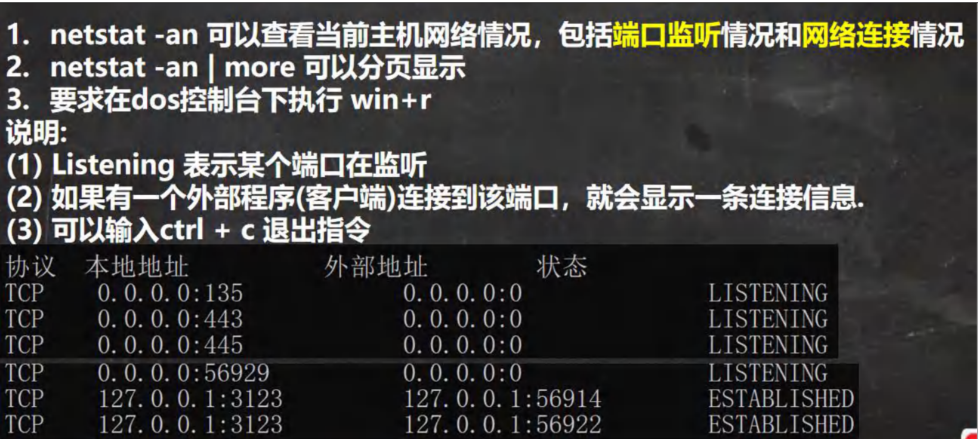

#### 常用 netstat 命令

| 命令 | 说明 |
|------|------|
| `netstat -an` | 查看所有网络连接 |
| `netstat -ano` | 查看所有连接及进程ID |
| `netstat -ano \| findstr 端口号` | 查看指定端口的占用情况 |

### 4.7 TCP 网络通讯不为人知的秘密

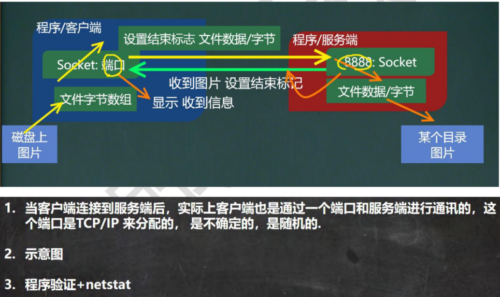


---

## 五、UDP 网络通信编程[了解]

### 5.1 基本介绍

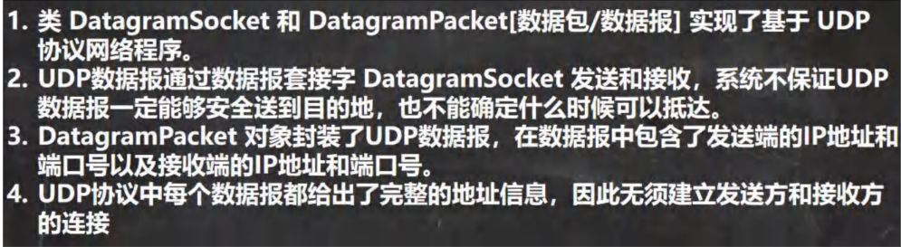

### 5.2 基本流程

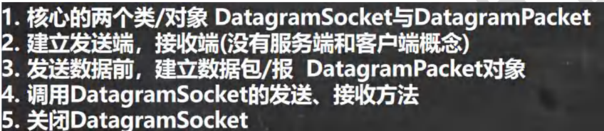

---

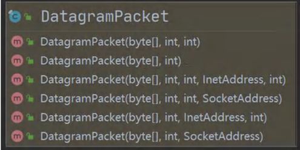

#### UDP 编程步骤

**发送端步骤：**
1. 创建 DatagramSocket 对象
2. 将数据封装到 DatagramPacket 对象中
3. 调用 send() 方法发送数据包
4. 关闭资源

**接收端步骤：**

1. 创建 DatagramSocket 对象，指定端口号
2. 创建 DatagramPacket 对象，准备接收数据
3. 调用 receive() 方法接收数据包（阻塞）
4. 从 DatagramPacket 中提取数据
5. 关闭资源

### 5.3 应用案例


#### 接收端 A

```java
import java.io.IOException;
import java.net.DatagramPacket;
import java.net.DatagramSocket;
import java.net.InetAddress;

/**
 * UDP 接收端
 */
public class UDPReceiverA {
    public static void main(String[] args) throws IOException {
        //1. 创建一个 DatagramSocket 对象，准备在 9999 接收数据
        DatagramSocket socket = new DatagramSocket(9999);
        
        //2. 构建一个 DatagramPacket 对象，准备接收数据
        // 在前面讲解 UDP 协议时，一个数据包最大 64k
        byte[] buf = new byte[1024];
        DatagramPacket packet = new DatagramPacket(buf, buf.length);
        
        //3. 调用 接收方法, 将通过网络传输的 DatagramPacket 对象
        // 填充到 packet 对象
        // 提示: 当有数据包发送到 本机的 9999 端口时，就会接收到数据
        // 如果没有数据包发送到 本机的 9999 端口, 就会阻塞等待
        System.out.println("接收端 A 等待接收数据..");
        socket.receive(packet);
        
        //4. 可以把 packet 进行拆包，取出数据，并显示
        int length = packet.getLength();//实际接收到的数据字节长度
        byte[] data = packet.getData();//接收到数据
        String s = new String(data, 0, length);
        System.out.println(s);
        
        //===回复信息给 B 端
        //将需要发送的数据，封装到 DatagramPacket 对象
        data = "好的, 明天见".getBytes();
        //说明: 封装的 DatagramPacket 对象 data 内容字节数组 , data.length , 主机(IP) , 端口
        packet = new DatagramPacket(data, data.length, InetAddress.getByName("192.168.12.1"), 9998);
        socket.send(packet);//发送
        
        //5. 关闭资源
        socket.close();
        System.out.println("A 端退出...");
    }
}
```

#### 发送端 B

```java
import java.io.IOException;
import java.net.DatagramPacket;
import java.net.DatagramSocket;
import java.net.InetAddress;

/**
 * 发送端 B ====> 也可以接收数据
 */
@SuppressWarnings({"all"})
public class UDPSenderB {
    public static void main(String[] args) throws IOException {
        //1.创建 DatagramSocket 对象，准备在 9998 端口 接收数据
        DatagramSocket socket = new DatagramSocket(9998);
        
        //2. 将需要发送的数据，封装到 DatagramPacket 对象
        byte[] data = "hello 明天吃火锅~".getBytes();
        //说明: 封装的 DatagramPacket 对象 data 内容字节数组 , data.length , 主机(IP) , 端口
        DatagramPacket packet = new DatagramPacket(data, data.length, InetAddress.getByName("192.168.12.1"), 9999);
        socket.send(packet);
        
        //3.=== 接收从 A 端回复的信息
        //(1) 构建一个 DatagramPacket 对象，准备接收数据
        // 在前面讲解 UDP 协议时，一个数据包最大 64k
        byte[] buf = new byte[1024];
        packet = new DatagramPacket(buf, buf.length);
        //(2) 调用 接收方法, 将通过网络传输的 DatagramPacket 对象
        // 填充到 packet 对象
        // 提示: 当有数据包发送到 本机的 9998 端口时，就会接收到数据
        // 如果没有数据包发送到 本机的 9998 端口, 就会阻塞等待
        socket.receive(packet);
        //(3) 可以把 packet 进行拆包，取出数据，并显示
        int length = packet.getLength();//实际接收到的数据字节长度
        data = packet.getData();//接收到数据
        String s = new String(data, 0, length);
        System.out.println(s);
        
        //关闭资源
        socket.close();
        System.out.println("B 端退出");
    }
}
```

---

## 六、网络编程最佳实践

### 6.1 异常处理和资源管理

#### 使用 try-with-resources 自动关闭资源

```java
import java.io.*;
import java.net.*;

/**
 * 使用 try-with-resources 的服务端示例
 */
public class BestPracticeServer {
    public static void main(String[] args) {
        // try-with-resources 会自动关闭资源
        try (ServerSocket serverSocket = new ServerSocket(9999)) {
            System.out.println("服务端启动，监听端口 9999...");
            
            // 接受客户端连接
            try (Socket socket = serverSocket.accept();
                 BufferedReader reader = new BufferedReader(
                     new InputStreamReader(socket.getInputStream()));
                 BufferedWriter writer = new BufferedWriter(
                     new OutputStreamWriter(socket.getOutputStream()))) {
                
                System.out.println("客户端已连接: " + socket.getInetAddress());
                
                // 读取客户端消息
                String message = reader.readLine();
                System.out.println("收到消息: " + message);
                
                // 回复客户端
                writer.write("服务端已收到: " + message);
                writer.newLine();
                writer.flush();
                
            } catch (IOException e) {
                System.err.println("处理客户端连接时出错: " + e.getMessage());
                e.printStackTrace();
            }
            
        } catch (IOException e) {
            System.err.println("服务端启动失败: " + e.getMessage());
            e.printStackTrace();
        }
    }
}
```

#### 完善的异常处理示例

```java
import java.io.*;
import java.net.*;

/**
 * 带完善异常处理的客户端
 */
public class BestPracticeClient {
    public static void main(String[] args) {
        Socket socket = null;
        BufferedReader reader = null;
        BufferedWriter writer = null;
        
        try {
            // 连接服务器
            socket = new Socket("localhost", 9999);
            System.out.println("已连接到服务器");
            
            // 获取输入输出流
            reader = new BufferedReader(
                new InputStreamReader(socket.getInputStream()));
            writer = new BufferedWriter(
                new OutputStreamWriter(socket.getOutputStream()));
            
            // 发送消息
            writer.write("Hello Server!");
            writer.newLine();
            writer.flush();
            
            // 接收响应
            String response = reader.readLine();
            System.out.println("服务器响应: " + response);
            
        } catch (UnknownHostException e) {
            System.err.println("无法找到主机: " + e.getMessage());
        } catch (ConnectException e) {
            System.err.println("连接被拒绝，请确认服务器已启动: " + e.getMessage());
        } catch (SocketTimeoutException e) {
            System.err.println("连接超时: " + e.getMessage());
        } catch (IOException e) {
            System.err.println("IO 异常: " + e.getMessage());
            e.printStackTrace();
        } finally {
            // 确保资源被关闭
            try {
                if (reader != null) reader.close();
                if (writer != null) writer.close();
                if (socket != null) socket.close();
            } catch (IOException e) {
                System.err.println("关闭资源时出错: " + e.getMessage());
            }
        }
    }
}
```

### 6.2 多线程服务器

#### 为每个客户端创建独立线程

```java
import java.io.*;
import java.net.*;

/**
 * 多线程服务器 - 可以同时处理多个客户端
 */
public class MultiThreadServer {
    public static void main(String[] args) {
        try (ServerSocket serverSocket = new ServerSocket(9999)) {
            System.out.println("多线程服务器启动，监听端口 9999...");
            
            // 持续接受客户端连接
            while (true) {
                Socket socket = serverSocket.accept();
                System.out.println("新客户端连接: " + socket.getInetAddress());
                
                // 为每个客户端创建一个新线程
                new Thread(new ClientHandler(socket)).start();
            }
            
        } catch (IOException e) {
            System.err.println("服务器异常: " + e.getMessage());
            e.printStackTrace();
        }
    }
}

/**
 * 客户端处理器
 */
class ClientHandler implements Runnable {
    private Socket socket;
    
    public ClientHandler(Socket socket) {
        this.socket = socket;
    }
    
    @Override
    public void run() {
        try (BufferedReader reader = new BufferedReader(
                 new InputStreamReader(socket.getInputStream()));
             BufferedWriter writer = new BufferedWriter(
                 new OutputStreamWriter(socket.getOutputStream()))) {
            
            String clientAddress = socket.getInetAddress().toString();
            System.out.println("线程 " + Thread.currentThread().getName() + 
                             " 正在处理客户端: " + clientAddress);
            
            // 读取客户端消息
            String message;
            while ((message = reader.readLine()) != null) {
                System.out.println("收到来自 " + clientAddress + " 的消息: " + message);
                
                // 回复客户端
                writer.write("服务器收到: " + message);
                writer.newLine();
                writer.flush();
                
                // 如果客户端发送 "bye"，结束连接
                if ("bye".equalsIgnoreCase(message.trim())) {
                    break;
                }
            }
            
        } catch (IOException e) {
            System.err.println("处理客户端时出错: " + e.getMessage());
        } finally {
            try {
                socket.close();
                System.out.println("客户端断开连接: " + socket.getInetAddress());
            } catch (IOException e) {
                e.printStackTrace();
            }
        }
    }
}
```

### 6.3 线程池优化

#### 使用线程池管理客户端连接

```java
import java.io.*;
import java.net.*;
import java.util.concurrent.*;

/**
 * 使用线程池的服务器 - 更高效的资源管理
 */
public class ThreadPoolServer {
    private static final int THREAD_POOL_SIZE = 10;
    
    public static void main(String[] args) {
        // 创建固定大小的线程池
        ExecutorService threadPool = Executors.newFixedThreadPool(THREAD_POOL_SIZE);
        
        try (ServerSocket serverSocket = new ServerSocket(9999)) {
            System.out.println("线程池服务器启动，线程池大小: " + THREAD_POOL_SIZE);
            
            while (true) {
                Socket socket = serverSocket.accept();
                System.out.println("新客户端连接: " + socket.getInetAddress());
                
                // 将任务提交给线程池
                threadPool.execute(new ClientHandler(socket));
            }
            
        } catch (IOException e) {
            System.err.println("服务器异常: " + e.getMessage());
            e.printStackTrace();
        } finally {
            threadPool.shutdown();
        }
    }
}
```

### 6.4 设置超时时间

#### 避免无限期阻塞

```java
import java.io.*;
import java.net.*;

/**
 * 设置超时时间的示例
 */
public class TimeoutExample {
    public static void main(String[] args) {
        try {
            Socket socket = new Socket();
            // 设置连接超时时间为 5 秒
            socket.connect(new InetSocketAddress("localhost", 9999), 5000);
            
            // 设置读取超时时间为 10 秒
            socket.setSoTimeout(10000);
            
            BufferedReader reader = new BufferedReader(
                new InputStreamReader(socket.getInputStream()));
            
            // 如果 10 秒内没有数据，会抛出 SocketTimeoutException
            String response = reader.readLine();
            System.out.println("收到响应: " + response);
            
            reader.close();
            socket.close();
            
        } catch (SocketTimeoutException e) {
            System.err.println("操作超时: " + e.getMessage());
        } catch (IOException e) {
            System.err.println("IO 异常: " + e.getMessage());
        }
    }
}
```

### 6.5 Socket 配置选项

#### 常用的 Socket 配置

```java
import java.io.IOException;
import java.net.*;

/**
 * Socket 配置选项示例
 */
public class SocketOptions {
    public static void main(String[] args) throws IOException {
        Socket socket = new Socket("localhost", 9999);
        
        // 1. 设置 TCP_NODELAY，禁用 Nagle 算法，减少延迟
        socket.setTcpNoDelay(true);
        
        // 2. 设置 SO_KEEPALIVE，保持连接活跃
        socket.setKeepAlive(true);
        
        // 3. 设置 SO_TIMEOUT，读取超时时间（毫秒）
        socket.setSoTimeout(30000);
        
        // 4. 设置 SO_LINGER，关闭时的延迟时间
        socket.setSoLinger(true, 5);
        
        // 5. 设置接收缓冲区大小
        socket.setReceiveBufferSize(8192);
        
        // 6. 设置发送缓冲区大小
        socket.setSendBufferSize(8192);
        
        // 7. 设置 SO_REUSEADDR，允许地址重用
        socket.setReuseAddress(true);
        
        System.out.println("Socket 配置完成");
        System.out.println("TCP_NODELAY: " + socket.getTcpNoDelay());
        System.out.println("KeepAlive: " + socket.getKeepAlive());
        System.out.println("SoTimeout: " + socket.getSoTimeout());
        System.out.println("ReceiveBufferSize: " + socket.getReceiveBufferSize());
        System.out.println("SendBufferSize: " + socket.getSendBufferSize());
        
        socket.close();
    }
}
```

## 七、网络编程常见问题

### 7.1 常见异常及解决方案

#### BindException: Address already in use

**原因：** 端口已被占用

**解决方案：**
- 检查是否有其他程序占用该端口
- 使用 `netstat -ano | findstr 端口号` 查看端口占用情况
- 更换端口或关闭占用端口的程序
- 设置 `SO_REUSEADDR` 选项

```java
ServerSocket serverSocket = new ServerSocket();
serverSocket.setReuseAddress(true);
serverSocket.bind(new InetSocketAddress(9999));
```

#### Connection refused

**原因：** 服务器未启动或防火墙阻止连接

**解决方案：**
- 确保服务器已启动并监听正确的端口
- 检查防火墙设置
- 确认 IP 地址和端口号正确

#### SocketTimeoutException

**原因：** 操作超时

**解决方案：**
- 增加超时时间
- 检查网络连接
- 优化服务器响应速度

#### Broken pipe / Connection reset

**原因：** 连接被对方关闭

**解决方案：**
- 在发送数据前检查连接状态
- 实现心跳机制
- 正确处理异常并重新建立连接

### 7.2 数据传输注意事项

#### 字符编码问题

```java
// 指定字符编码，避免乱码
BufferedReader reader = new BufferedReader(
    new InputStreamReader(socket.getInputStream(), "UTF-8"));
BufferedWriter writer = new BufferedWriter(
    new OutputStreamWriter(socket.getOutputStream(), "UTF-8"));
```

#### 粘包和拆包问题

**TCP 是流式协议，可能出现粘包和拆包现象**

**解决方案：**
1. 固定长度消息
2. 使用分隔符（如换行符）
3. 消息头包含长度信息

```java
// 方案 3 示例：消息头包含长度
public void sendMessage(OutputStream out, String message) throws IOException {
    byte[] data = message.getBytes("UTF-8");
    // 先发送长度（4 字节）
    out.write((data.length >> 24) & 0xFF);
    out.write((data.length >> 16) & 0xFF);
    out.write((data.length >> 8) & 0xFF);
    out.write(data.length & 0xFF);
    // 再发送数据
    out.write(data);
    out.flush();
}

public String receiveMessage(InputStream in) throws IOException {
    // 先读取长度（4 字节）
    int length = (in.read() << 24) | (in.read() << 16) | 
                 (in.read() << 8) | in.read();
    // 根据长度读取数据
    byte[] data = new byte[length];
    int totalRead = 0;
    while (totalRead < length) {
        int read = in.read(data, totalRead, length - totalRead);
        if (read == -1) break;
        totalRead += read;
    }
    return new String(data, "UTF-8");
}
```

### 7.3 性能优化建议

#### 1. 使用缓冲流

```java
// 使用 BufferedInputStream 和 BufferedOutputStream 提高性能
BufferedInputStream bis = new BufferedInputStream(socket.getInputStream());
BufferedOutputStream bos = new BufferedOutputStream(socket.getOutputStream());
```

#### 2. 合理设置缓冲区大小

```java
// 根据实际情况调整缓冲区大小
socket.setReceiveBufferSize(64 * 1024); // 64KB
socket.setSendBufferSize(64 * 1024);
```

#### 3. 使用 NIO（非阻塞 IO）

对于高并发场景，考虑使用 Java NIO（New IO）或 Netty 框架

#### 4. 连接池

对于频繁建立连接的场景，使用连接池复用连接

### 7.4 安全性考虑

#### 1. 使用 SSL/TLS 加密通信

```java
import javax.net.ssl.*;
import java.io.*;

/**
 * SSL Socket 示例
 */
public class SSLSocketExample {
    public static void main(String[] args) throws Exception {
        SSLSocketFactory factory = (SSLSocketFactory) SSLSocketFactory.getDefault();
        SSLSocket socket = (SSLSocket) factory.createSocket("example.com", 443);
        
        // 使用加密连接
        BufferedReader reader = new BufferedReader(
            new InputStreamReader(socket.getInputStream()));
        BufferedWriter writer = new BufferedWriter(
            new OutputStreamWriter(socket.getOutputStream()));
        
        // 发送和接收数据...
        
        socket.close();
    }
}
```

#### 2. 输入验证

始终验证和清理从网络接收的数据，防止注入攻击

#### 3. 限制连接数

防止 DoS 攻击，限制同一 IP 的连接数

```java
// 使用 ConcurrentHashMap 跟踪连接
private static final int MAX_CONNECTIONS_PER_IP = 5;
private static final ConcurrentHashMap<String, AtomicInteger> connectionCount = 
    new ConcurrentHashMap<>();

public boolean acceptConnection(String ipAddress) {
    AtomicInteger count = connectionCount.computeIfAbsent(
        ipAddress, k -> new AtomicInteger(0));
    return count.incrementAndGet() <= MAX_CONNECTIONS_PER_IP;
}
```

## 八、总结

#### 网络编程核心要点

1. **TCP vs UDP**
   - TCP：可靠、面向连接、适合对数据完整性要求高的场景
   - UDP：不可靠、无连接、适合对实时性要求高的场景

2. **资源管理**
   - 使用 try-with-resources 自动关闭资源
   - 在 finally 块中确保资源释放

3. **异常处理**
   - 捕获并处理特定的网络异常
   - 提供友好的错误提示

4. **多线程**
   - 使用线程池管理并发连接
   - 避免为每个连接创建新线程

5. **性能优化**
   - 使用缓冲流
   - 合理设置 Socket 选项
   - 考虑使用 NIO 或 Netty

6. **安全性**
   - 使用 SSL/TLS 加密
   - 验证输入数据
   - 防止 DoS 攻击

