# Java 反射机制

> **本章重点：** Class类、反射创建对象、访问属性和方法、类加载机制、动态代理
> 
> **面试频率：** ⭐⭐⭐⭐⭐

---

## 目录
- [一、一个需求引出反射](#一一个需求引出反射)
- [二、Class类](#二class类)
- [三、获取Class类对象](#三获取class类对象)
- [四、哪些类型有Class对象](#四哪些类型有class对象)
- [五、类加载](#五类加载)
- [六、通过反射获取类的结构信息](#六通过反射获取类的结构信息)
- [七、通过反射创建对象](#七通过反射创建对象)
- [八、通过反射访问类中的成员](#八通过反射访问类中的成员)

---

## 一、一个需求引出反射

### 1.1 请看下面的问题

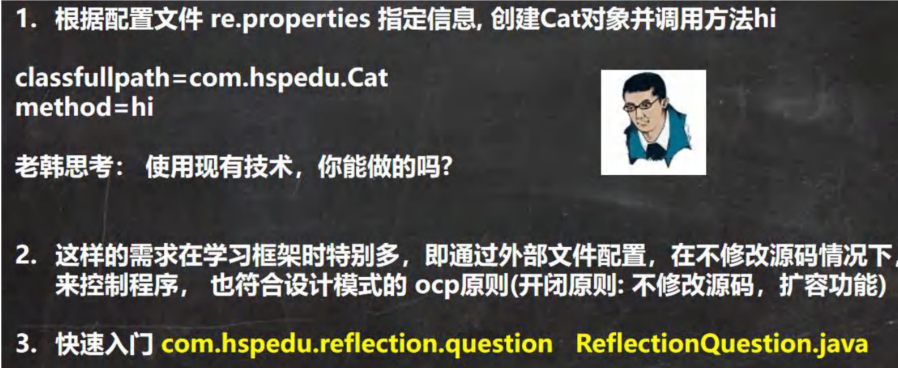

---

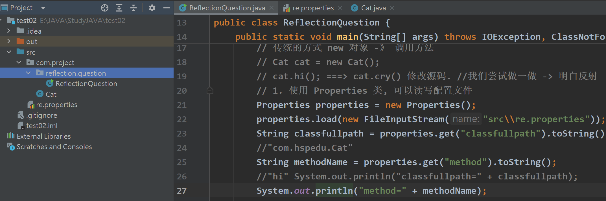

```java
package com.project.reflection.question;

import java.io.FileInputStream;
import java.io.IOException;
import java.lang.reflect.InvocationTargetException;
import java.lang.reflect.Method;
import java.util.Properties;

/**
 * 反射问题的引入
 */
@SuppressWarnings({"all"})
public class ReflectionQuestion {
    public static void main(String[] args) throws IOException, ClassNotFoundException, IllegalAccessException, InstantiationException, NoSuchMethodException, InvocationTargetException, NoSuchFieldException {
        // 根据配置文件 re.properties 指定信息, 创建 Cat 对象并调用方法 hi
        // 回忆
        // 传统的方式 new 对象 -》 调用方法
        // Cat cat = new Cat();
        // cat.hi(); ===> cat.cry() 修改源码. //我们尝试做一做 -> 明白反射
        // 1. 使用 Properties 类, 可以读写配置文件
        Properties properties = new Properties();
        properties.load(new FileInputStream("src\\re.properties"));
        String classfullpath = properties.get("classfullpath").toString();
        //"com.hspedu.Cat"
        String methodName = properties.get("method").toString();
        //"hi" System.out.println("classfullpath=" + classfullpath);
        System.out.println("method=" + methodName);

        // 2. 创建对象 , 传统的方法，行不通 =》 反射机制
        // new classfullpath();

        // 3. 使用反射机制解决
        // (1) 加载类, 返回 Class 类型的对象 cls
        Class cls = Class.forName(classfullpath);
        // (2) 通过 cls 得到你加载的类 com.hspedu.Cat 的对象实例
        Object o = cls.newInstance();
        System.out.println("o 的运行类型=" + o.getClass()); //运行类型
        // (3) 通过 cls 得到你加载的类 com.hspedu.Cat 的 methodName"hi" 的方法对象
        // 即：在反射中，可以把方法视为对象（万物皆对象）
        Method method1 = cls.getMethod(methodName);
        // (4) 通过 method1 调用方法: 即通过方法对象来实现调用方法
        System.out.println("=============================");
        method1.invoke(o); //传统方法 对象.方法() , 反射机制 方法.invoke(对象)
    }
}
```

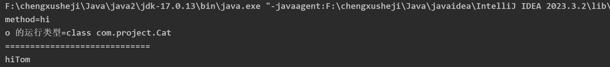

---

### 1.2 反射机制

#### 1.2.1 Java Reflection

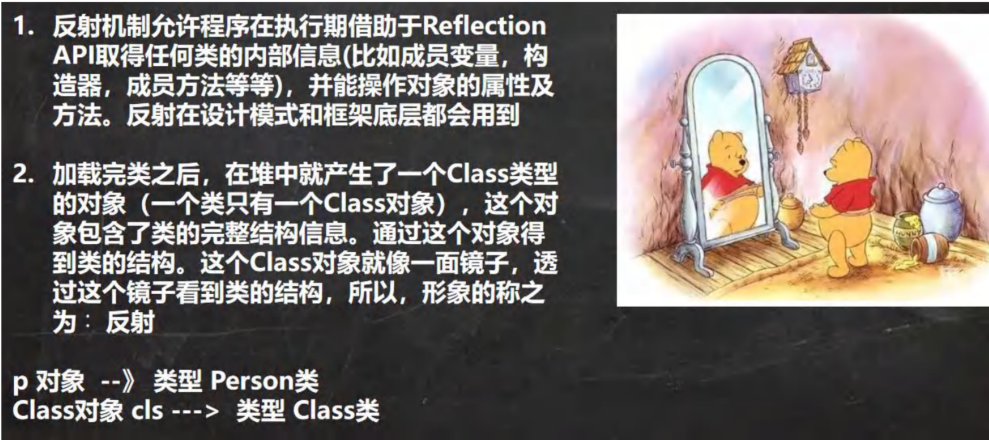

这里的Class类理解：

例如：有一个人的名字叫张三，另外一个人的名字特殊就是他就叫名字。

- 人 ——> 张三
- 人 ——> 名字


#### 1.2.2 Java 反射机制原理示意图

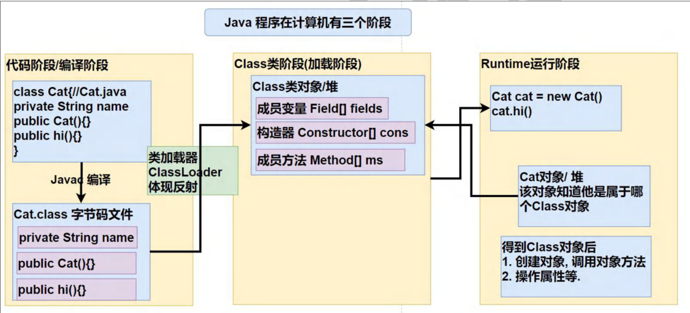

#### 1.2.3 Java 反射机制可以完成

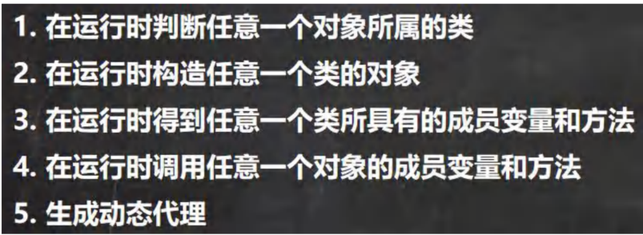

#### 1.2.4 反射相关的主要类

| 类名 | 说明 |
|------|------|
| **java.lang.Class** | 代表一个类，Class对象表示某个类加载后在堆中的对象 |
| **java.lang.reflect.Method** | 代表类的方法，Method对象表示某个类的方法 |
| **java.lang.reflect.Field** | 代表类的成员变量，Field对象表示某个类的成员变量 |
| **java.lang.reflect.Constructor** | 代表类的构造方法，Constructor对象表示构造器 |

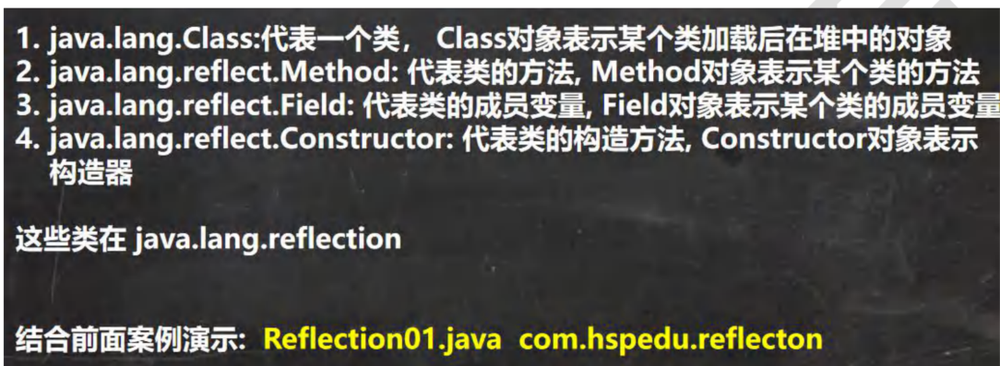

Cat类：

```java
package com.project;

public class Cat {
    private String name = "Tom";
    public int age = 0;

    public Cat() { // 无参构造器
        System.out.println("无参构造方法");
    }

    public Cat(String name) { // 有参构造器
        this.name = name;
        System.out.println("有参构造方法");
    }
    public void hi() {
        System.out.println("hi" + name);
    }

    public void cry() {
        System.out.println(name + "cry");
    }
}

```


```java
package com.project.reflection;

import java.io.FileInputStream;
import java.lang.reflect.Constructor;
import java.lang.reflect.Field;
import java.lang.reflect.Method;
import java.util.Properties;

public class Reflection01 {
    public static void main(String[] args) throws Exception {
        //1. 使用 Properties 类, 可以读写配置文件
        Properties properties = new Properties();
        properties.load(new FileInputStream("src\\re.properties"));
        String classfullpath = properties.get("classfullpath").toString();
        //"com.hspedu.Cat"
        String methodName = properties.get("method").toString();//"hi"
        
        //2. 使用反射机制解决
        //(1) 加载类, 返回 Class 类型的对象 cls
        Class cls = Class.forName(classfullpath);
        
        //(2) 通过 cls 得到你加载的类 com.hspedu.Cat 的对象实例
        Object o = cls.newInstance();
        System.out.println("o 的运行类型=" + o.getClass()); //运行类型
        
        //(3) 通过 cls 得到你加载的类 com.hspedu.Cat 的 methodName"hi" 的方法对象
        // 即：在反射中，可以把方法视为对象（万物皆对象）
        Method method1 = cls.getMethod(methodName);
        
        //(4) 通过 method1 调用方法: 即通过方法对象来实现调用方法
        System.out.println("=============================");
        method1.invoke(o); //传统方法 对象.方法() , 反射机制 方法.invoke(对象)

        // java.lang.reflect.Field: 代表类的成员变量, Field 对象表示某个类的成员变量
        // 得到 name 字段
        // getField 不能得到私有的属性
        Field nameField = cls.getField("age"); // 这里可以获得public属性的age
        System.out.println(nameField.get(o)); // 传统写法 对象.成员变量 , 反射 : 成员变量对象.get(对象) 来获取私有的name

        // java.lang.reflect.Constructor: 代表类的构造方法, Constructor 对象表示构造器
        Constructor constructor = cls.getConstructor(); //()中可以指定构造器参数类型, 返回无参构造器
        System.out.println(constructor);// Cat()

        Constructor constructor2 = cls.getConstructor(String.class); // 这里传入的 String.class 就是 String 类 的 Class 对象
        System.out.println(constructor2);// Cat(String name)
    }
}
```

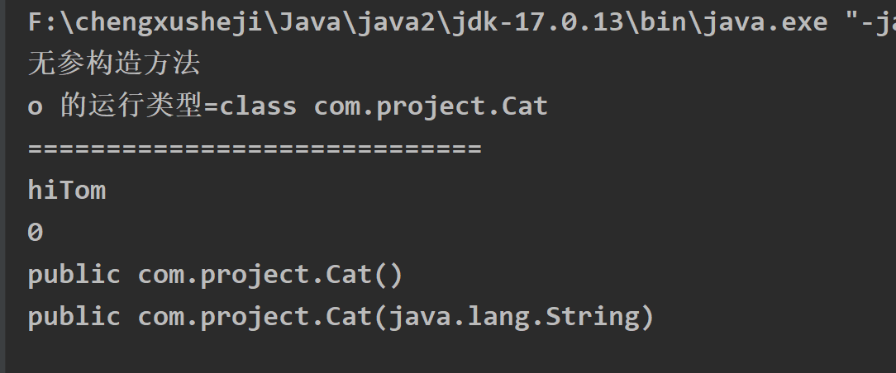

#### 1.2.5 反射优点和缺点

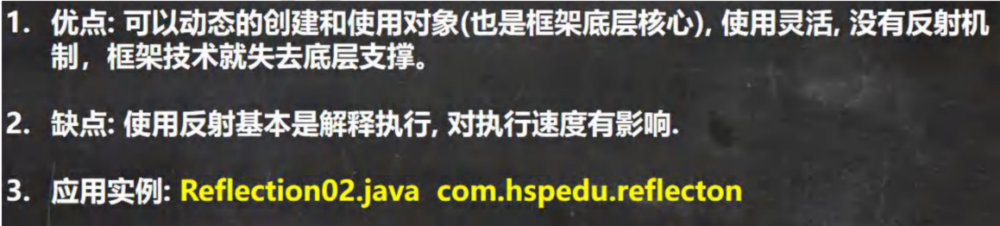

| 特性 | 说明 | 评价 |
|------|------|------|
| **优点** | 可以动态创建和使用对象（框架底层核心），灵活性高 | ⭐⭐⭐⭐⭐ |
| **缺点1** | 使用反射基本是解释执行，对执行速度有影响 | 性能较低 |
| **缺点2** | 反射可以访问私有成员，可能破坏封装性 | 安全性降低 |

```java
package com.project.reflection;

import com.project.Cat;
import java.io.FileInputStream;
import java.lang.reflect.Constructor;
import java.lang.reflect.Field;
import java.lang.reflect.InvocationTargetException;
import java.lang.reflect.Method;
/**
 * 测试反射调用的性能，和优化方案
 */
public class Reflection02 {
    public static void main(String[] args) throws ClassNotFoundException, NoSuchMethodException, InvocationTargetException, InstantiationException, IllegalAccessException {
    //Field
    //Method
    //Constructor
        m1();//传统
        m2();//反射
        m3();//反射优化
    }
    //传统方法来调用 hi
    public static void m1() {
        Cat cat = new Cat();
        long start = System.currentTimeMillis();
        for (int i = 0; i < 90; i++) {
            cat.hi();
        }
        long end = System.currentTimeMillis();
        System.out.println("m1() 耗时=" + (end - start));
    }
    
    //反射机制调用方法 hi
    public static void m2() throws ClassNotFoundException, IllegalAccessException, InstantiationException, NoSuchMethodException, InvocationTargetException {
        Class cls = Class.forName("com.hspedu.Cat");
        Object o = cls.newInstance();
        Method hi = cls.getMethod("hi");
        long start = System.currentTimeMillis();
        for (int i = 0; i < 900000000; i++) {
            hi.invoke(o);//反射调用方法
        }
        long end = System.currentTimeMillis();
        System.out.println("m2() 耗时=" + (end - start));
    }
    
    //反射调用优化 + 关闭访问检查
    public static void m3() throws ClassNotFoundException, IllegalAccessException, InstantiationException, NoSuchMethodException, InvocationTargetException {
        Class cls = Class.forName("com.hspedu.Cat");
        Object o = cls.newInstance();
        Method hi = cls.getMethod("hi");
        hi.setAccessible(true);//在反射调用方法时，取消访问检查
        long start = System.currentTimeMillis();
        for (int i = 0; i < 900000000; i++) {
            hi.invoke(o);//反射调用方法
        }
        long end = System.currentTimeMillis();
        System.out.println("m3() 耗时=" + (end - start));
    }
}
```

#### 1.2.6 反射调用优化-关闭访问检查

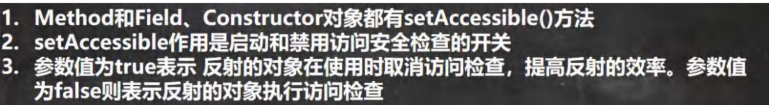

---

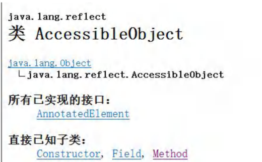

**优化建议：**
- ✅ 使用 `setAccessible(true)` 关闭访问检查
- ✅ 可以提升反射性能约50%
- ✅ 适用于 Method、Field、Constructor

---

## 二、Class 类

### 2.1 基本介绍

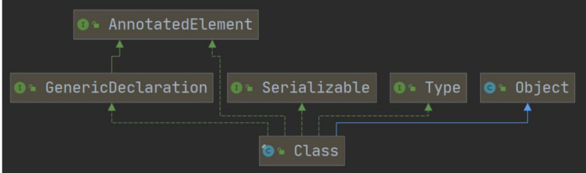

---

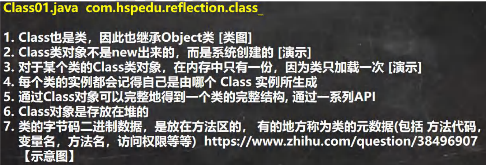

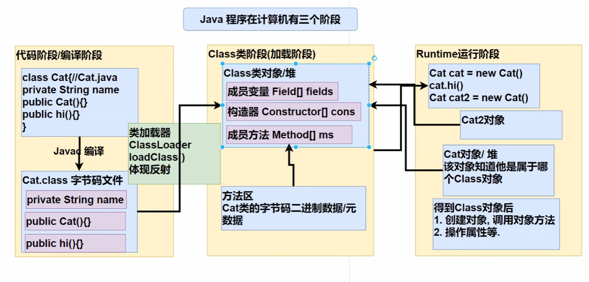

#### Class类特点

| 特点 | 说明 |
|------|------|
| **唯一性** | 对于某个类的Class类对象，在内存中只有一份 |
| **创建方式** | Class对象不是new出来的，而是系统创建的 |
| **继承关系** | Class也是类，因此也继承Object类 |
| **加载时机** | 类只加载一次，Class对象也只创建一次 |

```java
package com.project.calss_;

import java.util.ArrayList;
/**
 * 对 Class 类特点的梳理
 */
public class Class01 {
    public static void main(String[] args) throws ClassNotFoundException {
        //看看 Class 类图
        //1. Class 也是类，因此也继承 Object 类
        //Class
        //2. Class 类对象不是 new 出来的，而是系统创建的
        //(1) 传统 new 对象
        /* ClassLoader 类
        public Class<?> loadClass(String name) throws ClassNotFoundException {
            return loadClass(name, false);
        }
        */
        //Cat cat = new Cat();
        
        //(2) 反射方式, 刚才老师没有 debug 到 ClassLoader 类的 loadClass, 原因是，我没有注销 Cat cat = new Cat();
        /*
        ClassLoader 类, 仍然是通过 ClassLoader 类加载 Cat 类的 Class 对象
        public Class<?> loadClass(String name) throws ClassNotFoundException {
            return loadClass(name, false);
        }
        */
        
        Class cls1 = Class.forName("com.hspedu.Cat");
        //3. 对于某个类的 Class 类对象，在内存中只有一份，因为类只加载一次
        Class cls2 = Class.forName("com.hspedu.Cat");
        System.out.println(cls1.hashCode());
        System.out.println(cls2.hashCode());
        Class cls3 = Class.forName("com.hspedu.Dog");
        System.out.println(cls3.hashCode());
    }
}
```

---

### 2.2 Class 类的常用方法

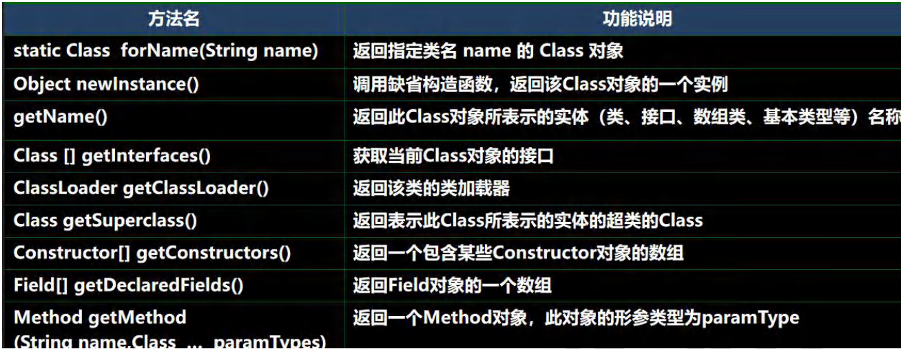

#### Class类常用方法总结

| 方法 | 说明 | 返回类型 |
|------|------|--------|
| `forName(String className)` | 根据类名返回Class对象 | Class<?> |
| `newInstance()` | 调用缺省构造函数，返回一个对象 | Object |
| `getName()` | 返回全类名 | String |
| `getSimpleName()` | 返回简单类名 | String |
| `getPackage()` | 返回包信息 | Package |
| `getClassLoader()` | 返回类加载器 | ClassLoader |
| `getSuperclass()` | 返回父类Class对象 | Class<?> |
| `getInterfaces()` | 返回接口数组 | Class<?>[] |

---

### 2.3 应用实例

```java
package com.project.reflection.calss_;

import com.project.Car;
import java.lang.reflect.Field;
/**
 * 演示 Class 类的常用方法
 */
public class Class02 {
    public static void main(String[] args) throws ClassNotFoundException, IllegalAccessException, InstantiationException, NoSuchFieldException {
        String classAllPath = "com.project.Car";

        //1 . 获取到 Car 类 对应的 Class 对象
        //<?> 表示不确定的 Java 类型
        Class<?> cls = Class.forName(classAllPath);
        //2. 输出 cls
        System.out.println(cls); //显示 cls 对象, 是哪个类的 Class 对象 com.hspedu.Car
        System.out.println(cls.getClass());//输出 cls 运行类型 java.lang.Class
        //3. 得到包名
        System.out.println(cls.getPackage().getName());//包名
        //4. 得到全类名
        System.out.println(cls.getName());

        //5. 通过 cls 创建对象实例
        Car car = (Car) cls.newInstance();
        System.out.println(car);//car.toString()

        //6. 通过反射获取属性 brand
        Field brand = cls.getField("brand");
        System.out.println(brand.get(car));//宝马

        //7. 通过反射给属性赋值
        brand.set(car, "奔驰");
        System.out.println(brand.get(car));//奔驰

        //8 我希望大家可以得到所有的属性(字段)
        System.out.println("=======所有的字段属性====");
        Field[] fields = cls.getFields();
        for (Field f : fields) {
            System.out.println(f.getName());//名称
        }
    }
}
```

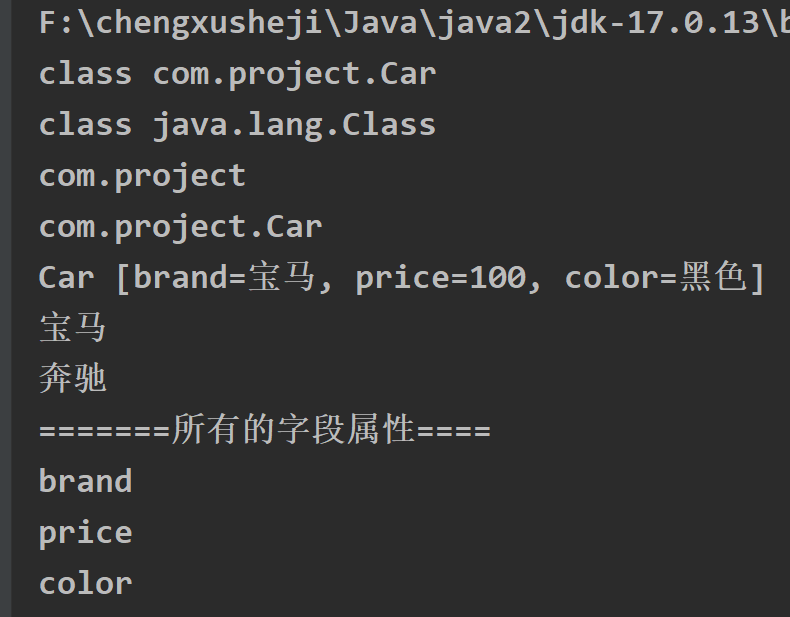

---

## 三、获取 Class 类对象

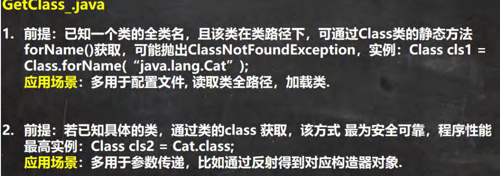

---

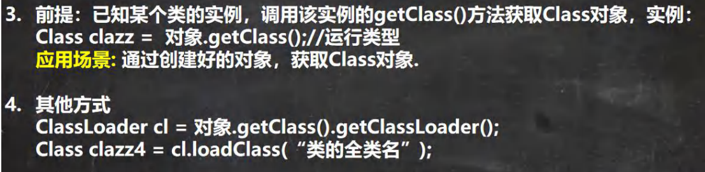

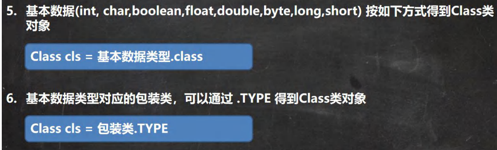

---

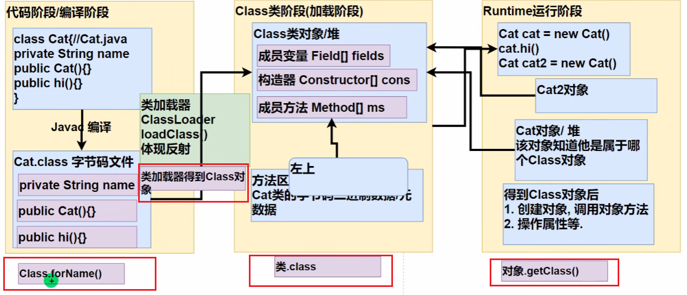

#### 获取Class对象的方式

| 方式 | 语法 | 应用场景 | 推荐度 |
|------|------|--------|--------|
| **Class.forName()** | `Class.forName("全类名")` | 配置文件，动态加载 | ⭐⭐⭐⭐⭐ |
| **类名.class** | `类名.class` | 参数传递 | ⭐⭐⭐⭐ |
| **对象.getClass()** | `对象.getClass()` | 有对象实例 | ⭐⭐⭐ |
| **类加载器** | `classLoader.loadClass("全类名")` | 高级用法 | ⭐⭐ |
| **基本类型** | `int.class` | 基本数据类型 | ⭐⭐⭐ |
| **包装类.TYPE** | `Integer.TYPE` | 基本类型对应包装类 | ⭐⭐ |

```java
package com.project.reflection.calss_;

import com.project.Car;

/**
 * 演示得到 Class 对象的各种方式(6)
 */
public class GetClass_ {
    public static void main(String[] args) throws ClassNotFoundException {
        //1. Class.forName
        String classAllPath = "com.project.Car"; //通过读取配置文件获取
        Class<?> cls1 = Class.forName(classAllPath);
        System.out.println(cls1);
        
        //2. 类名.class , 应用场景: 用于参数传递
        Class cls2 = Car.class;
        System.out.println(cls2);
        
        //3. 对象.getClass(), 应用场景，有对象实例
        Car car = new Car();
        Class cls3 = car.getClass();
        System.out.println(cls3);
        
        //4. 通过类加载器【4 种】来获取到类的 Class 对象
        //(1)先得到类加载器 car
        ClassLoader classLoader = car.getClass().getClassLoader();
        
        //(2)通过类加载器得到 Class 对象
        Class cls4 = classLoader.loadClass(classAllPath);
        System.out.println(cls4);
        //cls1 , cls2 , cls3 , cls4 其实是同一个对象
        System.out.println(cls1.hashCode());
        System.out.println(cls2.hashCode());
        System.out.println(cls3.hashCode());
        System.out.println(cls4.hashCode());
        
        //5. 基本数据(int, char,boolean,float,double,byte,long,short) 按如下方式得到 Class 类对象
        Class<Integer> integerClass = int.class;
        Class<Character> characterClass = char.class;
        Class<Boolean> booleanClass = boolean.class;
        System.out.println(integerClass);//int
        
        //6. 基本数据类型对应的包装类，可以通过 .TYPE 得到 Class 类对象
        Class<Integer> type1 = Integer.TYPE;
        Class<Character> type2 = Character.TYPE; //其它包装类 BOOLEAN, DOUBLE, LONG,BYTE 等待
        System.out.println(type1);
        System.out.println(integerClass.hashCode());//?
        System.out.println(type1.hashCode());//?
    }
}
```

---

## 四、哪些类型有 Class 对象

### 4.1 如下类型有 Class 对象

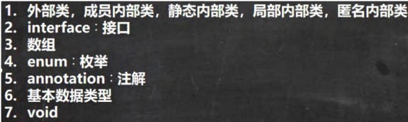

#### 拥有Class对象的类型

| 类型 | 示例 | 说明 |
|------|------|------|
| **外部类** | `String.class` | 普通类 |
| **接口** | `Serializable.class` | 接口类型 |
| **数组** | `Integer[].class` | 一维数组 |
| **二维数组** | `float[][].class` | 多维数组 |
| **注解** | `Deprecated.class` | 注解类型 |
| **枚举** | `Thread.State.class` | 枚举类型 |
| **基本数据类型** | `int.class` | 8种基本类型 |
| **void** | `void.class` | void关键字 |
| **Class** | `Class.class` | Class类本身 |

### 4.2 应用实例

```java
package com.project.reflection.calss_;

import java.io.Serializable;
/**
 * 演示哪些类型有 Class 对象
 */
public class AllTypeClass {
    public static void main(String[] args) {
 
        Class<String> cls1 = String.class;//外部类
        Class<Serializable> cls2 = Serializable.class;//接口
        Class<Integer[]> cls3 = Integer[].class;//数组
        Class<float[][]> cls4 = float[][].class;//二维数组
        Class<Deprecated> cls5 = Deprecated.class;//注解
        
        //枚举
        Class<Thread.State> cls6 = Thread.State.class;
        Class<Long> cls7 = long.class;//基本数据类型
        Class<Void> cls8 = void.class;//void 数据类型
        Class<Class> cls9 = Class.class;//
        System.out.println(cls1);
        System.out.println(cls2);
        System.out.println(cls3);
        System.out.println(cls4);
        System.out.println(cls5);
        System.out.println(cls6);
        System.out.println(cls7);
        System.out.println(cls8);
        System.out.println(cls9);
    }
}
```

---

## 五、类加载

### 5.1 基本说明

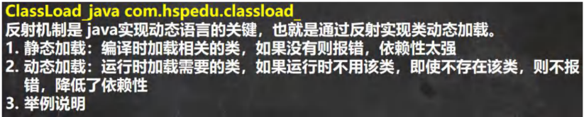

#### 静态加载 vs 动态加载

| 类型 | 说明 | 特点 | 优缺点 |
|------|------|------|--------|
| **静态加载** | 编译时加载相关的类，依赖性强 | 如：`new Dog()` | 缺点：依赖性强，灵活性差 |
| **动态加载** | 运行时加载需要的类，灵活性高 | 如：`Class.forName()` | 优点：灵活性高，降低依赖性 ✅ |

```java
import java.util.*;
import java.lang.reflect.*;

public class ClassLoad01 {
    public static void main(String[] args) throws Exception {
        Scanner scanner = new Scanner(System.in);
        System.out.println("请输入key");

        String key = scanner.next();

        switch (key) {
            case "1":
                 Dog dog = new Dog(); // 静态加载，代码依赖性很强
                 dog.cry();
                break;
            case "2":
                // 反射 -> 动态加载
                Class cls = Class.forName("Person");//加载Person类[动态加载]
                Object o = cls.newInstance();
                Method m = cls.getMethod("hi");
                m.invoke(o);
                System.out.println("ok");
                break;
            default:
                System.out.println("do noting...");
        }
    }
}
// 因为new Dog() 是静态加载，所以，没有编写Dog类会直接报错，因此必须编写Dog类
class Dog {
    public void cry() {
        System.out.println("Dog cry...");
    }
}
// 因为Person类是动态加载，所以，没有编写Person类也不会报错，只有执行动态加载到该类时，才会报错

```


---

### 5.2 类加载时机

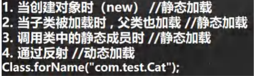

#### 类加载时机

| 时机 | 说明 |
|------|------|
| **创建对象实例** | 当创建某个类的new实例时 |
| **创建子类实例** | 创建子类实例时，父类也会被加载 |
| **使用类的静态成员** | 访问类的静态变量或静态方法 |
| **反射方式** | 使用反射方式来强制创建Class对象 |

---

### 5.3 类加载过程图

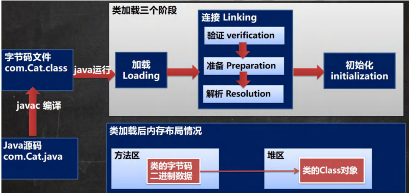

#### 类加载三大阶段

1. **加载（Loading）** - 将class文件字节码内容加载到内存中
2. **连接（Linking）** - 验证、准备、解析
3. **初始化（Initialization）** - 执行类构造器`<clinit>()`方法

---

### 5.4 类加载各阶段完成任务

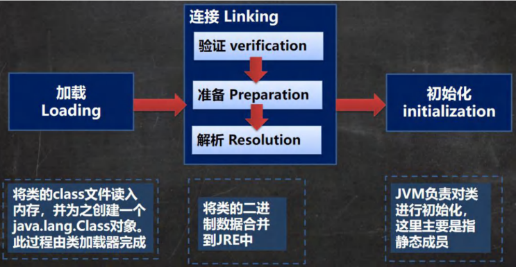

---

### 5.5 加载阶段

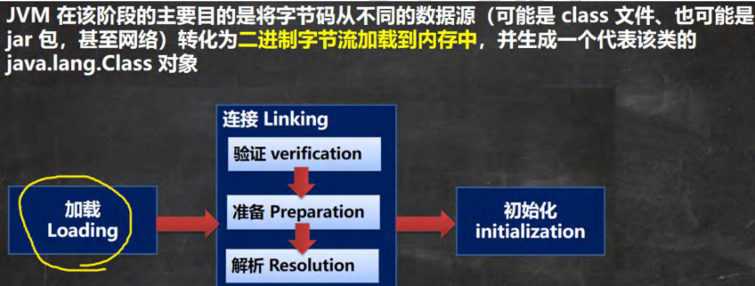

---

### 5.6 连接阶段-验证

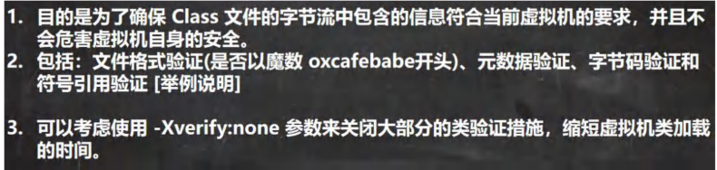

---

### 5.7 连接阶段-准备

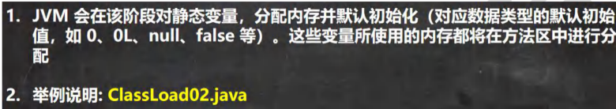

#### 准备阶段变量处理

| 变量类型 | 处理方式 | 示例 |
|----------|----------|------|
| **实例变量** | 不分配内存 | `public int n1 = 10;` |
| **静态变量** | 分配内存，默认初始化 | `public static int n2 = 20;` → 0 |
| **静态常量** | 分配内存，直接赋值 | `public static final int n3 = 30;` → 30 |

```java
package com.project.reflection.classload_;
/**

* 我们说明一个类加载的链接阶段-准备
*/
public class ClassLoad02 {
public static void main(String[] args) {
    
    }
}

class A {
    //属性-成员变量-字段
    //分析类加载的链接阶段-准备 属性是如何处理
    //1. n1 是实例属性, 不是静态变量，因此在准备阶段，是不会分配内存
    //2. n2 是静态变量，分配内存 n2 是默认初始化 0 ,而不是 20
    //3. n3 是 static final 是常量, 他和静态变量不一样, 因为一旦赋值就不变 n3 = 30
    public int n1 = 10;
    public static int n2 = 20;
    public static final int n3 = 30;
}

```

---

### 5.8 连接阶段-解析


---

### 5.9 Initialization（初始化）

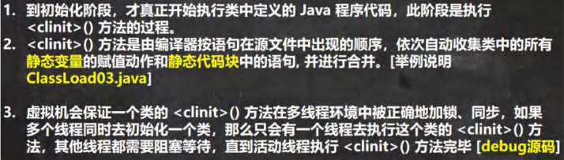

#### 初始化阶段特点

- ✅ 执行`<clinit>()`方法
- ✅ 收集所有静态变量赋值和静态代码块
- ✅ 按顺序合并执行
- ✅ 有同步机制保证线程安全

```java
package com.project.reflection.classload_;

/**
 * 演示类加载-初始化阶段
 */
public class ClassLoad03 {
    public static void main(String[] args) throws ClassNotFoundException {
        //分析
        //1. 加载 B 类，并生成 B 的 class 对象
        //2. 链接 num = 0
        //3. 初始化阶段
        // 依次自动收集类中的所有静态变量的赋值动作和静态代码块中的语句,并合并
        
        /*
            clinit() {
                System.out.println("B 静态代码块被执行");
                //num = 300;
                num = 100;
            }
            合并: num = 100
        */
        
        //new B();//类加载
        //System.out.println(B.num);//100, 如果直接使用类的静态属性，也会导致类的加载
        //看看加载类的时候，是有同步机制控制
        
        /*
        protected Class<?> loadClass(String name, boolean resolve) throws ClassNotFoundException {
            //正因为有这个机制，才能保证某个类在内存中, 只有一份 Class 对象
            synchronized (getClassLoadingLock(name)) {
            //.... }
        }
        */
        B b = new B();
    }
}
class B {
    static {
        System.out.println("B 静态代码块被执行");
        num = 300;
    }
    static int num = 100;
    public B() {//构造器
        System.out.println("B() 构造器被执行");
    }
}
```

---

## 六、通过反射获取类的结构信息

### 6.1 第一组: java.lang.Class 类

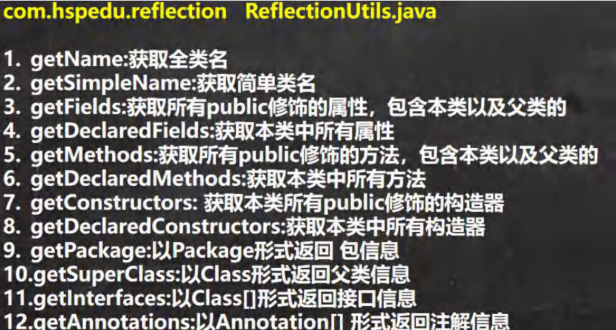

---

### 6.2 第二组: java.lang.reflect.Field 类

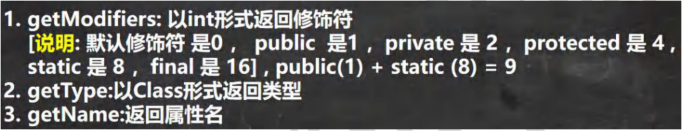

---

### 6.3 第三组: java.lang.reflect.Method 类

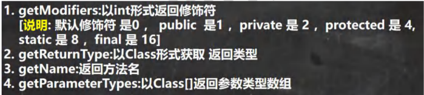

---

### 6.4 第四组: java.lang.reflect.Constructor 类


#### 反射API总结

| API类 | 主要方法 | 功能 |
|--------|----------|------|
| **Class** | `getFields()` / `getDeclaredFields()` | 获取属性 |
| **Class** | `getMethods()` / `getDeclaredMethods()` | 获取方法 |
| **Class** | `getConstructors()` / `getDeclaredConstructors()` | 获取构造器 |
| **Field** | `get(Object)` / `set(Object, value)` | 访问属性 |
| **Method** | `invoke(Object, args...)` | 调用方法 |
| **Constructor** | `newInstance(args...)` | 创建对象 |

**注意：**
- `getXxx()` 只能获取public成员（包括父类）
- `getDeclaredXxx()` 能获取所有成员（不包括父类）

```java
package com.project.reflection;

import org.junit.jupiter.api.Test;
import java.lang.annotation.Annotation;
import java.lang.reflect.Constructor;
import java.lang.reflect.Field;
import java.lang.reflect.Method;
/**
 * 演示如何通过反射获取类的结构信息
 */

public class ReflectionUtils {
    public static void main(String[] args) {
    }
    
    @Test
    public void api_02() throws ClassNotFoundException, NoSuchMethodException {
        //得到 Class 对象
        Class<?> personCls = Class.forName("com.hspedu.reflection.Person");
        //getDeclaredFields:获取本类中所有属性
        //规定 说明: 默认修饰符 是 0 ， public 是 1 ，private 是 2 ，protected 是 4 , static 是 8 ，final 是 16
        Field[] declaredFields = personCls.getDeclaredFields();
        for (Field declaredField : declaredFields) {
            System.out.println("本类中所有属性=" + declaredField.getName()
                            + " 该属性的修饰符值=" + declaredField.getModifiers()
                            + " 该属性的类型=" + declaredField.getType());
        }
        
        //getDeclaredMethods:获取本类中所有方法
        Method[] declaredMethods = personCls.getDeclaredMethods();
        for (Method declaredMethod : declaredMethods) {
            System.out.println("本类中所有方法=" + declaredMethod.getName()
                    + " 该方法的访问修饰符值=" + declaredMethod.getModifiers()
                    + " 该方法返回类型" + declaredMethod.getReturnType());
        //输出当前这个方法的形参数组情况
            Class<?>[] parameterTypes = declaredMethod.getParameterTypes();
            for (Class<?> parameterType : parameterTypes) {
                System.out.println("该方法的形参类型=" + parameterType);
            }
        }
        
        //getDeclaredConstructors:获取本类中所有构造器
        Constructor<?>[] declaredConstructors = personCls.getDeclaredConstructors();
        for (Constructor<?> declaredConstructor : declaredConstructors) {
            System.out.println("====================");
            System.out.println("本类中所有构造器=" + declaredConstructor.getName());//这里老师只是输出名
            Class<?>[] parameterTypes = declaredConstructor.getParameterTypes();
            for (Class<?> parameterType : parameterTypes) {
                System.out.println("该构造器的形参类型=" + parameterType);
            }
        }
    }
    
    //第一组方法 API
    @Test
    public void api_01() throws ClassNotFoundException, NoSuchMethodException {
        //得到 Class 对象
        Class<?> personCls = Class.forName("com.hspedu.reflection.Person");
        
        //getName:获取全类名
        System.out.println(personCls.getName());//com.hspedu.reflection.Person
        
        //getSimpleName:获取简单类名
        System.out.println(personCls.getSimpleName());//Person
        
        //getFields:获取所有 public 修饰的属性，包含本类以及父类的
        Field[] fields = personCls.getFields();
        for (Field field : fields) {//增强 for
            System.out.println("本类以及父类的属性=" + field.getName());
        }
        
        //getDeclaredFields:获取本类中所有属性
        Field[] declaredFields = personCls.getDeclaredFields();
        for (Field declaredField : declaredFields) {
            System.out.println("本类中所有属性=" + declaredField.getName());
        }
        
        //getMethods:获取所有 public 修饰的方法，包含本类以及父类的
        Method[] methods = personCls.getMethods();
        for (Method method : methods) {
            System.out.println("本类以及父类的方法=" + method.getName());
        }
        
        //getDeclaredMethods:获取本类中所有方法
        Method[] declaredMethods = personCls.getDeclaredMethods();
        for (Method declaredMethod : declaredMethods) {
            System.out.println("本类中所有方法=" + declaredMethod.getName());
        }
        //getConstructors: 获取所有 public 修饰的构造器，包含本类
        Constructor<?>[] constructors = personCls.getConstructors();
        for (Constructor<?> constructor : constructors) {
            System.out.println("本类的构造器=" + constructor.getName());
        }
        
        //getDeclaredConstructors:获取本类中所有构造器
        Constructor<?>[] declaredConstructors = personCls.getDeclaredConstructors();
        for (Constructor<?> declaredConstructor : declaredConstructors) {
            System.out.println("本类中所有构造器=" + declaredConstructor.getName());//这里老师只是输出名
        }
        
        //getPackage:以 Package 形式返回 包信息
        System.out.println(personCls.getPackage());//com.hspedu.reflection
        
        //getSuperClass:以 Class 形式返回父类信息
        Class<?> superclass = personCls.getSuperclass();
        System.out.println("父类的 class 对象=" + superclass);
        
        //getInterfaces:以 Class[]形式返回接口信息
        Class<?>[] interfaces = personCls.getInterfaces();
        for (Class<?> anInterface : interfaces) {
            System.out.println("接口信息=" + anInterface);
        }
        
        //getAnnotations:以 Annotation[] 形式返回注解信息
        Annotation[] annotations = personCls.getAnnotations();
        for (Annotation annotation : annotations) {
            System.out.println("注解信息=" + annotation);//注解
        }
    }
}

class A {
    public String hobby;
    public void hi() {
    }
    public A() {
    }
    public A(String name) {
    }
}

interface IA {
}

interface IB {
}

@Deprecated
class Person extends A implements IA, IB {
    //属性
    public String name;
    protected static int age; // 4 + 8 = 12
    String job;
    private double sal;
    //构造器
    public Person() {
    }
    public Person(String name) {
    }
    //私有的
    private Person(String name, int age) {
    }
    //方法
    public void m1(String name, int age, double sal) {
    }
    protected String m2() {
        return null;
    }
    void m3() {
    }
    private void m4() {
    }
}

```

---

## 七、通过反射创建对象

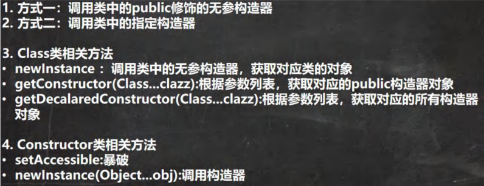

#### 创建对象的方式

| 方式 | 语法 | 适用场景 |
|------|------|--------|
| **无参构造器** | `cls.newInstance()` | 必须有public无参构造器 |
| **指定构造器** | `constructor.newInstance(args...)` | 可以调用任意构造器 |
| **私有构造器** | `constructor.setAccessible(true)` | 需要暴破访问 |

案例演示 

com.project.reflection  

ReflecCreateInstance.java

测试 1：通过反射创建某类的对象，要求该类中必须有 public 的无参构造

测试 2：通过调用某个特定构造器的方式，实现创建某类的对象

```java
package com.project.reflection;
import java.lang.reflect.Constructor;
import java.lang.reflect.InvocationTargetException;
/**
 * 演示通过反射机制创建实例
 */
public class ReflecCreateInstance {
    public static void main(String[] args) throws ClassNotFoundException, IllegalAccessException, InstantiationException, NoSuchMethodException, InvocationTargetException {

        //1. 先获取到 User 类的 Class 对象
        Class<?> userClass = Class.forName("com.project.reflection.User");
        
        //2. 通过 public 的无参构造器创建实例
        Object o = userClass.newInstance();
        System.out.println(o);
        
        //3. 通过 public 的有参构造器创建实例
        /*
        constructor 对象就是
        public User(String name) {//public 的有参构造器
            this.name = name;
        }
        */
        //3.1 先得到对应构造器
        Constructor<?> constructor = userClass.getConstructor(String.class);
        //3.2 创建实例，并传入实参
        Object yx= constructor.newInstance("yx");
        System.out.println("yx=" + yx);
        
        //4. 通过非 public 的有参构造器创建实例
        //4.1 得到 private 的构造器对象
        Constructor<?> constructor1 = userClass.getDeclaredConstructor(int.class, String.class);
        //4.2 创建实例
        //暴破【暴力破解】 , 使用反射可以访问 private 构造器/方法/属性, 反射面前，都是纸老虎
        constructor1.setAccessible(true);
        Object user2 = constructor1.newInstance(100, "张三丰");
        System.out.println("user2=" + user2);
    }
}

class User { //User 类
    private int age = 10;
    private String name = "懿轩";
    
    public User() {//无参 public
    }
    
    public User(String name) {//public 的有参构造器
        this.name = name;
    }
    
    private User(int age, String name) {//private 有参构造器
        this.age = age;
        this.name = name;
    }
    
    public String toString() {
        return "User [age=" + age + ", name=" + name + "]";
    }
}
```

---

## 八、通过反射访问类中的成员

### 8.1 访问属性 

ReflecAccessProperty.java

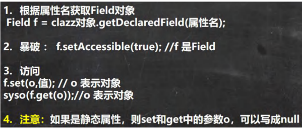

#### 访问属性步骤

1. **获取Class对象** - `Class.forName()`
2. **创建对象实例** - `cls.newInstance()`
3. **获取Field对象** - `getField()` / `getDeclaredField()`
4. **设置可访问** - `field.setAccessible(true)` (私有属性)
5. **访问属性** - `field.get(obj)` / `field.set(obj, value)`

```java
package com.project.reflection;
import java.lang.reflect.Field;
/**
 * 演示反射操作属性
 */
public class ReflecAccessProperty {
    public static void main(String[] args) throws ClassNotFoundException, IllegalAccessException, InstantiationException, NoSuchFieldException {
        //1. 得到 Student 类对应的 Class 对象
        Class<?> stuClass = Class.forName("com.project.reflection.Student");
        
        //2. 创建对象
        Object o = stuClass.newInstance(); // o 的运行类型就是 Student
        System.out.println(o.getClass());  // Student
        
        //3. 使用反射得到 age 属性对象
        Field age = stuClass.getField("age");
        age.set(o, 88);// 通过反射来操作属性
        System.out.println(o);//
        System.out.println(age.get(o));// 返回 age 属性的值
        
        //4. 使用反射操作 name 属性
        Field name = stuClass.getDeclaredField("name");
        // 对 name 进行暴破, 可以操作 private 属性
        name.setAccessible(true);
        // name.set(o, "老人");
        name.set(null, "老人~");// 因为 name 是 static 属性，因此 o 也可以写出 null
        System.out.println(o);
        System.out.println(name.get(o));   // 获取属性值
        System.out.println(name.get(null));// 获取属性值, 要求 name 是 static
    }
}

class Student { // 类
    public int age;
    private static String name;
    
    public Student() { // 构造器
    }

    public String toString() {
        return "Student [age=" + age + ", name=" + name + "]";
    }
}
```

---

### 8.2 访问方法 

ReflecAccessMethod.java

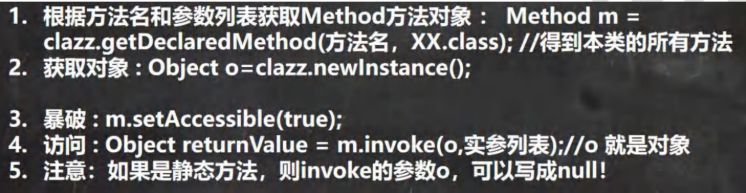

#### 访问方法步骤

1. **获取Class对象** - `Class.forName()`
2. **创建对象实例** - `cls.newInstance()`
3. **获取Method对象** - `getMethod()` / `getDeclaredMethod()`
4. **设置可访问** - `method.setAccessible(true)` (私有方法)
5. **调用方法** - `method.invoke(obj, args...)`

**注意：**
- 静态方法调用时，第一个参数可以传null
- 方法返回值统一为Object类型

```java
package com.project.reflection;
import java.lang.reflect.InvocationTargetException;
import java.lang.reflect.Method;

/**
 * 演示通过反射调用方法
 */

public class ReflecAccessMethod {
    public static void main(String[] args) throws ClassNotFoundException, NoSuchMethodException, IllegalAccessException, InstantiationException, InvocationTargetException {
        //1. 得到 Boss 类对应的 Class 对象
        Class<?> bossCls = Class.forName("com.p'ro.reflection.Boss");
        //2. 创建对象
        Object o = bossCls.newInstance();
        
        //3. 调用 public 的 hi 方法
        //Method hi = bossCls.getMethod("hi", String.class);//OK
        //3.1 得到 hi 方法对象
        Method hi = bossCls.getDeclaredMethod("hi", String.class);//OK
        //3.2 调用
        hi.invoke(o, "你好~");
        
        //4. 调用 private static 方法
        //4.1 得到 say 方法对象
        Method say = bossCls.getDeclaredMethod("say", int.class, String.class, char.class);
        //4.2 因为 say 方法是 private, 所以需要暴破，原理和前面讲的构造器和属性一样
        say.setAccessible(true);
        System.out.println(say.invoke(o, 100, "张三", '男'));
        //4.3 因为 say 方法是 static 的，还可以这样调用 ，可以传入 null
        System.out.println(say.invoke(null, 200, "李四", '女'));
        
        //5. 在反射中，如果方法有返回值，统一返回 Object , 但是他运行类型和方法定义的返回类型一致
        Object reVal = say.invoke(null, 300, "王五", '男');
        System.out.println("reVal 的运行类型=" + reVal.getClass());//String
        //在演示一个返回的案例
        Method m1 = bossCls.getDeclaredMethod("m1");
        Object reVal2 = m1.invoke(o);
        System.out.println("reVal2 的运行类型=" + reVal2.getClass());//Monster
    }
}
class Monster {}
class Boss {//类
    public int age;
    private static String name;
    public Boss() {//构造器
    }
    public Monster m1() {
        return new Monster();
    }
    private static String say(int n, String s, char c) {//静态方法
        return n + " " + s + " " + c;
    }
    public void hi(String s) {//普通 public 方法
        System.out.println("hi " + s);
    }
}
```

---

## 九、反射机制总结

### 核心要点

#### 1. 反射的本质

| 概念 | 说明 |
|------|------|
| **定义** | 在运行时动态获取类的信息并操作类的成员 |
| **核心类** | Class、Method、Field、Constructor |
| **关键特性** | 动态性、灵活性、可访问私有成员 |

#### 2. 反射的应用场景

| 场景 | 说明 | 示例 |
|------|------|------|
| **框架开发** | Spring、MyBatis等框架的核心 | 依赖注入、AOP |
| **动态代理** | 实现代理模式 | JDK动态代理 |
| **配置文件** | 根据配置动态创建对象 | 工厂模式 |
| **注解处理** | 运行时处理注解 | @Autowired、@RequestMapping |

#### 3. 反射 vs 传统方式

| 特性 | 传统方式 | 反射方式 |
|------|---------|---------|
| **编译时检查** | ✅ 有 | ❌ 无 |
| **性能** | ✅ 快 | ⚠️ 较慢 |
| **灵活性** | ❌ 低 | ✅ 高 |
| **代码复杂度** | ✅ 简单 | ⚠️ 复杂 |
| **类型安全** | ✅ 安全 | ⚠️ 需要转换 |

#### 4. 反射最佳实践

**✅ 推荐做法：**
1. 使用 `setAccessible(true)` 提升性能
2. 缓存 Class、Method、Field 对象，避免重复获取
3. 优先使用 `getDeclaredXxx()` 方法
4. 处理好异常，提供友好的错误提示

**❌ 避免做法：**
1. 不要在性能敏感的代码中频繁使用反射
2. 不要滥用反射破坏封装性
3. 不要忽略异常处理

#### 5. 常见问题

| 问题 | 解决方案 |
|------|---------|
| **访问私有成员** | 使用 `setAccessible(true)` |
| **性能问题** | 缓存反射对象，关闭访问检查 |
| **找不到方法/字段** | 检查方法名、参数类型是否正确 |
| **ClassNotFoundException** | 检查类路径和类名是否正确 |

#### 6. 反射与类加载

```
类加载流程：加载 → 连接(验证、准备、解析) → 初始化
```

- **静态加载**：编译时加载，依赖性强
- **动态加载**：运行时加载，灵活性高 ✅

#### 7. 记忆口诀

```
反射三步走：
1. 获取Class对象
2. 获取成员对象（Field/Method/Constructor）
3. 操作成员（get/set/invoke/newInstance）

私有成员访问：
setAccessible(true) 暴力破解
```

## 总结

反射是Java的高级特性，是框架开发的基础。虽然性能较低，但提供了极大的灵活性。在实际开发中：

- ✅ **框架开发**：大量使用反射
- ✅ **工具类开发**：适度使用反射
- ⚠️ **业务代码**：谨慎使用反射
- ❌ **性能敏感代码**：避免使用反射

掌握反射机制，是成为Java高级开发者的必经之路！

