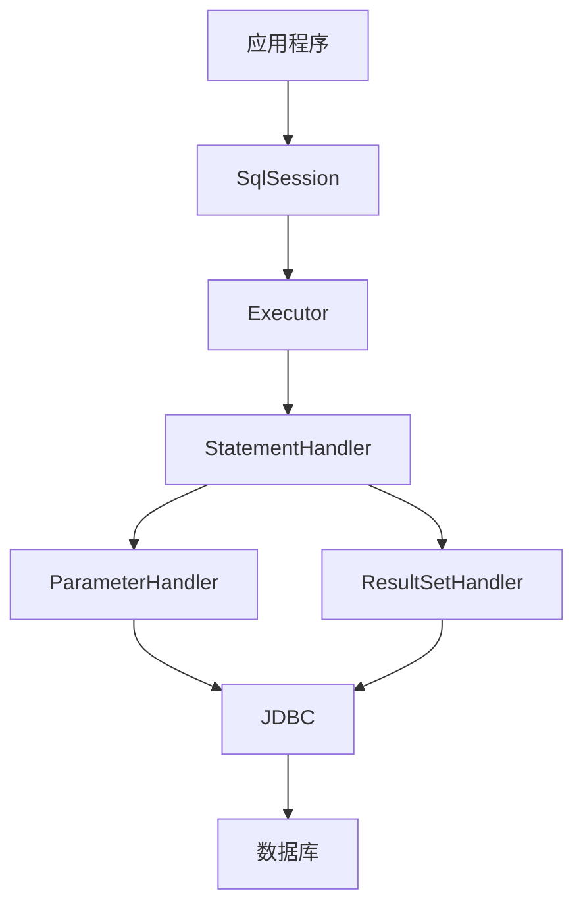

# MyBatis 教程

> 从入门到精通，掌握 MyBatis 持久层框架

## 📚 教程简介

本教程将带你系统学习 MyBatis 框架，从基础配置到高级特性，涵盖 XML 映射、动态 SQL、高级映射、缓存机制等核心知识点。MyBatis 是目前最流行的 Java 持久层框架之一，掌握它是每个 Java 开发者的必备技能。

## 🎯 学习目标

- ✅ 掌握 MyBatis 核心概念和工作原理
- ✅ 熟练编写 Mapper XML 映射文件
- ✅ 掌握动态 SQL 的使用
- ✅ 理解一对一、一对多、多对多映射
- ✅ 掌握 MyBatis 缓存机制
- ✅ 熟练使用注解开发
- ✅ 具备解决实际开发问题的能力
- ✅ 应对 MyBatis 面试

## 📖 教程目录

### [第一章：MyBatis 基础入门](1.MyBatis基础入门.md) ⭐⭐⭐⭐⭐
**学习内容：**
- MyBatis 是什么？
- MyBatis vs JDBC vs Hibernate
- MyBatis 工作原理
- 创建第一个 MyBatis 项目
- 核心组件详解
- CRUD 基本操作

### [第二章：配置文件详解](2.配置文件详解.md) ⭐⭐⭐⭐⭐
**学习内容：**
- mybatis-config.xml 详解
- 环境配置（environments）
- 属性配置（properties）
- 类型别名（typeAliases）
- 类型处理器（typeHandlers）
- 插件（plugins）
- 设置（settings）

### [第三章：XML 映射文件](3.XML映射文件.md) ⭐⭐⭐⭐⭐
**学习内容：**
- Mapper XML 基本结构
- select、insert、update、delete
- 参数映射（parameterType）
- 结果映射（resultMap）
- SQL 片段（sql）
- 占位符 #{} 和 ${}

### [第四章：动态 SQL](4.动态SQL.md) ⭐⭐⭐⭐⭐
**学习内容：**
- if 条件判断
- choose、when、otherwise
- where、set、trim
- foreach 循环
- bind 变量
- 动态 SQL 最佳实践

### [第五章：高级映射](5.高级映射.md) ⭐⭐⭐⭐⭐
**学习内容：**
- 一对一映射（association）
- 一对多映射（collection）
- 多对多映射
- 延迟加载
- 嵌套查询 vs 嵌套结果

### [第六章：缓存机制](6.缓存机制.md) ⭐⭐⭐⭐
**学习内容：**
- 一级缓存（SqlSession 级别）
- 二级缓存（Mapper 级别）
- 缓存配置
- 缓存失效场景
- 整合第三方缓存（Redis）

### [第七章：注解开发](7.注解开发.md) ⭐⭐⭐⭐
**学习内容：**
- @Select、@Insert、@Update、@Delete
- @Results、@Result
- @One、@Many
- 动态 SQL 注解
- 注解 vs XML

### [第八章：MyBatis 面试题集](8.MyBatis面试题集.md) ⭐⭐⭐⭐⭐
**学习内容：**
- 基础概念面试题
- 配置相关面试题
- 动态 SQL 面试题
- 缓存机制面试题
- 高级特性面试题
- 高频面试题 30+

## 🚀 快速开始

### 环境准备

**前置要求：**
- JDK 8 或更高版本
- Maven 3.5+
- MySQL 5.7+
- IDE（推荐 IntelliJ IDEA）

### 创建第一个 MyBatis 项目

**1. 创建 Maven 项目**
```xml
<dependencies>
    <!-- MyBatis -->
    <dependency>
        <groupId>org.mybatis</groupId>
        <artifactId>mybatis</artifactId>
        <version>3.5.13</version>
    </dependency>
    
    <!-- MySQL Driver -->
    <dependency>
        <groupId>mysql</groupId>
        <artifactId>mysql-connector-java</artifactId>
        <version>8.0.33</version>
    </dependency>
</dependencies>
```

**2. 创建配置文件（mybatis-config.xml）**
```xml
<?xml version="1.0" encoding="UTF-8" ?>
<!DOCTYPE configuration
  PUBLIC "-//mybatis.org//DTD Config 3.0//EN"
  "http://mybatis.org/dtd/mybatis-3-config.dtd">
<configuration>
    <environments default="development">
        <environment id="development">
            <transactionManager type="JDBC"/>
            <dataSource type="POOLED">
                <property name="driver" value="com.mysql.cj.jdbc.Driver"/>
                <property name="url" value="jdbc:mysql://localhost:3306/test"/>
                <property name="username" value="root"/>
                <property name="password" value="123456"/>
            </dataSource>
        </environment>
    </environments>
    
    <mappers>
        <mapper resource="mapper/UserMapper.xml"/>
    </mappers>
</configuration>
```

**3. 创建实体类**
```java
public class User {
    private Long id;
    private String username;
    private String email;
    private Integer age;
    // getter/setter
}
```

**4. 创建 Mapper 接口**
```java
public interface UserMapper {
    User selectById(Long id);
    List<User> selectAll();
    int insert(User user);
}
```

**5. 创建 Mapper XML**
```xml
<?xml version="1.0" encoding="UTF-8" ?>
<!DOCTYPE mapper
  PUBLIC "-//mybatis.org//DTD Mapper 3.0//EN"
  "http://mybatis.org/dtd/mybatis-3-mapper.dtd">
<mapper namespace="com.example.mapper.UserMapper">
    
    <select id="selectById" resultType="com.example.entity.User">
        SELECT * FROM user WHERE id = #{id}
    </select>
    
    <select id="selectAll" resultType="com.example.entity.User">
        SELECT * FROM user
    </select>
    
    <insert id="insert">
        INSERT INTO user (username, email, age)
        VALUES (#{username}, #{email}, #{age})
    </insert>
</mapper>
```

**6. 使用 MyBatis**
```java
public class MyBatisDemo {
    public static void main(String[] args) throws IOException {
        // 读取配置文件
        String resource = "mybatis-config.xml";
        InputStream inputStream = Resources.getResourceAsStream(resource);
        
        // 创建 SqlSessionFactory
        SqlSessionFactory sqlSessionFactory = 
            new SqlSessionFactoryBuilder().build(inputStream);
        
        // 获取 SqlSession
        try (SqlSession session = sqlSessionFactory.openSession()) {
            // 获取 Mapper
            UserMapper mapper = session.getMapper(UserMapper.class);
            
            // 查询
            User user = mapper.selectById(1L);
            System.out.println(user);
        }
    }
}
```

## 💡 学习建议

1. **循序渐进** - 按照章节顺序学习，不要跳章
2. **动手实践** - 每学完一章，必须动手编码
3. **理解原理** - 不仅要会用，还要理解底层原理
4. **对比学习** - 对比 JDBC、Hibernate，理解优劣
5. **项目实战** - 通过实际项目巩固知识

## 🌟 MyBatis 核心特性

### 1. 简单易用

**对比 JDBC：**
```java
// JDBC 代码（繁琐）
Connection conn = DriverManager.getConnection(url, user, password);
PreparedStatement ps = conn.prepareStatement("SELECT * FROM user WHERE id = ?");
ps.setLong(1, id);
ResultSet rs = ps.executeQuery();
User user = null;
if (rs.next()) {
    user = new User();
    user.setId(rs.getLong("id"));
    user.setUsername(rs.getString("username"));
    // ...
}
rs.close();
ps.close();
conn.close();

// MyBatis 代码（简洁）
User user = userMapper.selectById(id);
```

### 2. 灵活的 SQL

**支持原生 SQL：**
```xml
<select id="selectComplex" resultType="User">
    SELECT u.*, d.dept_name 
    FROM user u 
    LEFT JOIN department d ON u.dept_id = d.id
    WHERE u.age > #{minAge}
    ORDER BY u.create_time DESC
</select>
```

### 3. 动态 SQL

**根据条件动态拼接：**
```xml
<select id="selectByCondition" resultType="User">
    SELECT * FROM user
    <where>
        <if test="username != null">
            AND username LIKE #{username}
        </if>
        <if test="age != null">
            AND age = #{age}
        </if>
    </where>
</select>
```

### 4. 强大的结果映射

**复杂对象映射：**
```xml
<resultMap id="userResultMap" type="User">
    <id property="id" column="id"/>
    <result property="username" column="username"/>
    <association property="department" javaType="Department">
        <id property="id" column="dept_id"/>
        <result property="name" column="dept_name"/>
    </association>
</resultMap>
```

## 📊 MyBatis vs Hibernate

| 特性 | MyBatis | Hibernate |
|------|---------|-----------|
| **类型** | 半自动 ORM | 全自动 ORM |
| **SQL 控制** | 完全控制 | 自动生成 |
| **学习曲线** | 平缓 | 陡峭 |
| **性能优化** | 容易 | 困难 |
| **复杂查询** | 擅长 | 较弱 |
| **代码量** | 中等 | 少 |
| **适用场景** | 复杂业务 | 简单 CRUD |

## 🏗️ MyBatis 架构



**组件说明：**
- **SqlSession**：会话接口，执行 SQL
- **Executor**：执行器，负责 SQL 执行和缓存
- **StatementHandler**：语句处理器，处理 SQL 语句
- **ParameterHandler**：参数处理器，处理参数映射
- **ResultSetHandler**：结果处理器，处理结果映射

## 🎯 学习路线图

```
第 1 周：基础入门
  ├── MyBatis 概述
  ├── 环境搭建
  ├── 核心组件
  └── 基本 CRUD

第 2 周：配置详解
  ├── mybatis-config.xml
  ├── 环境配置
  ├── 类型别名
  └── 类型处理器

第 3 周：XML 映射
  ├── Mapper XML 结构
  ├── 参数映射
  ├── 结果映射
  └── SQL 片段

第 4 周：动态 SQL
  ├── if、choose
  ├── where、set
  ├── foreach
  └── 最佳实践

第 5 周：高级映射
  ├── 一对一映射
  ├── 一对多映射
  ├── 多对多映射
  └── 延迟加载

第 6 周：缓存机制
  ├── 一级缓存
  ├── 二级缓存
  ├── 缓存配置
  └── 整合 Redis

第 7 周：注解开发
  ├── CRUD 注解
  ├── 结果映射注解
  ├── 动态 SQL
  └── 注解 vs XML

第 8 周：项目实战
  ├── 整合 Spring
  ├── 整合 Spring Boot
  ├── 分页插件
  └── 逆向工程
```

## 🔥 常用插件

**1. PageHelper（分页插件）**
```xml
<dependency>
    <groupId>com.github.pagehelper</groupId>
    <artifactId>pagehelper</artifactId>
    <version>5.3.3</version>
</dependency>
```

**2. MyBatis Generator（代码生成器）**
```xml
<plugin>
    <groupId>org.mybatis.generator</groupId>
    <artifactId>mybatis-generator-maven-plugin</artifactId>
    <version>1.4.2</version>
</plugin>
```

**3. MyBatis-Plus（增强工具）**
```xml
<dependency>
    <groupId>com.baomidou</groupId>
    <artifactId>mybatis-plus</artifactId>
    <version>3.5.4.1</version>
</dependency>
```

## 📚 推荐资源

### 官方资源
- [MyBatis 官方文档](https://mybatis.org/mybatis-3/zh/)
- [MyBatis GitHub](https://github.com/mybatis/mybatis-3)
- [MyBatis Generator](https://mybatis.org/generator/)

### 推荐书籍
- 《MyBatis 从入门到精通》
- 《深入浅出 MyBatis》

### 视频教程
- B站搜索：MyBatis 教程
- 慕课网：MyBatis 实战

## ⚠️ 常见问题

### 1. #{} 和 ${} 的区别？

- **#{}**：预编译，防止 SQL 注入（推荐）
- **${}**：直接拼接，可能 SQL 注入（慎用）

### 2. resultType 和 resultMap 的区别？

- **resultType**：简单映射，自动映射
- **resultMap**：复杂映射，手动配置

### 3. 一级缓存和二级缓存？

- **一级缓存**：SqlSession 级别，默认开启
- **二级缓存**：Mapper 级别，需要配置

## 💪 进阶学习

**掌握 MyBatis 后，可以学习：**
1. **MyBatis-Plus** - MyBatis 增强工具
2. **分页插件** - PageHelper
3. **逆向工程** - 代码自动生成
4. **Spring 整合** - 企业级开发
5. **性能优化** - SQL 优化、缓存优化

## 📄 版权说明

本教程仅供学习使用，欢迎分享传播。

---

**准备好了吗？让我们开始 MyBatis 学习之旅！🚀**

**建议从 [第一章：MyBatis 基础入门](1.MyBatis基础入门.md) 开始学习**
