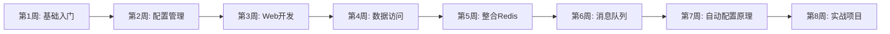

# Spring Boot 教程

> 从入门到精通，掌握现代化Java开发

## 📚 教程简介

本教程将带你系统学习 Spring Boot 框架，从零基础到项目实战，涵盖 Spring Boot 的核心知识和企业级应用开发。Spring Boot 是目前最流行的 Java 开发框架，简化了 Spring 应用的开发流程，让你专注于业务逻辑。

## 🎯 学习目标

- ✅ 掌握 Spring Boot 核心概念和特性
- ✅ 熟练使用 Spring Boot 开发 Web 应用
- ✅ 掌握配置管理和多环境部署
- ✅ 熟练整合 MyBatis、Redis、消息队列
- ✅ 理解自动配置原理和 Starter 机制
- ✅ 具备独立开发企业级项目的能力
- ✅ 应对 Spring Boot 面试

## 📖 教程目录

### [第一章：Spring Boot 基础入门](1.SpringBoot基础入门.md) ⭐⭐⭐⭐⭐
**学习内容：**
- Spring Boot 是什么？
- 为什么选择 Spring Boot？
- 创建第一个 Spring Boot 项目
- 项目结构详解
- 核心注解：@SpringBootApplication
- 启动类和主方法

### [第二章：配置管理](2.配置管理.md) ⭐⭐⭐⭐⭐
**学习内容：**
- application.yml 配置
- 配置文件优先级
- @Value 和 @ConfigurationProperties
- 多环境配置（dev、test、prod）
- 外部化配置
- 配置加密

### [第三章：Web 开发](3.Web开发.md) ⭐⭐⭐⭐⭐
**学习内容：**
- RESTful API 开发
- 统一响应格式
- 全局异常处理
- 参数验证
- 拦截器和过滤器
- 跨域配置
- Swagger 接口文档

### [第四章：数据访问](4.数据访问.md) ⭐⭐⭐⭐⭐
**学习内容：**
- Spring Boot 整合 MyBatis
- MyBatis-Plus 使用
- JPA 使用
- 多数据源配置
- 事务管理
- 数据库连接池

### [第五章：整合 Redis](5.整合Redis.md) ⭐⭐⭐⭐⭐
**学习内容：**
- Spring Boot 整合 Redis
- RedisTemplate 使用
- Redis 缓存注解
- 分布式锁
- 缓存策略

### [第六章：消息队列](6.消息队列.md) ⭐⭐⭐⭐
**学习内容：**
- Spring Boot 整合 RabbitMQ
- Spring Boot 整合 Kafka
- 消息发送与接收
- 消息确认机制
- 死信队列

### [第七章：自动配置原理](7.自动配置原理.md) ⭐⭐⭐⭐
**学习内容：**
- @EnableAutoConfiguration 原理
- 自动配置源码分析
- 条件注解详解
- 自定义 Starter
- SPI 机制

### [第八章：实战项目](8.实战项目.md) ⭐⭐⭐⭐⭐
**学习内容：**
- 项目架构设计
- 用户认证与授权（JWT）
- 文件上传下载
- 定时任务
- 邮件发送
- 日志管理
- 监控与部署

### [第九章：Spring Boot 面试题集](9.SpringBoot面试题集.md) ⭐⭐⭐⭐⭐
**学习内容：**
- 基础概念面试题
- 自动配置面试题
- 整合框架面试题
- 实战经验面试题
- 高频面试题 30+

## 🚀 快速开始

### 环境准备

**前置要求：**
- JDK 8 或更高版本（推荐 JDK 11/17）
- Maven 3.5+ 或 Gradle 6+
- IDE（推荐 IntelliJ IDEA）
- MySQL 5.7+（可选）
- Redis 5.0+（可选）

### 创建第一个 Spring Boot 项目

**方式一：Spring Initializr（推荐）**

1. 访问 [https://start.spring.io/](https://start.spring.io/)
2. 配置项目信息：
   - Project: Maven
   - Language: Java
   - Spring Boot: 2.7.x（稳定版）
   - Group: com.example
   - Artifact: demo
3. 添加依赖：Spring Web、Spring Data JPA、MySQL Driver
4. 点击 Generate 下载项目

**方式二：IDEA 创建**

```
File → New → Project → Spring Initializr
```

**方式三：Maven 命令**

```bash
mvn archetype:generate \
  -DgroupId=com.example \
  -DartifactId=demo \
  -DarchetypeArtifactId=maven-archetype-quickstart \
  -DinteractiveMode=false
```

### Hello World 示例

**1. 添加依赖（pom.xml）**
```xml
<parent>
    <groupId>org.springframework.boot</groupId>
    <artifactId>spring-boot-starter-parent</artifactId>
    <version>2.7.18</version>
</parent>

<dependencies>
    <dependency>
        <groupId>org.springframework.boot</groupId>
        <artifactId>spring-boot-starter-web</artifactId>
    </dependency>
</dependencies>
```

**2. 创建启动类**
```java
@SpringBootApplication
public class DemoApplication {
    public static void main(String[] args) {
        SpringApplication.run(DemoApplication.class, args);
    }
}
```

**3. 创建 Controller**
```java
@RestController
public class HelloController {
    
    @GetMapping("/hello")
    public String hello() {
        return "Hello, Spring Boot!";
    }
}
```

**4. 运行项目**
```bash
mvn spring-boot:run

# 访问：http://localhost:8080/hello
```

## 💡 学习建议

1. **循序渐进** - 按照章节顺序学习，不要跳章
2. **动手实践** - 每学完一章，必须动手编码
3. **理解原理** - 不仅要会用，还要理解底层原理
4. **项目驱动** - 通过实战项目巩固知识
5. **查阅文档** - 遇到问题查看官方文档

## 🌟 Spring Boot 核心特性

### 1. 自动配置（Auto Configuration）

**传统 Spring 配置：**
```xml
<!-- 繁琐的 XML 配置 -->
<bean id="dataSource" class="...">
    <property name="url" value="..."/>
    <property name="username" value="..."/>
</bean>
```

**Spring Boot 配置：**
```yaml
# 简洁的配置
spring:
  datasource:
    url: jdbc:mysql://localhost:3306/test
    username: root
    password: 123456
```

### 2. Starter 依赖

**统一管理依赖：**
```xml
<!-- 只需一个依赖，自动引入相关包 -->
<dependency>
    <groupId>org.springframework.boot</groupId>
    <artifactId>spring-boot-starter-web</artifactId>
</dependency>
```

### 3. 内嵌服务器

**无需外部 Tomcat：**
```bash
# 直接运行 jar 包
java -jar app.jar
```

### 4. 生产就绪（Actuator）

**监控端点：**
```
/actuator/health    - 健康检查
/actuator/metrics   - 性能指标
/actuator/env       - 环境变量
```

## 🏗️ Spring Boot 项目结构

```
springboot-demo/
├── pom.xml
├── src/
│   ├── main/
│   │   ├── java/
│   │   │   └── com/example/demo/
│   │   │       ├── DemoApplication.java        # 启动类
│   │   │       ├── controller/                 # 控制层
│   │   │       │   └── UserController.java
│   │   │       ├── service/                    # 业务层
│   │   │       │   ├── UserService.java
│   │   │       │   └── impl/
│   │   │       │       └── UserServiceImpl.java
│   │   │       ├── mapper/                     # 数据访问层
│   │   │       │   └── UserMapper.java
│   │   │       ├── entity/                     # 实体类
│   │   │       │   └── User.java
│   │   │       ├── dto/                        # 数据传输对象
│   │   │       ├── vo/                         # 视图对象
│   │   │       ├── config/                     # 配置类
│   │   │       ├── interceptor/                # 拦截器
│   │   │       ├── exception/                  # 异常处理
│   │   │       └── util/                       # 工具类
│   │   └── resources/
│   │       ├── application.yml                 # 主配置文件
│   │       ├── application-dev.yml             # 开发环境
│   │       ├── application-prod.yml            # 生产环境
│   │       ├── mapper/                         # MyBatis XML
│   │       ├── static/                         # 静态资源
│   │       └── templates/                      # 模板文件
│   └── test/                                   # 测试代码
└── target/
```

## 📊 Spring Boot vs Spring MVC

| 特性 | Spring MVC | Spring Boot |
|------|-----------|-------------|
| **配置方式** | XML + Java 配置 | 约定优于配置 |
| **依赖管理** | 手动管理版本 | Starter 统一管理 |
| **内嵌服务器** | 需要外部 Tomcat | 内置 Tomcat |
| **学习曲线** | 陡峭 | 平缓 |
| **开发效率** | 一般 | 高 |
| **监控运维** | 需要自己实现 | Actuator 自带 |
| **适用场景** | 传统项目 | 微服务、快速开发 |

## 🎯 学习路线图



**详细规划：**

**第 1-2 周：基础入门**
- Spring Boot 核心概念
- 快速开始
- 配置管理
- 多环境部署

**第 3-4 周：Web 开发**
- RESTful API
- 数据验证
- 异常处理
- 接口文档

**第 5-6 周：数据访问**
- 整合 MyBatis
- 整合 Redis
- 事务管理
- 缓存策略

**第 7-8 周：中间件整合**
- 消息队列
- Elasticsearch
- 定时任务
- 文件上传

**第 9-10 周：进阶学习**
- 自动配置原理
- 自定义 Starter
- 监控与部署
- 性能优化

**第 11-12 周：项目实战**
- 完整项目开发
- 用户认证授权
- 日志管理
- 部署上线

## 🔥 热门技术栈

**Spring Boot 生态：**
```
Spring Boot
├── Spring Web (RESTful API)
├── Spring Data JPA/MyBatis (数据访问)
├── Spring Security (安全认证)
├── Spring Cache (缓存)
├── Spring Validation (数据验证)
└── Spring Actuator (监控)
```

**常用中间件：**
```
中间件
├── MySQL/PostgreSQL (关系数据库)
├── Redis (缓存/分布式锁)
├── RabbitMQ/Kafka (消息队列)
├── Elasticsearch (搜索引擎)
├── MongoDB (NoSQL)
└── Nginx (反向代理)
```

## 📚 推荐资源

### 官方资源
- [Spring Boot 官方文档](https://spring.io/projects/spring-boot)
- [Spring Boot Reference](https://docs.spring.io/spring-boot/docs/current/reference/html/)
- [Spring Guides](https://spring.io/guides)

### 推荐书籍
- 《Spring Boot 编程思想》
- 《深入理解 Spring Boot》
- 《Spring Boot 实战》

### 视频教程
- B站搜索：Spring Boot 教程
- 慕课网：Spring Boot 实战

### 开源项目
- [Spring Boot Examples](https://github.com/spring-projects/spring-boot)
- [Spring Boot Demo](https://github.com/xkcoding/spring-boot-demo)

## ⚠️ 常见问题

### 1. Spring Boot 版本选择

**推荐版本：**
- 生产环境：2.7.x（稳定版）
- 学习练习：3.x（最新特性）

### 2. JDK 版本要求

- Spring Boot 2.x：JDK 8+
- Spring Boot 3.x：JDK 17+

### 3. 打包方式

```bash
# jar 包（推荐）
mvn clean package

# war 包（需要外部 Tomcat）
mvn clean package -P war
```

## 💪 进阶学习

**掌握 Spring Boot 后，可以学习：**
1. **Spring Cloud** - 微服务架构
2. **Dubbo** - RPC 框架
3. **Docker** - 容器化部署
4. **Kubernetes** - 容器编排
5. **消息驱动** - Spring Cloud Stream

## 📄 版权说明

本教程仅供学习使用，欢迎分享传播。

---

**准备好了吗？让我们开始 Spring Boot 学习之旅！🚀**

**建议从 [第一章：Spring Boot 基础入门](1.SpringBoot基础入门.md) 开始学习**
