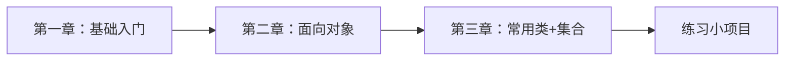
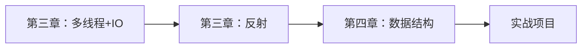

# Java 学习教程大纲

> 📚 **系统化Java学习路线** | 涵盖基础到进阶 | 包含面试高频考点
> 
> 💡 **使用建议**：按章节顺序学习，每章配有代码示例和面试题

---

## 📖 教程结构

### 第一章：Java 基础入门
> 适合零基础学习者，掌握Java开发环境和基本语法

| 序号 | 章节 | 核心内容 | 面试频率 |
|------|------|----------|----------|
| 01 | [开发环境与工具](第01章-基础入门/01-开发环境与工具.md) | IDEA使用、输入输出、常用方法 | ⭐⭐ |
| 02 | [变量与数据类型](第01章-基础入门/02-变量与数据类型.md) | 八大基本类型、类型转换 | ⭐⭐⭐⭐ |
| 03 | [运算符](第01章-基础入门/03-运算符.md) | 算术、关系、逻辑、位运算 | ⭐⭐⭐ |
| 04 | [数组](第01章-基础入门/04-数组.md) | 一维数组、二维数组、数组操作 | ⭐⭐⭐⭐ |

**学习目标：**
- ✅ 搭建Java开发环境
- ✅ 掌握基本语法和数据类型
- ✅ 理解内存模型和数据传递

---

### 第二章：面向对象编程（核心）
> Java的核心思想，必须深入理解

| 序号 | 章节 | 核心内容 | 面试频率 |
|------|------|----------|----------|
| 01 | [面向对象初级](第02章-核心编程/01-面向对象初级.md) | 类与对象、方法、构造器、this关键字 | ⭐⭐⭐⭐⭐ |
| 02 | [面向对象中级](第02章-核心编程/02-面向对象中级.md) | 封装、继承、多态、包管理 | ⭐⭐⭐⭐⭐ |
| 03 | [面向对象高级](第02章-核心编程/03-面向对象高级.md) | 抽象类、接口、内部类、单例模式 | ⭐⭐⭐⭐⭐ |

**学习目标：**
- ✅ 掌握面向对象三大特性
- ✅ 理解类与对象的关系
- ✅ 学会使用接口和抽象类

**重点面试题：**
- 封装、继承、多态的理解
- 重载与重写的区别
- 抽象类与接口的区别
- static、final关键字

---

### 第三章：Java 进阶编程
> 提升Java编程能力，掌握高级特性

| 序号 | 章节 | 核心内容 | 面试频率 |
|------|------|----------|----------|
| 01 | [枚举与注解](第03章-进阶编程/01-枚举与注解.md) | enum、@Override、@Deprecated | ⭐⭐⭐⭐ |
| 02 | [异常处理](第03章-进阶编程/02-异常处理.md) | try-catch、自定义异常 | ⭐⭐⭐⭐⭐ |
| 03 | [常用类](第03章-进阶编程/03-常用类.md) | String、StringBuilder、Math、日期类 | ⭐⭐⭐⭐⭐ |
| 04 | [集合框架](第03章-进阶编程/04-集合类.md) | List、Set、Map、Collection | ⭐⭐⭐⭐⭐ |
| 05 | [泛型](第03章-进阶编程/05-泛型.md) | 泛型类、泛型方法、通配符 | ⭐⭐⭐⭐ |
| 06 | [多线程](第03章-进阶编程/06-多线程.md) | Thread、Runnable、线程同步 | ⭐⭐⭐⭐⭐ |
| 07 | [IO流](第03章-进阶编程/07-IO流文件操作.md) | 字节流、字符流、文件操作 | ⭐⭐⭐⭐ |
| 08 | [网络编程](第03章-进阶编程/08-网络编程.md) | Socket、TCP/UDP | ⭐⭐⭐ |
| 09 | [反射](第03章-进阶编程/09-反射.md) | Class类、动态代理 | ⭐⭐⭐⭐⭐ |
| 10 | [正则表达式](第03章-进阶编程/10-正则表达式.md) | 模式匹配、字符串处理 | ⭐⭐⭐ |

**学习目标：**
- ✅ 掌握Java核心API
- ✅ 理解集合框架的使用
- ✅ 掌握多线程编程
- ✅ 了解反射机制

**重点面试题：**
- String、StringBuilder、StringBuffer区别
- ArrayList与LinkedList区别
- HashMap原理（JDK 7 vs JDK 8）
- 线程创建方式、线程安全
- 反射的应用场景

---

### 第四章：数据结构与算法（待补充）
> 提升算法能力，为面试和竞赛做准备

**学习目标：**
- ✅ 掌握常见数据结构
- ✅ 熟悉经典算法
- ✅ 提升算法思维能力

---

## 🎯 学习路线建议

### 🔰 初学者路线（0-3个月）

**推荐学习顺序：**
1. 第一章全部内容（1周）
2. 第二章全部内容（2周）
3. 第三章：01-05（3周）
4. 完成综合练习项目

---

### 🚀 进阶路线（3-6个月）

**推荐学习顺序：**
1. 第三章：06-10（4周）
2. 第四章全部内容（4周）
3. 学习框架（Spring、MyBatis等）
4. 参与实战项目

---

## 📝 面试高频考点汇总

### ⭐⭐⭐⭐⭐ 必考考点
1. **面向对象三大特性**（封装、继承、多态）
2. **重载与重写的区别**
3. **String 相关**（String、StringBuilder、StringBuffer）
4. **集合框架**（ArrayList、LinkedList、HashMap、HashSet）
5. **多线程**（线程创建、线程安全、synchronized）
6. **异常处理**（try-catch-finally、自定义异常）
7. **反射机制**（Class类、动态代理）
8. **值传递与引用传递**

### ⭐⭐⭐⭐ 常考考点
1. **static、final 关键字**
2. **抽象类与接口的区别**
3. **枚举的使用**
4. **泛型**（泛型类、泛型方法）
5. **IO流**（字节流、字符流）
6. **equals() 和 hashCode()**
7. **注解**（@Override、@Deprecated）

### ⭐⭐⭐ 了解即可
1. **网络编程**（Socket、TCP/UDP）
2. **正则表达式**
3. **序列化与反序列化**

---

## 🛠️ 配套资源

### 开发工具
- **IDE**: IntelliJ IDEA（推荐）/ Eclipse
- **JDK版本**: JDK 8 / JDK 11 / JDK 17

### 推荐书籍
1. 《Java核心技术 卷I》- 基础入门
2. 《Java编程思想》- 深入理解
3. 《Effective Java》- 最佳实践
4. 《深入理解Java虚拟机》- JVM原理

### 在线资源
- [Oracle Java官方文档](https://docs.oracle.com/javase/8/docs/)
- [LeetCode](https://leetcode.cn/) - 算法练习
- [牛客网](https://www.nowcoder.com/) - 面试题库

---

## 📊 学习进度追踪

### 基础阶段 ✅
- [ ] 第一章：Java基础入门
- [ ] 第二章：面向对象编程
- [ ] 基础项目练习

### 进阶阶段 🔄
- [ ] 第三章：Java进阶编程
- [ ] 第四章：数据结构与算法
- [ ] 中级项目练习

### 高级阶段 ⏳
- [ ] 框架学习（Spring、MyBatis）
- [ ] 微服务（Spring Cloud）
- [ ] 实战项目

---

## 💡 学习建议

### ✅ 推荐做法
1. **循序渐进**：按章节顺序学习，不要跳过基础
2. **动手实践**：每个知识点都要写代码验证
3. **总结归纳**：每章学完后总结重点
4. **刷题巩固**：在LeetCode上练习算法
5. **项目实战**：学完基础后做实战项目

### ❌ 避免误区
1. ❌ 只看不练，缺乏实践
2. ❌ 急于求成，基础不牢
3. ❌ 死记硬背，不理解原理
4. ❌ 孤立学习，缺乏总结

---

## 🔗 相关教程

- [MySQL数据库教程](../MySQL教程/README.md)
- [SpringBoot框架](../10、Springboot/)
- [Maven构建工具](../11、Maven/)
- [Redis缓存](../13、Redis/)
- [设计模式](../27、设计模式/)

---

## 📮 反馈与建议

如果在学习过程中遇到问题或有改进建议，欢迎反馈！

**最后更新时间**: 2025年1月

---

**开始学习：** [第一章 - Java基础入门](第01章-基础入门/01-开发环境与工具.md) →
